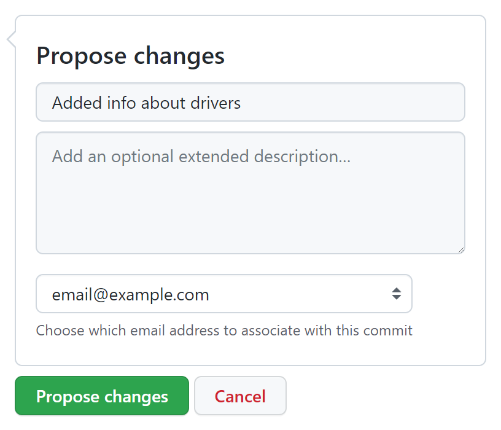

# Editing Windows IT professional documentation

Thank you for your interest in the Windows IT professional documentation! We appreciate your feedback, edits, and additions to our docs.
This page covers the basic steps for editing our technical documentation.
For a more up-to-date and complete contribution guide, see the main [contributor guide overview](https://docs.microsoft.com/contribute/).

## Sign a CLA

All contributors who are ***not*** a Microsoft employee or vendor must [sign a Microsoft Contributor License Agreement (CLA)](https://cla.microsoft.com/) before editing any Microsoft repositories.
If you've already edited within Microsoft repositories in the past, congratulations!
You've already completed this step.

## Editing topics

We've tried to make editing an existing, public file as simple as possible.

> **Note** 
> At this time, only the English (en-us) content is available for editing. If you have suggestions for edits to localized content, file feedback on the article.

### To edit a topic

1. Browse to the [Microsoft Docs](https://docs.microsoft.com/) article that you want to update.

    > **Note** 
    > If you're a Microsoft employee or vendor, before you edit the article, append `review.` to the beginning of the URL. This action lets you use the private repository, **windows-docs-pr**. For more information, see the [internal contributor guide](https://review.docs.microsoft.com/help/get-started/edit-article-in-github?branch=main).

1. Then select the **Pencil** icon.

    

    If the pencil icon isn't present, the content might not be open to public contributions. Some pages are generated (for example, from inline documentation in code) and must be edited in the project they belong to. This isn't always the case and you might be able to find the documentation by searching the [MicrosoftDocs organization on GitHub](https://github.com/MicrosoftDocs).

    > **TIP** 
    > View the page source in your browser, and look for the following metadata: `original_content_git_url`. This path always points to the source markdown file for the article.

1. In GitHub, select the **Pencil** icon to edit the article. If the pencil icon is grayed out, you need to either sign in to your GitHub account or create a new account.

    

1. Using Markdown language, make your changes to the file. For info about how to edit content using Markdown, see the [Docs Markdown reference](https://docs.microsoft.com/contribute/markdown-reference) and GitHub's [Mastering Markdown](https://guides.github.com/features/mastering-markdown/) documentation.

1. Make your suggested change, and then select **Preview changes** to make sure it looks correct.

    

1. When you're finished editing, scroll to the bottom of the page. In the **Propose changes** area, enter a title and optionally a description for your changes. The title will be the first line of the commit message. Briefly state _what_ you changed. Select **Propose changes** to commit your changes:

    

1. The **Comparing changes** screen appears to show what the changes are between your fork and the original content. On the **Comparing changes** screen, you'll see if there are any problems with the file you're checking. If there are no problems, you'll see the message **Able to merge**.

    

     Select **Create pull request**. Next, enter a title and description to give the approver the appropriate context about _why_ you're suggesting this change. Make sure that only your changed files are in this pull request; otherwise, you could overwrite changes from other people.

1. Select **Create pull request** again to actually submit the pull request.

    The pull request is sent to the writer of the topic and your edits are reviewed. If your request is accepted, updates are published to their respective article. This repository contains articles on some of the following topics:

    - [Windows client documentation for IT Pros](https://docs.microsoft.com/windows/resources/)
    - [Microsoft Store](https://docs.microsoft.com/microsoft-store)
    - [Windows 10 for Education](https://docs.microsoft.com/education/windows)
    - [Windows 10 for SMB](https://docs.microsoft.com/windows/smb)
    - [Internet Explorer 11](https://docs.microsoft.com/internet-explorer/)

## Making more substantial changes

To make substantial changes to an existing article, add or change images, or contribute a new article, you'll need to create a local clone of the content.
For info about creating a fork or clone, see [Set up a local Git repository](https://docs.microsoft.com/contribute/get-started-setup-local). The GitHub docs topic, [Fork a Repo](https://docs.github.com/articles/fork-a-repo), is also insightful.

Fork the official repo into your personal GitHub account, and then clone the fork down to your local device.  Work locally, then push your changes back into your fork.  Finally, open a pull request back to the main branch of the official repo.

## Using issues to provide feedback on documentation

If you just want to provide feedback rather than directly modifying actual documentation pages, you can create an issue in the repository.

At the top of an article, you'll see a feedback icon. Select the icon to go to the **Feedback** section at the bottom of the article. Then select **This page** to file feedback for the current article.

In the new issue form, enter a brief title. In the body of the form, describe the concern, but don't modify the **Document Details** section. You can use markdown in this form. When you're ready, select **Submit new issue**.

## Resources

- You can use your favorite text editor to edit Markdown files.  We recommend [Visual Studio Code](https://code.visualstudio.com/), a free lightweight open source editor from Microsoft.
- You can learn the basics of Markdown in just a few minutes.  To get started, check out [Mastering Markdown](https://guides.github.com/features/mastering-markdown/).
- Microsoft technical documentation uses several custom Markdown extensions. To learn more, see the [Docs Markdown reference](https://docs.microsoft.com/contribute/markdown-reference).
