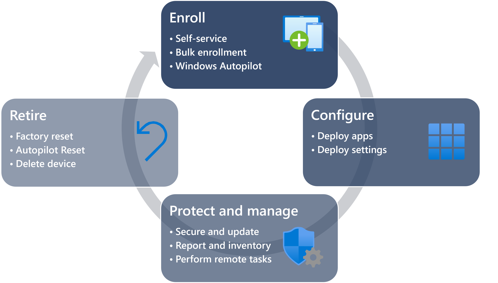

# The powerful simplicity of Microsoft education technology

Our innovative approach to education technology is built on the idea of *powerful simplicity* and combines the unparalleled user experience and security features of Surface Laptop Student Edition (SE), Windows 11 SE, and Microsoft 365 Education. Students can unlock learning and develop new skills with Surface Laptop SE, which seamlessly runs Windows 11 SE—our new, cloud-first operating system—and Microsoft 365 Education. Surface Laptop SE comes preloaded with widely used apps like Microsoft Teams, Word, PowerPoint, Excel, and OneNote, so students are ready to learn right from the start. Likewise, teachers will appreciate how easy it is to develop and deploy their lessons and enrichment experiences, while IT administrators will save time, money, and frustration with comprehensive modern device management. 

## Device lifecycle management

Historically, school IT administrators and educators have struggled to find a simple, flexible, and secure way to manage the lifecycle of the devices in their schools. In response, Microsoft has developed integrated suites of products for streamlined, cost-effective device lifecycle management.

Microsoft 365 Education provides tools and services that enable simplified management of all devices through Microsoft Endpoint Manager (MEM). This gives IT administrators the flexibility to support diverse scenarios, including both school-owned devices and bring-your-own devices. MEM services include [Microsoft Intune](https://docs.microsoft.com/en-us/mem/intune/fundamentals/what-is-intune), [Microsoft Intune for Education](https://www.microsoft.com/education/intune), Configuration Manager, Desktop Analytics, Windows Autopilot, and [Surface Management Portal](https://docs.microsoft.com/en-us/surface/surface-management-portal). These services are part of the Microsoft 365 stack to help secure access, protect data, and manage risk. 

## Why Intune for Education?

Surface Laptop SE with Windows 11 SE can be managed with Intune for Education, enabling simplified management of multiple devices from a single point. With the Set Up School PCs app, you can select Windows 11 SE as the operating system and then create a simple provisioning package. You can also use Windows Autopilot to set up Windows 11 SE devices across your schools. Similarly, Intune for Education provides simple avenues for resetting devices at the end of the school year so that they can be reused the following year. 

From enrollment, through configuration and protection, to resetting, Intune for Education helps school IT administrators manage and optimize the devices across school settings:

- **Enroll.** To enable remote device management as the IT administrator, you need to enroll devices through an account in your tenant. Some methods require you to initiate enrollment, while others require students to complete the initial device setup process. This cookbook discusses the facets of various device enrollment methods.

- **Protect.** In addition to its configuration capabilities, Intune for Education helps protect managed devices from unauthorized access or malicious attacks. For example, adding an extra layer of authentication with Windows Hello can make devices more secure. Policies are available that let you control settings for Windows Firewall, Endpoint Protection, and software updates.
- **Reset.** When it’s time to repurpose a device, Intune for Education offers several methods, including resetting the device, removing it from management, and wiping it of school data. In this cookbook, we cover these and other device return and exchange scenarios. 

For more information, see [Overview of the Microsoft Intune MDM lifecycle](https://docs.microsoft.com/en-us/mem/intune/fundamentals/device-lifecycle).

## Four pillars of modern device management

In the remainder of this cookbook, we will discuss the key concepts and benefits of modern device management with Microsoft 365 solutions for education. The cookbook is organized around the four main pillars of modern device management:

- **Identity management.** Setting up and configuring the identity system, with Microsoft 365 Education and Azure Active Directory as the foundation for user identity and authentication.
- **Initial setup.** Setting up the Intune for Education environment for managing updates, applications, and settings. 
- **Device enrollment.** Setting up Windows 11 SE devices for deployment and enrolling them in Intune for Education.
- **Device reset.** Resetting managed devices with Intune for Education.