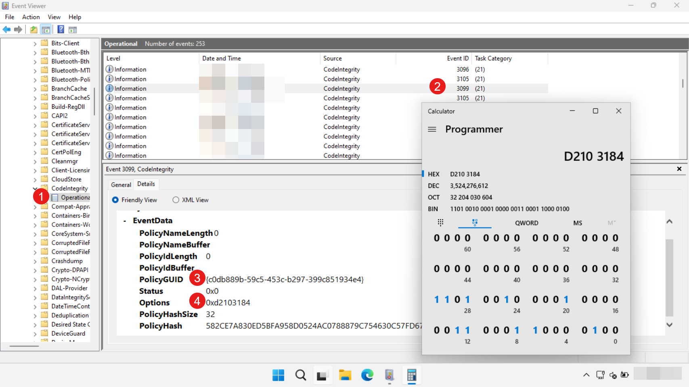
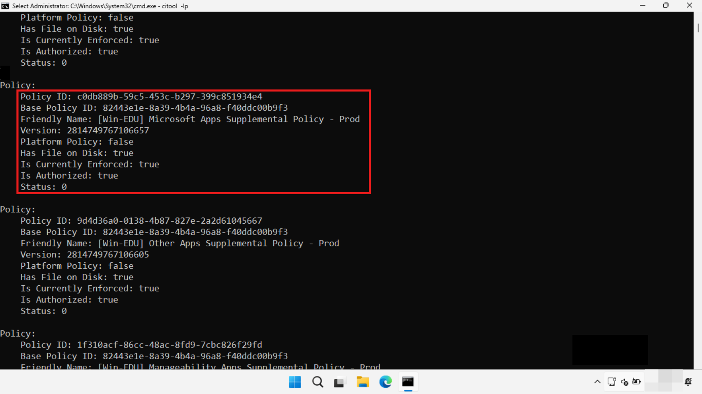
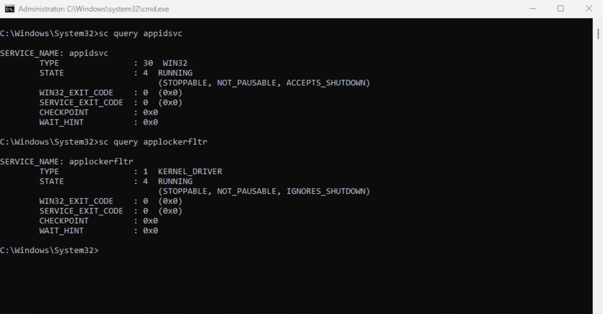

# Troubleshooting guide when deploying apps with Managed Installer

The following table lists common problems and options to resolve them:

| **Problem** | **Potential solution** |
|---|---|
| **App hasn't installed** | <li>Check the type of app:<ul><li>Win32 apps should be able to install with no problem</li><li>UWP and Store apps require writing an additional supplemental policy</li></ul></li><li>Check that the managed installer policies are deployed correctly</li><li>It's possible the app is trying to execute a blocked binary. Check the AppLocker and CodeIntegrity logs in Event Viewer to see if any executables related to the app are being blocked.If so, you'll need to write a supplemental policy to support the app</li><li> Check the Intune Management Extension logs to see if there was an attempt to install your app</li>|
| **App has problems when running** | It's possible the app is trying to execute a blocked binary. <br> Check the *AppLocker* and *CodeIntegrity* logs in Event Viewer to see if any executables related to the app are being blocked. If so, you'll need to write a supplemental policy to support the app. |
| **My supplemental policy hasn't deployed** |<li>Your XML policy is malformed. Double-check to see if all markup is tagged correctly</li><li>Check that your policy was correctly applied. See [AppLocker policy deployment](./Prepare-devices-for-managed-installer-(TAP-ONLY)#applocker-policy-deployment) and verify that the policy with the matching PolicyID has been applied</li>|

## WDAC Supplemental policy validation

Use the Event Viewer to see if a supplemental policy has deployed correctly. These rules apply to both the policy that allows managed installers and any additional supplemental policies that you deploy.

1. Open the *Event viewer* on a target device
1. Expand **Applications and Services** > **Microsoft** > **Windows** > **CodeIntegrity** > **Operational**
1. Look for **event ID 3099**: *the policy was Refreshed and activated*
  - For example: `Refreshed and activated Code Integrity policy {GUID} . id . Status 0x0`
  - The policy that allows managed installers is **`C0DB889B-59C5-453C-B297-399C851934E4`**. Checking that this policy is applied correctly, indicates that a device is setup to allow managed installers (and therefore, can allow installation of Win32 apps via the Intune Management Extension).\
  You can check that the *Managed Installer policy* rule was set in the policy, by checking the *Options* field in the *details* pane.\
  For more information, see: [Understanding Application Control event IDs][WIN-1]

  

You can also verify that the policy has been activated by running the following from the <kbd>Win</kbd> + <kbd>R</kbd> *Run dialog* on a target device as an Administrator (hold <kbd>CTRL</kbd> + <kbd>Shift</kbd> when pressing Enter to run the command):

  ```
  citool.exe -lp
  ```

  - For the policy which allows managed installers to run, a policy with the ID `C0DB889B-59C5-453C-B297-399C851934E4` and Friendly Name *[Win-EDU] Microsoft Apps Supplemental Policy - Prod* should be present, and have *Is Currently Enforced* showing as *true*
  - For any additional policies that you deploy, check that a policy with a matching ID and Friendly Name is shown in the list and the *Is Currently Enforced* and *Is Authorized* properties are both showing as *true*

    


1. Look for **error events** with code **3077**: and reference [Understanding Application Control event IDs][WIN-1]


When checking an error event, you can observe that the information in the *General* tab may show something like the following:

>`Code Integrity determined that a process (\Device\HarddiskVolume3\Windows\System32\svchost.exe) attempted to load` **`\Device\HarddiskVolume3\Program Files\Epic Games\Launcher\Portal\SelfUpdateStaging\Install\Portal\Extras\Redist\LauncherPrereqSetup_x64.exe`** `that did not meet the Enterprise signing level requirements or violated code integrity policy Policy ID:`**`{82443e1e-8a39-4b4a-96a8-f40ddc00b9f3}`**`).`

The important things to parse here are:

- **Failing application**: the path and executable here inform you which application failed. It's important to check that this executable is expected for the application you're validating. (e.g. You would expect zoom.exe to fail for Zoom as opposed to cmd.exe.)
- **Error reason**: indicates why this the application was unable to run. `...did not meet the Enterprise signing level requirements or violated code integrity policy` is what should be seen
- **Policy ID**: is the policy that is being violated, meaning that a rule in this policy is preventing the application from running

> **Note**
>
> **`{82443e1e-8a39-4b4a-96a8-f40ddc00b9f3}`** is the base policy, which is what restricts most third-party apps from running. If you see another policy ID, it's worth taking note of that.

Alternatively you can use `cidiag.exe /stop`, which parses and copies all the relevant events to a text file.

## AppLocker policy validation

> **Note**
>
> The validation process described below requires access to PowerShell, which is not available on production devices.

You can query the existing AppLocker policy via PowerShell running from a device.

```PowerShell
get-applockerpolicy -xml -effective
```

- For the policy that sets the Intune Management Extension as a Managed installer, *MICROSOFT.MANAGEMENT.SERVICES.INTUNEWINDOWSAGENT.EXE* should be nested under a RuleCollection section of Type *ManagedInstaller*
  
- For any policies you added to set additional executables you want to be managed installers, look for the rules you defined nested under a RuleCollection section of Type *ManagedInstaller*

You can check the AppLocker service status with the following commands:
```cmd
sc.exe query appidsvc
sc.exe query applockerfltr
```

When executing the `sc.exe query` commands, the *STATE* property should show a state of *4 RUNNING* for both services:



## AppLocker - MSI and Script

1. Open the **Event Viewer** on a target device
1. Expand **Applications and Services** > **Microsoft** > **Windows** > **AppLocker** > **MSI and Script**
1. Check for **error events** with code *8040*, and reference [Understanding Application Control event IDs][WIN-1]

## Intune Management Extension

- [Collect diagnostics from a Windows device][MEM-1]
- Logs can be collected from `%programdata%\Microsoft\IntuneManagementExtension\Logs`

## Next steps

Advance to the next article to learn about additional considerations before deploying apps with managed installer.

> [!div class="nextstepaction"]
> [Next: considerations >](considerations.md)

[MEM-1]: https://learn.microsoft.com/mem/intune/remote-actions/collect-diagnostics
[WIN-1]: https://learn.microsoft.com/windows/security/threat-protection/windows-defender-application-control/event-id-explanations