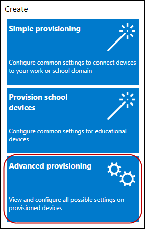
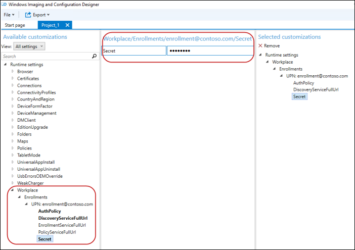
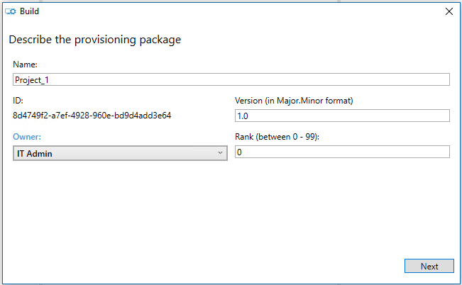
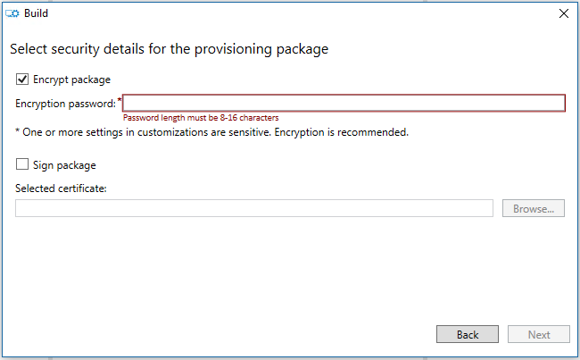
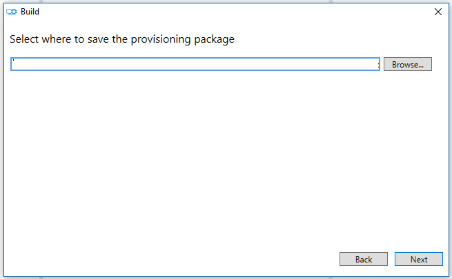
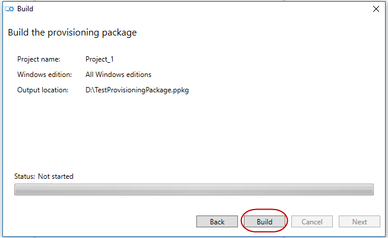
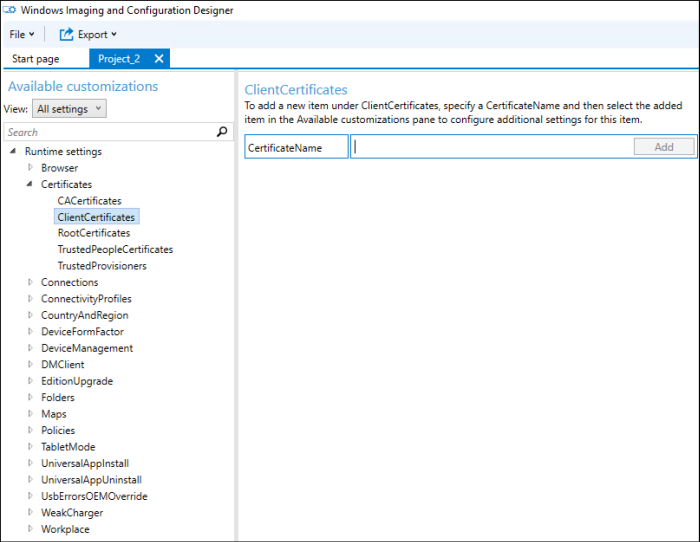

# Bulk enrollment using Windows Configuration Designer

Bulk enrollment is an efficient way to set up a large number of devices to be managed by an MDM server without the need to reimage the devices. You can use the [Provisioning CSP](mdm/provisioning-csp.md) for bulk enrollment, except for the Azure Active Directory Join enrollment scenario.

## Typical use cases

- Set up devices in bulk for large organizations for MDM management.
- Set up kiosks, such as ATMs or point-of-sale (POS) terminals.
- Set up school computers.
- Set up industrial machinery.
- Set handheld POS devices.

On the desktop, you can create an Active Directory account, such as `enrollment@contoso.com` and give it only the ability to join the domain. Once the desktop is joined with that admin account, then standard users in the domain can sign in to use it. This account is especially useful in getting a large number of desktop ready to use within a domain.

On the desktop and mobile devices, you can use an enrollment certificate or enrollment username and password, such as `enroll@contoso.com` and `enrollmentpassword`. These credentials are used in the provisioning package, which you can use to enroll multiple devices to the MDM service. Once the devices are joined, many users can use them.

> [!NOTE]
>
> - Bulk-join is not supported in Azure Active Directory Join.
> - Bulk enrollment does not work in Intune standalone environment.
> - Bulk enrollment works in Microsoft Intune where the ppkg is generated from the Configuration Manager console.
> - To change bulk enrollment settings, login to **Azure AD**, then **Devices**, and then click **Device Settings**. Change the number under **Maximum number of devices per user**.
> - Bulk Token creation is not supported with federated accounts.

## What you need

- Windows devices.
- Windows Configuration Designer (WCD) tool.

    To get the WCD tool, download from the [Microsoft Store](https://www.microsoft.com/store/productId/9NBLGGH4TX22). For more information about the WCD tool, see [Windows Configuration Designer](/windows/configuration/provisioning-packages/provisioning-install-icd) and [Getting started with Windows WCD](/windows/configuration/provisioning-packages/provisioning-install-icd).

- Enrollment credentials (domain account for enrollment, generic enrollment credentials for MDM, enrollment certificate for MDM.).
- Wi-Fi credentials, computer name scheme, and anything else required by your organization.

    Some organizations require custom APNs to be provisioned before talking to the enrollment endpoint or custom VPN to join a domain.

## Create and apply a provisioning package for on-premises authentication

Using the WCD, create a provisioning package using the enrollment information required by your organization. Ensure that you have all the configuration settings.

1. Open the WCD tool.
1. Select **Advanced Provisioning**.

   

1. Enter a project name and select **Next**.
1. Select **All Windows editions**, since Provisioning CSP is common to all Windows editions, then select **Next**.
1. Skip **Import a provisioning package (optional)** and select **Finish**.
1. Expand **Runtime settings** > **Workplace**.
1. Select **Enrollments**, enter a value in **UPN**, and then select **Add**. The UPN is a unique identifier for the enrollment. For bulk enrollment, this UPN must be a service account that is allowed to enroll multiple users, such as `enrollment@contoso.com`.
1. On the left navigation pane, expand the **UPN** and then enter the information for the rest of the settings for enrollment process. Here's the list of available settings:

   - **AuthPolicy** - Select **OnPremise**.
   - **DiscoveryServiceFullUrl** - specify the full URL for the discovery service.
   - **EnrollmentServiceFullUrl** - Optional and in most cases, it should be left blank.
   - **PolicyServiceFullUrl** - Optional and in most cases, it should be left blank.
   - **Secret** - Password

   For detailed descriptions of these settings, see [Provisioning CSP](mdm/provisioning-csp.md). Here's the screenshot of the WCD at this point.

    

1. Configure the other settings, such as the Wi-Fi connections so that the device can join a network before joining MDM (for example, **Runtime settings** > **ConnectivityProfiles** > **WLANSetting**).
1. When you're done adding all the settings, on the **File** menu, select **Save**.
1. On the main menu, select **Export** > **Provisioning package**.

    

1. Enter the values for your package and specify the package output location.

    
    
    

1. Select **Build**.

    

1. Apply the package to some test devices and verify that they work. For more information, see [Apply a provisioning package](#apply-a-provisioning-package).
1. Apply the package to your devices.

## Create and apply a provisioning package for certificate authentication

Using the WCD, create a provisioning package using the enrollment information required by your organization. Ensure that you have all the configuration settings.

1. Open the WCD tool.
1. Select **Advanced Provisioning**.
1. Enter a project name and select **Next**.
1. Select **Common to all Windows editions**, since Provisioning CSP is common to all Windows editions.
1. Skip **Import a provisioning package (optional)** and select **Finish**.
1. Specify the certificate:

   1. Go to **Runtime settings** > **Certificates** > **ClientCertificates**.
   1. Enter a **CertificateName** and then select **Add**.
   1. Enter the **CertificatePassword**.
   1. For **CertificatePath**, browse and select the certificate to be used.
   1. Set **ExportCertificate** to False.
   1. For **KeyLocation**, select **Software only**.

   

1. Specify the workplace settings.

   1. Got to **Workplace** > **Enrollments**.
   1. Enter the **UPN** for the enrollment and then select **Add**. The UPN is a unique identifier for the enrollment. For bulk enrollment, this UPN must be a service account that is allowed to enroll multiple users, such as `enrollment@contoso.com`.
   1. On the left column, expand the **UPN** and then enter the information for the rest of the settings for enrollment process. Here's the list of available settings:
      - **AuthPolicy** - Select **Certificate**.
      - **DiscoveryServiceFullUrl** - specify the full URL for the discovery service.
      - **EnrollmentServiceFullUrl** - Optional and in most cases, it should be left blank.
      - **PolicyServiceFullUrl** - Optional and in most cases, it should be left blank.
      - **Secret** - the certificate thumbprint.

   For detailed descriptions of these settings, see [Provisioning CSP](mdm/provisioning-csp.md).

1. Configure the other settings, such as the Wi-Fi connection so that the device can join a network before joining MDM (for example, **Runtime settings** > **ConnectivityProfiles** > **WLANSetting**).
1. When you're done adding all the settings, on the **File** menu, select **Save**.
1. Export and build the package (steps 10-13 in previous section).
1. Apply the package to some test devices and verify that they work. For more information, see [Apply a provisioning package](#apply-a-provisioning-package).
1. Apply the package to your devices.

## Apply a provisioning package

- [Apply a package during initial setup](/windows/configuration/provisioning-packages/provisioning-apply-package#during-initial-setup)
- [Apply a package after initial setup](/windows/configuration/provisioning-packages/provisioning-apply-package#after-initial-setup)
- [Apply a package directly](/windows/configuration/provisioning-packages/provisioning-apply-package#apply-directly)
- [Apply a package from the Settings app](/windows/configuration/provisioning-packages/provisioning-apply-package#windows-settings).

## Validate that the provisioning package was applied

1. Go to **Settings** > **Accounts** > **Access work or school**.
1. Select **Add or remove a provisioning package**. You should see your package listed.

## Retry logic if there's a failure

- If the provisioning engine receives a failure from a CSP, it retries provisioning three times in a row.
- If all immediate attempts fail, a delayed task is launched to try provisioning again later. It will retry four times at a decaying rate of 15 minutes -> 1 hr -> 4 hr -> "Next System Start". These attempts are run from the SYSTEM context.
- It also retries the provisioning each time it's launched, if started from somewhere else as well.
- In addition, provisioning will be restarted in the SYSTEM context after a sign in and the [system has been idle](/windows/win32/taskschd/task-idle-conditions).

## Related articles

- [Provision PCs with apps and certificates for initial deployment](/windows/configuration/provisioning-packages/provision-pcs-with-apps)
- [Provision PCs with common settings for initial deployment](/windows/configuration/provisioning-packages/provision-pcs-for-initial-deployment)
