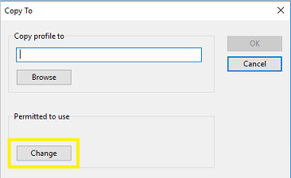
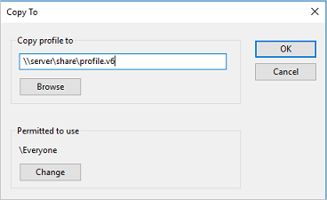

# Create mandatory user profiles

A mandatory user profile is a roaming user profile that has been pre-configured by an administrator to specify settings for users. Settings commonly defined in a mandatory profile include (but aren't limited to) icons that appear on the desktop, desktop backgrounds, user preferences in Control Panel, printer selections, and more. Configuration changes made during a user's session that are normally saved to a roaming user profile aren't saved when a mandatory user profile is assigned.

Mandatory user profiles are useful when standardization is important, such as on a kiosk device or in educational settings. Only system administrators can make changes to mandatory user profiles.

When the server that stores the mandatory profile is unavailable, such as when the user isn't connected to the corporate network, users with mandatory profiles can sign in with the locally cached copy of the mandatory profile, if one exists. Otherwise, the user is signed in with a temporary profile.

User profiles become mandatory profiles when the administrator renames the `NTuser.dat` file (the registry hive) of each user's profile in the file system of the profile server from `NTuser.dat` to `NTuser.man`. The `.man` extension causes the user profile to be a read-only profile.

## Profile extension for each Windows version

The name of the folder in which you store the mandatory profile must use the correct extension for the operating system it applies to. The following table lists the correct extension for each operating system version.

| Client operating system version     | Server operating system version                 | Profile extension |
|-------------------------------------|-------------------------------------------------|-------------------|
| Windows XP                          | Windows Server 2003 </br>Windows Server 2003 R2 | none              |
| Windows Vista</br>Windows 7         | Windows Server 2008 </br>Windows Server 2008 R2 | v2                |
| Windows 8                           | Windows Server 2012                             | v3                |
| Windows 8.1                         | Windows Server 2012 R2                          | v4                |
| Windows 10, versions 1507 and 1511  | N/A                                             | v5                |
| Windows 10, versions 1607 and later | Windows Server 2016 and Windows Server 2019     | v6                |

For more information, see [Deploy Roaming User Profiles, Appendix B](/windows-server/storage/folder-redirection/deploy-roaming-user-profiles#appendix-b-profile-version-reference-information) and [Roaming user profiles versioning in Windows 10 and Windows Server Technical Preview](/troubleshoot/windows-server/user-profiles-and-logon/roaming-user-profiles-versioning).

## Mandatory user profile

First, you create a default user profile with the customizations that you want, run Sysprep with CopyProfile set to **True** in the answer file, copy the customized default user profile to a network share, and then you rename the profile to make it mandatory.

### How to create a default user profile

1. Sign in to a computer running Windows as a member of the local Administrator group. Don't use a domain account.

   > [!NOTE]
   > Use a lab or extra computer running a clean installation of Windows to create a default user profile. Do not use a computer that is required for business (that is, a production computer). This process removes all domain accounts from the computer, including user profile folders.

1. Configure the computer settings that you want to include in the user profile. For example, you can configure settings for the desktop background, uninstall default apps, install line-of-business apps, and so on.

   > [!NOTE]
   > Unlike previous versions of Windows, you cannot apply a Start and taskbar layout using a mandatory profile. For alternative methods for customizing the Start menu and taskbar, see [Related topics](#related-topics).

1. [Create an answer file (Unattend.xml)](/windows-hardware/customize/desktop/wsim/create-or-open-an-answer-file) that sets the [CopyProfile](/windows-hardware/customize/desktop/unattend/microsoft-windows-shell-setup-copyprofile) parameter to **True**. The CopyProfile parameter causes Sysprep to copy the currently signed-on user's profile folder to the default user profile. You can use [Windows System Image Manager](/windows-hardware/customize/desktop/wsim/windows-system-image-manager-technical-reference), which is part of the Windows Assessment and Deployment Kit (ADK) to create the Unattend.xml file.

1. Uninstall any application you don't need or want from the PC. For examples on how to uninstall Windows Application see [Remove-AppxProvisionedPackage](/powershell/module/dism/remove-appxprovisionedpackage?view=win10-ps&preserve-view=true). For a list of uninstallable applications, see [Understand the different apps included in Windows](/windows/application-management/apps-in-windows-10).

   > [!NOTE]
   > It is highly recommended to uninstall unwanted or unneeded apps as it will speed up user sign-in times.

1. At a command prompt, type the following command and press **ENTER**.

   ```cmd
   sysprep /oobe /reboot /generalize /unattend:unattend.xml
   ```

   (Sysprep.exe is located at: `C:\Windows\System32\sysprep`. By default, Sysprep looks for `unattend.xml` in the same folder.)

   > [!TIP]
   > If you receive an error message that says "Sysprep was not able to validate your Windows installation", open `%WINDIR%\System32\Sysprep\Panther\setupact.log` and look for an entry like the following:
   >
   > 
   >
   > Use the [Remove-AppxProvisionedPackage](/powershell/module/dism/remove-appxprovisionedpackage?view=win10-ps&preserve-view=true) and [Remove-AppxPackage -AllUsers](/powershell/module/appx/remove-appxpackage?view=win10-ps&preserve-view=true) cmdlet in Windows PowerShell to uninstall the app that is listed in the log.

1. The sysprep process reboots the PC and starts at the first-run experience screen. Complete the setup, and then sign in to the computer using an account that has local administrator privileges.

1. Right-click Start, go to **Control Panel** (view by large or small icons) > **System** > **Advanced system settings**, and select **Settings** in the **User Profiles** section.

1. In **User Profiles**, select **Default Profile**, and then select **Copy To**.

   

1. In **Copy To**, under **Permitted to use**, select **Change**.

   

1. In **Select User or Group**, in the **Enter the object name to select** field, type `everyone`, select **Check Names**, and then select **OK**.

1. In **Copy To**, in the **Copy profile to** field, enter the path and folder name where you want to store the mandatory profile. The folder name must use the correct [extension](#profile-extension-for-each-windows-version) for the operating system version. For example, the folder name must end with `.v6` to identify it as a user profile folder for Windows 10, version 1607 or later.

   - If the device is joined to the domain and you're signed in with an account that has permissions to write to a shared folder on the network, you can enter the shared folder path.

     

   - If the device isn't joined to the domain, you can save the profile locally, and then copy it to the shared folder location.

1. Select **OK** to copy the default user profile.

### How to make the user profile mandatory

1. In File Explorer, open the folder where you stored the copy of the profile.

   > [!NOTE]
   > If the folder is not displayed, click **View** > **Options** > **Change folder and search options**. On the **View** tab, select **Show hidden files and folders**, clear **Hide protected operating system files**, click **Yes** to confirm that you want to show operating system files, and then click **OK** to save your changes.

1. Rename `Ntuser.dat` to `Ntuser.man`.

### Verify the correct owner for the mandatory profile folders

1. Open the properties of the "profile.v6" folder.
1. Select the **Security** tab and then select **Advanced**.
1. Verify the **Owner** of the folder. It must be the builtin **Administrators** group. To change the owner, you must be a member of the Administrators group on the file server, or have "Set owner" privilege on the server.
1. When you set the owner, select **Replace owner on subcontainers and objects** before you select OK.

## Apply a mandatory user profile to users

In a domain, you modify properties for the user account to point to the mandatory profile in a shared folder residing on the server.

### How to apply a mandatory user profile to users

1. Open **Active Directory Users and Computers** (dsa.msc).
1. Navigate to the user account that you'll assign the mandatory profile to.
1. Right-click the user name and open **Properties**.
1. On the **Profile** tab, in the **Profile path** field, enter the path to the shared folder without the extension. For example, if the folder name is `\\server\share\profile.v6`, you would enter `\\server\share\profile`.
1. Select **OK**.

It may take some time for this change to replicate to all domain controllers.

## Apply policies to improve sign-in time

When a user is configured with a mandatory profile, Windows starts as though it was the first sign-in each time the user signs in. To improve sign-in performance for users with mandatory user profiles, apply the Group Policy settings shown in the following table.

| Group Policy setting                                                                                                                          | Windows 10 | Windows Server 2016 |
|-----------------------------------------------------------------------------------------------------------------------------------------------|:----------:|:-------------------:|
| Computer Configuration > Administrative Templates > System > Logon > **Show first sign-in animation** = Disabled                              | ✅         | ✅                 |
| Computer Configuration > Administrative Templates > Windows Components > Search > **Allow Cortana** = Disabled                                | ✅         | ✅                 |
| Computer Configuration > Administrative Templates > Windows Components > Cloud Content > **Turn off Microsoft consumer experience** = Enabled | ✅         | ❌                 |

> [!NOTE]
> These Group Policy settings can be applied in Windows Professional edition.

## Related articles

- [Manage Windows 10 Start layout and taskbar options](/windows/configuration/windows-10-start-layout-options-and-policies)
- [Lock down Windows 10 to specific apps](/windows/configuration/lock-down-windows-10-to-specific-apps)
- [Windows Spotlight on the lock screen](/windows/configuration/windows-spotlight)
- [Configure devices without MDM](/windows/configuration/configure-devices-without-mdm)
