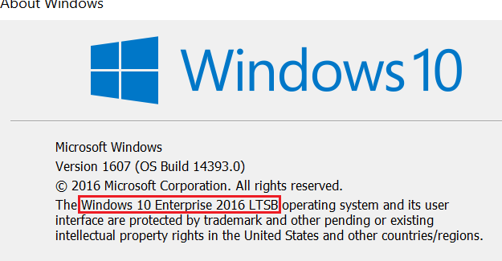

# What version of Windows am I running?

The [Long-Term Servicing Channel](/windows/deployment/update/waas-overview#servicing-channels) (LTSC, formerly LTSB) build of Windows doesn't contain many in-box applications, such as Microsoft Edge, Microsoft Store, Cortana (you do have some limited search capabilities), Microsoft Mail, Calendar, OneNote, Weather, News, Sports, Money, Photos, Camera, Music, and Clock. It's important to remember that the LTSC model is primarily for specialized devices.

In the [General Availability Channel](/windows/deployment/update/waas-overview#servicing-channels), you can set feature updates as soon as Microsoft releases them. This servicing modal is ideal for pilot deployments and to test Windows feature updates and for users like developers who need to work with the latest features immediately. Once you've tested the latest release, you can choose when to roll it out broadly in your deployment.

To determine if your device is enrolled in the Long-Term Servicing Channel or the General Availability Channel, you'll need to know what version of Windows you're running. There are a few ways to figure this out. Each method provides a different set of details, so it's useful to learn about all of them.

## System Properties

Select **Start** > **Settings** > **System**, then select **About**. You'll then see **Edition**, **Version**, and **OS Build** information.

## Using Keyword Search

You can type the following in the search bar and press **ENTER** to see version details for your device.

- **"winver"**:

    

- **"msinfo"** or **"msinfo32"** to open **System Information**:

    

> [!TIP]
> You can also use `winver` or `msinfo32` commands at the command prompt.

## Using Command Prompt or PowerShell

- At the PowerShell or Command Prompt, type `systeminfo | findstr /B /C:"OS Name" /B /C:"OS Version"` and then press **ENTER**

    

- At the PowerShell or Command Prompt, type `slmgr /dlv`, and then press ENTER. The /dlv command displays the detailed licensing information. Notice the output displays "EnterpriseS" as seen in the image below:

    
