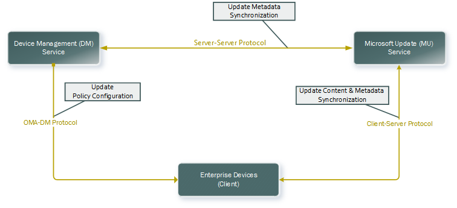
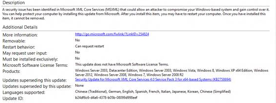
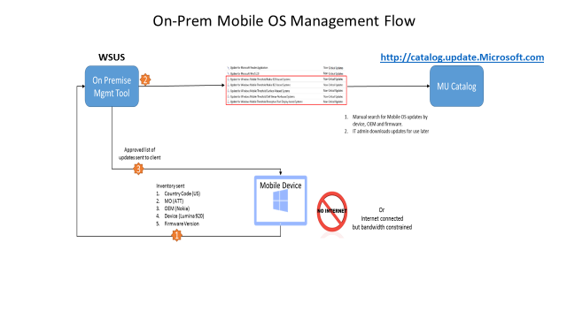
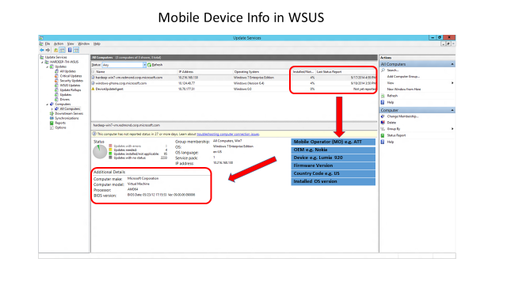
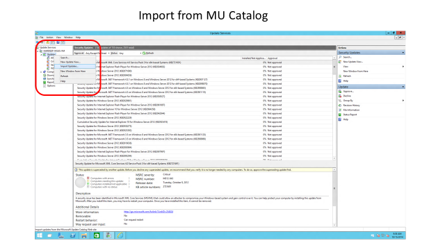
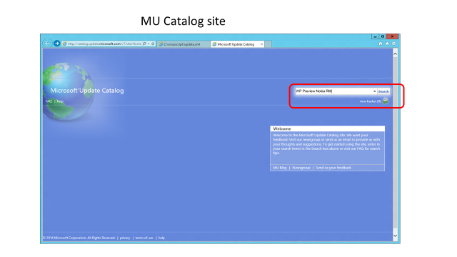
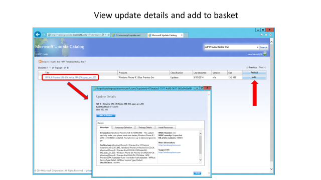
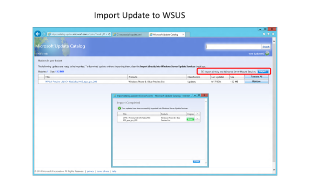
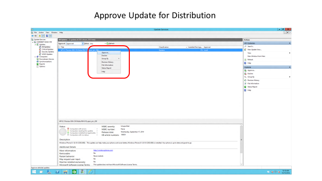

# Mobile device management (MDM) for device updates

>[!TIP]
>If you're not a developer or administrator, you'll find more helpful information in the [Windows Update: Frequently Asked Questions](https://support.microsoft.com/help/12373/windows-update-faq).

With PCs, tablets, phones, and IoT devices, Mobile Device Management (MDM) solutions are becoming prevalent as a lightweight device management technology. In Windows, we're investing heavily in extending the management capabilities available to MDMs. One key feature we're adding is the ability for MDMs to keep devices up to date with the latest Microsoft updates.

In particular, Windows provides APIs to enable MDMs to:

- Ensure machines stay up to date by configuring Automatic Update policies.
- Test updates on a smaller set of machines by configuring which updates are approved for a given device. Then, do an enterprise-wide rollout.
- Get compliance status of managed devices. IT can understand which machines still need a security patch, or how current is a particular machine.
- Configure automatic update policies to ensure devices stay up to date.
- Get device compliance information (the list of updates that are needed but not yet installed).
- Enter a per-device update approval list. The list makes sure devices only install updates that are approved and tested.
- Approve end-user license agreements (EULAs) for the end user so update deployment can be automated even for updates with EULAs.

This article provides independent software vendors (ISV) with the information they need to implement update management in Windows. For more information, see [Policy CSP - Update](mdm/policy-csp-update.md).

> [!NOTE]
> The OMA DM APIs for specifying update approvals and getting compliance status refer to updates by using an Update ID. The Update ID is a GUID that identifies a particular update. The MDM will want to show IT-friendly information about the update, instead of a raw GUID, including the update's title, description, KB, update type, like a security update or service pack. For more information, see [[MS-WSUSSS]: Windows Update Services: Server-Server Protocol](/openspecs/windows_protocols/ms-wsusss/f49f0c3e-a426-4b4b-b401-9aeb2892815c).

The following diagram provides a conceptual overview of how this works:



The diagram can be roughly divided into three areas:

- The Device Management service syncs update information (title, description, applicability) from Microsoft Update using the Server-Server sync protocol (top of the diagram).
- The Device Management service sets automatic update policies, obtains update compliance information, and sets approvals via OMA DM (left portion of the diagram).
- The device gets updates from Microsoft Update using client/server protocol. It only downloads and installs updates that apply to the device and are approved by IT (right portion of the diagram).

## Getting update metadata using the Server-Server sync protocol

The Microsoft Update Catalog contains many updates that aren't needed by MDM-managed devices. It includes updates for legacy software, like updates to servers, down-level desktop operating systems, & legacy apps, and a large number of drivers. We recommend MDMs use the Server-Server sync protocol to get update metadata for updates reported from the client.

This section describes this setup. The following diagram shows the server-server sync protocol process.

:::image type="content" alt-text="mdm server-server sync." source="images/deviceupdateprocess2.png" lightbox="images/deviceupdateprocess2.png":::

MSDN provides much information about the Server-Server sync protocol. In particular:

- It's a SOAP-based protocol, and you can get the WSDL in [Server Sync Web Service](/openspecs/windows_protocols/ms-wsusss/8a3b2470-928a-4bd1-bdcc-8c2bf6b8e863). The WSDL can be used to generate calling proxies for many programming environments, which will simplify your development.
- You can find code samples in [Protocol Examples](/openspecs/windows_protocols/ms-wsusss/2dedbd00-fbb7-46ee-8ee0-aec9bd1ecd2a). The sample code shows raw SOAP commands, which can be used. Although it's even simpler to make the call from a programming language like .NET (calling the WSDL-generated proxies). The stub generated by the Server Sync WSDL from the MSDN link above generates an incorrect binding URL. The binding URL should be set to `https://fe2.update.microsoft.com/v6/ServerSyncWebService/serversyncwebservice.asmx`.

Some important highlights:

- The protocol has an authorization phase (calling GetAuthConfig, GetAuthorizationCookie, and GetCookie). In [Protocol Examples](/openspecs/windows_protocols/ms-wsusss/2dedbd00-fbb7-46ee-8ee0-aec9bd1ecd2a), the **Sample 1: Authorization** code shows how authorization is done. Even though it's called the authorization phase, the protocol is completely open (no credentials are needed to run this phase of the protocol). This sequence of calls needs to be done to obtain a cookie for the main part of the sync protocol. As an optimization, you can cache the cookie and only call this sequence again if your cookie has expired.
- The protocol allows the MDM to sync update metadata for a particular update by calling GetUpdateData. For more information, see [GetUpdateData](/openspecs/windows_protocols/ms-wsusss/c28ad30c-fa3f-4bc6-a747-788391d2d964) in MSDN. The LocURI to get the applicable updates with their revision numbers is `<LocURI>./Vendor/MSFT/Update/InstallableUpdates?list=StructData</LocURI>`. Because not all updates are available via S2S sync, make sure you handle SOAP errors.
- For mobile devices, you can sync metadata for a particular update by calling GetUpdateData. Or, for a local on-premises solution, you can use Windows Server Update Services (WSUS) and manually import the mobile updates from the Microsoft Update Catalog site. For more information, see [Process flow diagram and screenshots of server sync process](#process-flow-diagram-and-screenshots-of-server-sync-process).

> [!NOTE]
> On Microsoft Update, metadata for a given update gets modified over time (updating descriptive information, fixing bugs in applicability rules, localization changes, and so on). Each time such a change is made that doesn't affect the update itself, a new update revision is created. The identity of an update revision is a compound key containing both an UpdateID (GUID) and a RevisionNumber (int). The MDM should not expose the notion of an update revision to IT. Instead, for each UpdateID (GUID) the MDM should just keep the metadata for the later revision of that update (the one with the highest revision number).

### Examples of update metadata XML structure and element descriptions

The response of the GetUpdateData call returns an array of ServerSyncUpdateData that contains the update metadata in the XmlUpdateBlob element. The schema of the update xml is available at [Protocol Examples](/openspecs/windows_protocols/ms-wsusss/2dedbd00-fbb7-46ee-8ee0-aec9bd1ecd2a). Some of the key elements are described below:

- **UpdateID** - The unique identifier for an update
- **RevisionNumber** - Revision number for the update in case the update was modified.
- **CreationDate** - the date on which this update was created.
- **UpdateType** - The type of update, which could include the following:
  - **Detectoid** - if this update identity represents a compatibility logic
  - **Category** - This element could represent either of the following:
    - A Product category the update belongs to. For example, Windows, MS office, and so on.
    - The classification the update belongs to. For example, drivers, security, and so on.
  - **Software** - If the update is a software update.
  - **Driver** - if the update is a driver update.
- **LocalizedProperties** - represents the language the update is available in, title and description of the update. It has the following fields:
  - **Language** - The language code identifier (LCID). For example, en or es.
  - **Title** - Title of the update. For example, "Windows SharePoint Services 3.0 Service Pack 3 x64 Edition (KB2526305)"
  - **Description** - Description of the update. For example, "Windows SharePoint Services 3.0 Service Pack 3 (KB2526305) provides the latest updates to Windows SharePoint Services 3.0. After you install this item, you may have to restart your computer. After you've installed this item, it can't be removed."
- **KBArticleID** - The KB article number for this update that has details about the particular update. For example, `https://support.microsoft.com/kb/2902892`.

### Recommended Flow for Using the Server-Server Sync Protocol

This section describes a possible algorithm for using the server-server sync protocol to pull in update metadata to the MDM.

First some background:

- If you have a multi-tenant MDM, the update metadata can be kept in a shared partition, since it's common to all tenants.
- A metadata sync service can then be implemented. The service periodically calls server-server sync to pull in metadata for the updates IT cares about.
- The MDM component that uses OMA DM to control devices (described in the next section) should send the metadata sync service the list of needed updates it gets from each client, if those updates aren't already known to the device.

The following procedure describes a basic algorithm for a metadata sync service:

1. Create an empty list of "needed update IDs to fault in". This list will get updated by the MDM service component that uses OMA DM. We recommend not adding definition updates to this list, since they're temporary. For example, Defender can release new definition updates many times per day, each of which is cumulative.
1. Sync periodically (we recommend once every 2 hours - no more than once/hour).
   1. Implement the authorization phase of the protocol to get a cookie if you don't already have a non-expired cookie. See **Sample 1: Authorization** in [Protocol Examples](/openspecs/windows_protocols/ms-wsusss/2dedbd00-fbb7-46ee-8ee0-aec9bd1ecd2a).
   1. Implement the metadata portion of the protocol (see **Sample 2: Metadata and Deployments Synchronization** in [Protocol Examples](/openspecs/windows_protocols/ms-wsusss/2dedbd00-fbb7-46ee-8ee0-aec9bd1ecd2a)), and:
     - Call GetUpdateData for all updates in the "needed update IDs to fault in" list if the update metadata hasn't already been pulled into the DB.
       - If the update is a newer revision of an existing update (same UpdateID, higher revision number), replace the previous update metadata with the new one.
       - Remove updates from the "needed update IDs to fault in" list once they've been brought in.

These steps get information about the set of Microsoft Updates that IT needs to manage, so the information can be used in various update management scenarios. For example, at update approval time, you can get information so IT can see what updates they're approving. Or, for compliance reports to see what updates are needed but not yet installed.

## Managing updates using OMA DM

An MDM can manage updates via OMA DM. The details of how to use and integrate an MDM with the Windows OMA DM protocol, and how to enroll devices for MDM management, is documented in [Mobile device management](mobile-device-enrollment.md). This section focuses on how to extend that integration to support update management. The key aspects of update management include the following information:

- Configure automatic update policies to ensure devices stay up to date.
- Get device compliance information (the list of updates that are needed but not yet installed)
- Specify a per-device update approval list. The list makes sure devices only install updates that are approved and tested.
- Approve EULAs for the end user so update deployment can be automated, even for updates with EULAs

The following list describes a suggested model for applying updates.

1. Have a "Test Group" and an "All Group".
1. In the Test group, just let all updates flow.
1. In the All Group, set up Quality Update deferral for seven days. Then, Quality Updates will be auto approved after the seven days. Definition Updates are excluded from Quality Update deferrals, and will be auto approved when they're available. This schedule can be done by setting Update/DeferQualityUpdatesPeriodInDays to seven, and just letting updates flow after seven days or pushing Pause if any issues.

Updates are configured using the [Update Policy CSP](mdm/policy-csp-update.md).

### Update management user experience screenshot

The following screenshots of the administrator console show the list of update titles, approval status, and additional metadata fields.




### SyncML example

Set auto update to notify and defer.

```xml
<SyncML xmlns="SYNCML:SYNCML1.1">
    <SyncBody>
        <Replace xmlns="">
            <CmdID>1</CmdID>
            <Item>
                <Meta>
                    <Format>int</Format>
                    <Type>text/plain</Type>
                </Meta>
                <Target>
                    <LocURI>./Vendor/MSFT/Policy/Config/Update/AllowUpdateService</LocURI>
                </Target>
                <Data>0</Data>
            </Item>
            <CmdID>2</CmdID>
            <Item>
                <Meta>
                    <Format>int</Format>
                    <Type>text/plain</Type>
                </Meta>
                <Target>
                    <LocURI>./Vendor/MSFT/Policy/Config/Update/RequireDeferUpgrade </LocURI>
                </Target>
                <Data>0</Data>
            </Item>
            <CmdID>3</CmdID>
            <Item>
                <Meta>
                    <Format>int</Format>
                    <Type>text/plain</Type>
                </Meta>
                <Target>
                    <LocURI>./Vendor/MSFT/Policy/Config/Update/RequireUpdateApproval </LocURI>
               </Target>
                <Data>0</Data>
            </Item>
        </Replace>
       <Final/>
    </SyncBody>
</SyncML>
```

## Process flow diagram and screenshots of server sync process

The following diagram and screenshots show the process flow of the device update process using Windows Server Update Services and Microsoft Update Catalog.















## Related articles

- [Policy CSP - Update](mdm/policy-csp-update.md)
- [Policy configuration service provider](mdm/policy-configuration-service-provider.md)
