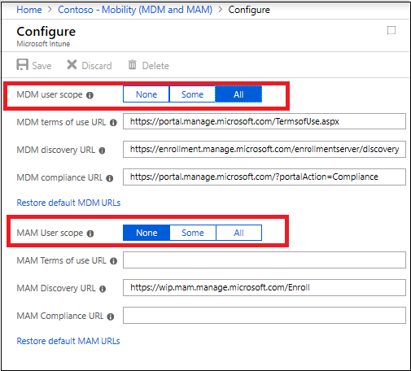
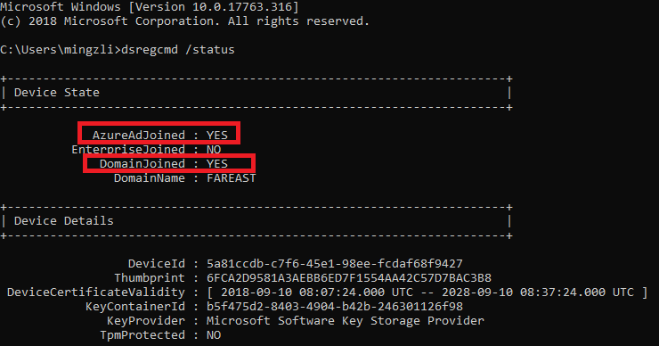
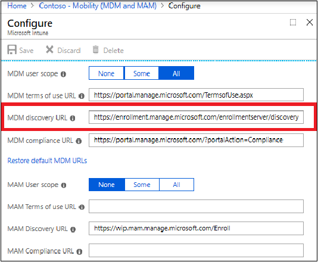

# Diagnose MDM enrollment

This article provides suggestions for troubleshooting device enrollment issues for MDM.

## Verify auto-enrollment requirements and settings

To ensure that the auto-enrollment feature is working as expected, you must verify that various requirements and settings are configured correctly. The following steps demonstrate required settings using the Intune service:

1. Verify that the user who is going to enroll the device has a valid [Intune license](/mem/intune/fundamentals/licenses).

   :::image type="content" alt-text="Intune license verification." source="images/auto-enrollment-intune-license-verification.png" lightbox="images/auto-enrollment-intune-license-verification.png":::

1. Verify that auto-enrollment is activated for those users who are going to enroll the devices into Mobile Device Management (MDM) with Intune. For more information, see [Azure AD and Microsoft Intune: Automatic MDM enrollment in the new Portal](./azure-ad-and-microsoft-intune-automatic-mdm-enrollment-in-the-new-portal.md).

    

    > [!IMPORTANT]
    > For bring-your-own devices (BYOD devices), the Mobile Application Management (MAM) user scope takes precedence if both MAM user scope and MDM user scope (automatic MDM enrollment) are enabled for all users (or the same groups of users). The device will use Windows Information Protection (WIP) Policies (if you configured them) rather than being MDM enrolled.
    >
    > For corporate-owned devices, the MDM user scope takes precedence if both scopes are enabled. The devices get MDM enrolled.

1. Verify that the device OS version is Windows 10, version 1709 or later.

1. Auto-enrollment into Intune via Group Policy is valid only for devices that are hybrid Azure AD joined. This condition means that the device must be joined into both local Active Directory and Azure Active Directory. To verify that the device is hybrid Azure AD joined, run `dsregcmd /status` from the command line.

    You can confirm that the device is properly hybrid-joined if both **AzureAdJoined** and **DomainJoined** are set to **YES**.

    

    Additionally, verify that the SSO State section displays **AzureAdPrt** as **YES**.

    

    This information can also be found on the Azure AD device list.

    

1. Verify that the MDM discovery URL during auto-enrollment is `https://enrollment.manage.microsoft.com/enrollmentserver/discovery.svc`.

    

1. Some tenants might have both **Microsoft Intune** and **Microsoft Intune Enrollment** under **Mobility**. Make sure that your auto-enrollment settings are configured under **Microsoft Intune** instead of **Microsoft Intune Enrollment**.

   :::image type="content" alt-text="Mobility setting MDM intune." source="images/auto-enrollment-microsoft-intune-setting.png" lightbox="images/auto-enrollment-microsoft-intune-setting.png":::

1. Verify that the *Enable Automatic MDM enrollment using default Azure AD credentials* group policy (**Local Group Policy Editor > Computer Configuration > Policies > Administrative Templates > Windows Components > MDM**) is properly deployed to all devices that should be enrolled into Intune. You may contact your domain administrators to verify if the group policy has been deployed successfully.

1. Verify that Microsoft Intune should allow enrollment of Windows devices.

   :::image type="content" alt-text="Enrollment of Windows devices." source="images/auto-enrollment-enrollment-of-windows-devices.png" lightbox="images/auto-enrollment-enrollment-of-windows-devices.png":::

## Troubleshoot auto-enrollment using group policy

Investigate the logs if you have issues even after performing all the mandatory verification steps. The first log file to investigate is the event log on the target Windows device. To collect Event Viewer logs:

1. Open Event Viewer.

1. Navigate to **Applications and Services Logs** > **Microsoft** > **Windows** > **DeviceManagement-Enterprise-Diagnostic-Provider** > **Admin**.

    > [!TIP]
    > For guidance on how to collect event logs for Intune, see [Collect MDM Event Viewer Log YouTube video](https://www.youtube.com/watch?v=U_oCe2RmQEc).

1. Search for event ID 75, which represents a successful auto-enrollment. Here's an example screenshot that shows the auto-enrollment completed successfully:

   :::image type="content" alt-text="Event ID 75." source="images/auto-enrollment-troubleshooting-event-id-75.png"  lightbox="images/auto-enrollment-troubleshooting-event-id-75.png":::

If you can't find event ID 75 in the logs, it indicates that the auto-enrollment failed. This failure can happen because of the following reasons:

- The enrollment failed with error. In this case, search for event ID 76, which represents failed auto-enrollment. Here's an example screenshot that shows that the auto-enrollment failed:

   :::image type="content" alt-text="Event ID 76." source="images/auto-enrollment-troubleshooting-event-id-76.png" lightbox="images/auto-enrollment-troubleshooting-event-id-76.png":::

   To troubleshoot, check the error code that appears in the event. For more information, see [Troubleshooting Windows device enrollment problems in Microsoft Intune](/troubleshoot/mem/intune/troubleshoot-windows-enrollment-errors).

- The auto-enrollment didn't trigger at all. In this case, you'll not find either event ID 75 or event ID 76. To know the reason, you must understand the internal mechanisms happening on the device as described below:

   The auto-enrollment process is triggered by a task (**Microsoft** > **Windows** > **EnterpriseMgmt**) within the task-scheduler. This task appears if the *Enable automatic MDM enrollment using default Azure AD credentials* group policy (**Computer Configuration** > **Policies** > **Administrative Templates** > **Windows Components** > **MDM**) is successfully deployed to the target machine as shown in the following screenshot:

   :::image type="content" alt-text="Task scheduler." source="images/auto-enrollment-task-scheduler.png" lightbox="images/auto-enrollment-task-scheduler.png":::

   > [!NOTE]
   > This task isn't visible to standard users, run Scheduled Tasks with administrative credentials to find the task.

   This task runs every 5 minutes for the duration of one day. To confirm if the task succeeded, check the task scheduler event logs: **Applications and Services Logs > Microsoft > Windows > Task Scheduler > Operational**. Look for an entry where the task scheduler created by enrollment client for automatically enrolling in MDM from Azure Active Directory is triggered by event ID 107.

   :::image type="content" alt-text="Event ID 107." source="images/auto-enrollment-event-id-107.png" lightbox="images/auto-enrollment-event-id-107.png":::

   When the task is completed, a new event ID 102 is logged.

   :::image type="content" alt-text="Event ID 102." source="images/auto-enrollment-event-id-102.png" lightbox="images/auto-enrollment-event-id-102.png":::

   The task scheduler log displays event ID 102 (task completed) regardless of the auto-enrollment success or failure. This status-display means that the task scheduler log is only useful to confirm if the auto-enrollment task is triggered or not. It doesn't indicate the success or failure of auto-enrollment.

   If you can't see from the log that task Schedule created by enrollment client for automatically enrolling in MDM from Azure AD is initiated, there's possibly an issue with the group policy. Immediately run the command `gpupdate /force` in a command prompt to get the group policy object applied. If this step still doesn't help, further troubleshooting on Active Directory is required.
   One frequently seen error is related to some outdated enrollment entries in the registry on the target client device (**HKLM > Software > Microsoft > Enrollments**). If a device has been enrolled (can be any MDM solution and not only Intune), some enrollment information added into the registry is seen:

   :::image type="content" alt-text="Outdated enrollment entries." source="images/auto-enrollment-outdated-enrollment-entries.png" lightbox="images/auto-enrollment-outdated-enrollment-entries.png":::

   By default, these entries are removed when the device is un-enrolled, but occasionally the registry key remains even after un-enrollment. In this case, `gpupdate /force` fails to initiate the auto-enrollment task and error code 2149056522 is displayed in the **Applications and Services Logs** > **Microsoft** > **Windows** > **Task Scheduler** > **Operational** event log file under event ID 7016.

   A resolution to this issue is to remove the registry key manually. If you don't know which registry key to remove, go for the key that displays most entries as the screenshot above. All other keys will display fewer entries as shown in the following screenshot:

   :::image type="content" alt-text="Manually deleted entries." source="images/auto-enrollment-activation-verification-less-entries.png" lightbox="images/auto-enrollment-activation-verification-less-entries.png":::
