# MDM enrollment of Windows devices

In today's cloud-first world, enterprise IT departments increasingly want to let employees use their own devices, or even choose and purchase corporate-owned devices. Connecting your devices to work makes it easy for you to access your organization's resources, such as apps, the corporate network, and email.

> [!NOTE]
> When you connect your device using mobile device management (MDM) enrollment, your organization may enforce certain policies on your device.

## Connect corporate-owned Windows devices

You can connect corporate-owned devices to work by either joining the device to an Active Directory domain, or to a Microsoft Entra domain. Windows doesn't require a personal Microsoft account on devices joined to Microsoft Entra ID or an on-premises Active Directory domain.

> [!NOTE]
> For devices joined to on-premises Active Directory, see [Group policy enrollment](enroll-a-windows-10-device-automatically-using-group-policy.md).

### Connect your device to a Microsoft Entra domain (join Microsoft Entra ID)

All Windows devices can be connected to a Microsoft Entra domain. These devices can be connected during OOBE. Additionally, desktop devices can be connected to a Microsoft Entra domain using the Settings app.

#### Out-of-box-experience

To join a domain:

1. Select **My work or school owns it**, then select **Next.**

    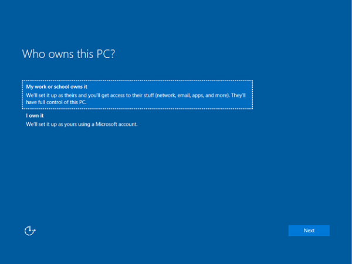

1. Select **Join Microsoft Entra ID**, and then select **Next.**

    

1. Type in your Microsoft Entra username. This username is the email address you use to log into Microsoft Office 365 and similar services.

    If the tenant is a cloud-only, password hash sync, or pass-through authentication tenant, this page changes to show the organization's custom branding, and you're able to enter your password directly on this page. If the tenant is part of a federated domain, you're redirected to the organization's on-premises federation server, such as Active Directory Federation Services (AD FS) for authentication.

    Based on IT policy, you may also be prompted to provide a second factor of authentication at this point.

    If your Microsoft Entra tenant has autoenrollment configured, your device also gets enrolled into MDM during this flow. For more information, see [these steps](azure-ad-and-microsoft-intune-automatic-mdm-enrollment-in-the-new-portal.md). If your tenant isn't configured for autoenrollment, you must go through the enrollment flow a second time to [connect your device to MDM](#enroll-in-device-management-only). After you complete the flow, your device will be connected to your organization's Microsoft Entra domain.

    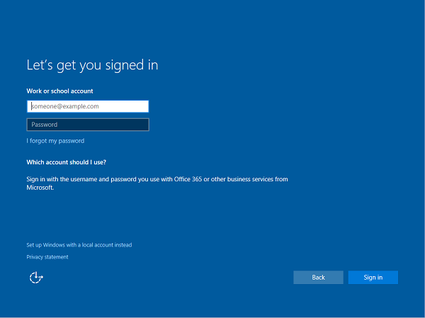

#### Use the Settings app

To create a local account and connect the device:

1. Launch the Settings app.

    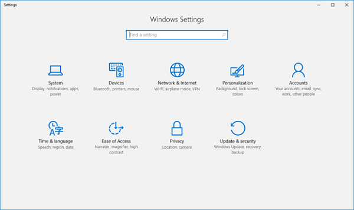

1. Next, navigate to **Accounts**.

    

1. Navigate to **Access work or school**.

    

1. Select **Connect**.

    

1. Under **Alternate Actions**, select **Join this device to Microsoft Entra ID**.

    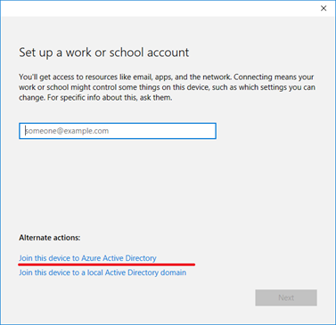

1. Type in your Microsoft Entra username. This username is the email address you use to log into Office 365 and similar services.

    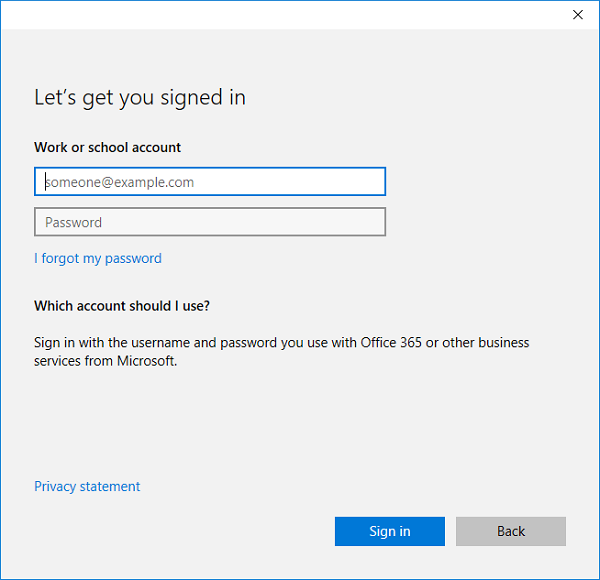

    If the tenant is a cloud-only, password hash sync, or pass-through authentication tenant, this page changes to show the organization's custom branding, and you can enter your password directly on this page. If the tenant is part of a federated domain, you're redirected to the organization's on-premises federation server, such as AD FS, for authentication.

    Based on IT policy, you may also be prompted to provide a second factor of authentication at this point.

    If your Microsoft Entra tenant has autoenrollment configured, your device also gets enrolled into MDM during this flow. For more information, see [this blog post](https://blogs.technet.microsoft.com/enterprisemobility/2015/08/14/windows-10-azure-ad-and-microsoft-intune-automatic-mdm-enrollment-powered-by-the-cloud/). If your tenant isn't configured for autoenrollment, you must go through the enrollment flow a second time to connect your device to MDM.

    After you reach the end of the flow, your device should be connected to your organization's Microsoft Entra domain. You may now sign out of your current account and sign in using your Microsoft Entra username.

    

#### Help with connecting to a Microsoft Entra domain

There are a few instances where your device can't be connected to a Microsoft Entra domain.

| Connection issue | Description |
|--|--|
| Your device is connected to a Microsoft Entra domain. | Your device can only be connected to a single Microsoft Entra domain at a time. |
| Your device is already connected to an Active Directory domain. | Your device can either be connected to a Microsoft Entra domain or an Active Directory domain. You can't connect to both simultaneously. |
| Your device already has a user connected to a work account. | You can either connect to a Microsoft Entra domain or connect to a work or school account. You can't connect to both simultaneously. |
| You're logged in as a standard user. | Your device can only be connected to a Microsoft Entra domain if you're logged in as an administrative user. You must switch to an administrator account to continue. |
| Your device is already managed by MDM. | The connect to Microsoft Entra ID flow attempts to enroll your device into MDM if your Microsoft Entra tenant has a preconfigured MDM endpoint. Your device must be unenrolled from MDM to be able to connect to Microsoft Entra ID in this case. |
| Your device is running Home edition. | This feature isn't available on Windows Home edition, so you can't connect to a Microsoft Entra domain. You must upgrade to Pro, Enterprise, or Education edition to continue. |

## Connect personally owned devices

Personally owned devices, also known as bring your own device (BYOD), can be connected to a work or school account, or to MDM. Windows devices don't require a personal Microsoft account on devices to connect to work or school.

All Windows devices can be connected to a work or school account. You can connect to a work or school account either through the Settings app or through any of the numerous Universal Windows Platform (UWP) apps, such as the universal Office apps.

### Register device in Microsoft Entra ID and enroll in MDM

To create a local account and connect the device:

1. Launch the Settings app, and then select **Accounts** >**Start** > **Settings** > **Accounts**.

    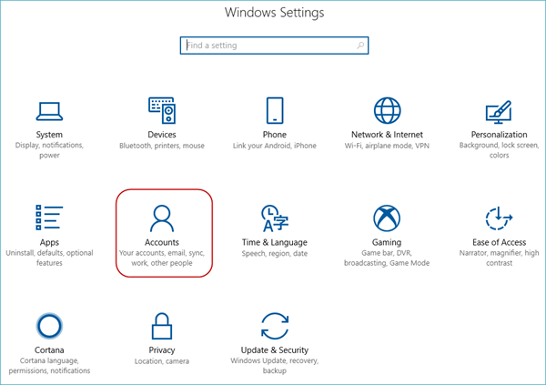

1. Navigate to **Access work or school**.

    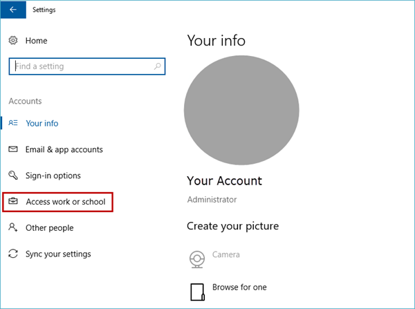

1. Select **Connect**.

    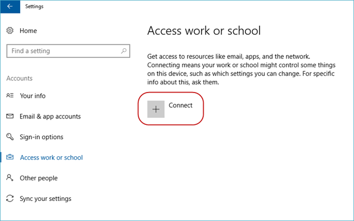

1. Type in your Microsoft Entra username. This username is the email address you use to log into Office 365 and similar services.

    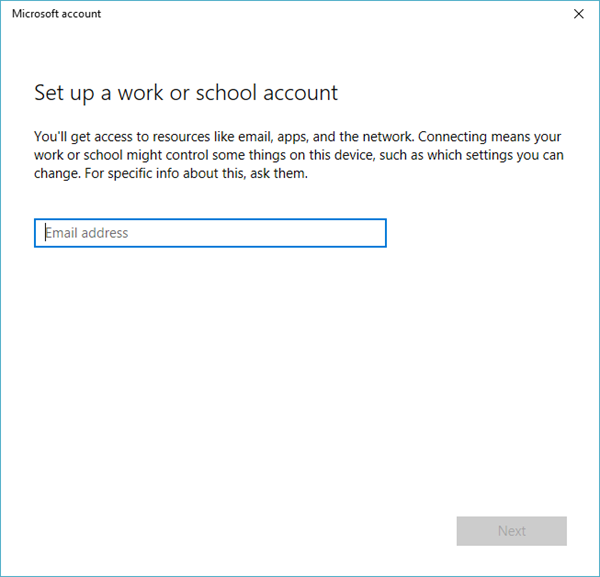

1. If the tenant is a cloud-only, password hash sync, or pass-through authentication tenant, this page changes to show the organization's custom branding, and can enter your password directly into the page. If the tenant is part of a federated domain, you're redirected to the organization's on-premises federation server, such as AD FS, for authentication.

    Based on IT policy, you may also be prompted to provide a second factor of authentication at this point.

    If your Microsoft Entra tenant has autoenrollment configured, your device also gets enrolled into MDM during this flow. For more information, see [this blog post](https://blogs.technet.microsoft.com/enterprisemobility/2015/08/14/windows-10-azure-ad-and-microsoft-intune-automatic-mdm-enrollment-powered-by-the-cloud/). If your tenant isn't configured for autoenrollment, you must go through the enrollment flow a second time to [connect your device to MDM](#enroll-in-device-management-only).

    You can see the status page that shows the progress of your device being set up.

    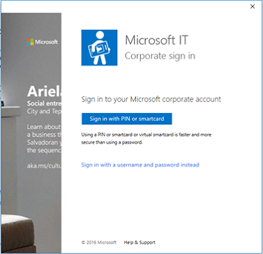

1. After you complete the flow, your Microsoft account will be connected to your work or school account.

    

### Help with connecting personally owned devices

There are a few instances where your device may not be able to connect to work.

| Error Message | Description |
|--|--|
| Your device is already connected to your organization's cloud. | Your device is already connected to either Microsoft Entra ID, a work or school account, or an AD domain. |
| We couldn't find your identity in your organization's cloud. | The username you entered wasn't found on your Microsoft Entra tenant. |
| Your device is already being managed by an organization. | Your device is either already managed by MDM or Microsoft Configuration Manager. |
| You don't have the right privileges to perform this operation. Talk to your admin. | You can't enroll your device into MDM as a standard user. You must be on an administrator account. |
| We couldn't autodiscover a management endpoint matching the username entered. Check your username and try again. If you know the URL to your management endpoint, enter it. | You need to provide the server URL for your MDM or check the spelling of the username you entered. |

## Enroll in device management only

All Windows devices can be connected to MDM. You can connect to an MDM through the Settings app. To create a local account and connect the device:

1. Launch the Settings app.

   

1. Next, navigate to **Accounts**.

   

1. Navigate to **Access work or school**.

   

1. Select the **Enroll only in device management** link.

   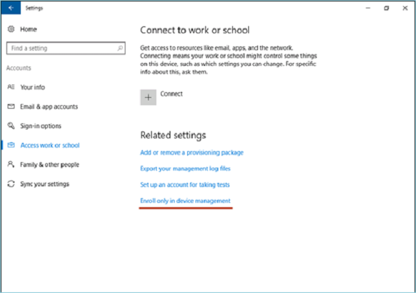

1. Type in your work email address.

   

1. If the device finds an endpoint that only supports on-premises authentication, this page changes and ask you for your password. If the device finds an MDM endpoint that supports federated authentication, you're presented with a new window that asks you for more authentication information.

   Based on IT policy, you may also be prompted to provide a second factor of authentication at this point. You can see the enrollment progress on screen.

   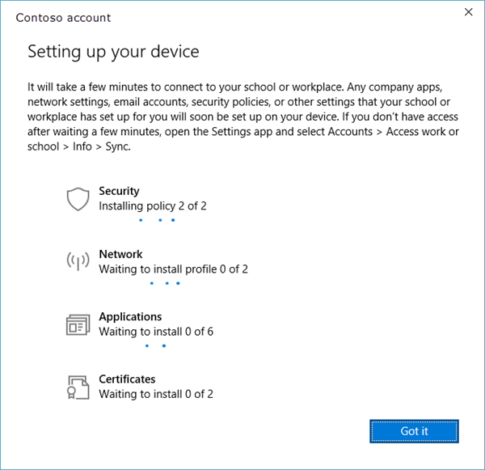

   After you complete the flow, your device is connected to your organization's MDM.

## Connect your Windows device to work using a deep link

Windows devices may be connected to work using a deep link. Users can select or open a link in a particular format from anywhere in Windows, and be directed to the new enrollment experience.

The deep link used for connecting your device to work uses the following format.

**ms-device-enrollment:?mode={mode\_name}**:

| Parameter | Description | Supported Value for Windows |
|--|--|--|
| mode | Describes which mode is executed in the enrollment app. | Mobile Device Management (MDM), Adding Work Account (AWA), and Microsoft Entra joined. |
| username | Specifies the email address or UPN of the user who should be enrolled into MDM. | string |
| servername | Specifies the MDM server URL that is used to enroll the device. | string |
| accesstoken | Custom parameter for MDM servers to use as they see fit. Typically, this parameter's value can be used as a token to validate the enrollment request. | string |
| deviceidentifier | Custom parameter for MDM servers to use as they see fit. Typically, this parameter's value can be used to pass in a unique device identifier. | GUID |
| tenantidentifier | Custom parameter for MDM servers to use as they see fit. Typically, this parameter's value can be used to identify which tenant the device or user belongs to. | GUID or string |
| ownership | Custom parameter for MDM servers to use as they see fit. Typically, this parameter's value can be used to determine whether the device is BYOD or Corp Owned. | 1, 2, or 3. Where "1" means ownership is unknown, "2" means the device is personally owned, and "3" means the device is corporate-owned |

### Connect to MDM using a deep link

> [!NOTE]
> Deep links only work with Internet Explorer or Microsoft Edge browsers. Examples of URI's that may be used to connect to MDM using a deep link:
>
> - **ms-device-enrollment:?mode=mdm**
> - **ms-device-enrollment:?mode=mdm&username=`someone@example.com`&servername=`https://example.server.com`**

To connect your devices to MDM using deep links:

1. Create a link to launch the built-in enrollment app using the URI **ms-device-enrollment:?mode=mdm**, and user-friendly display text, such as **Click here to connect Windows to work**:

    This link launches the flow equivalent to the Enroll into the device management option.

    - IT admins can add this link to a welcome email that users can select to enroll into MDM.

      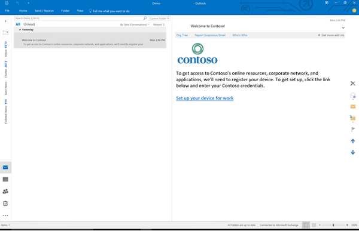

      > [!NOTE]
      > Ensure that your email filters do not block deep links.

    - IT admins can also add this link to an internal web page that users refer to enrollment instructions.

1. After you select the link or run it, Windows launches the enrollment app in a special mode that only allows MDM enrollments (similar to the Enroll into device management option).

    Type in your work email address.

    

1. If the device finds an endpoint that only supports on-premises authentication, this page changes and asks you for your password. If the device finds an MDM endpoint that supports federated authentication, you're presented with a new window that asks for more authentication information. Based on IT policy, you may also be prompted to provide a second factor of authentication at this point.

    After you complete the flow, your device will be connected to your organization's MDM.

    

## Manage connections

To manage your work or school connections, select **Settings** > **Accounts** > **Access work or school**. Your connections are displayed on this page and selecting one expands options for that connection.

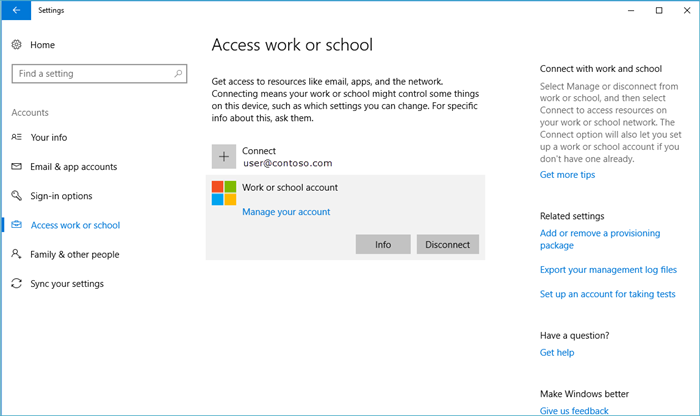

### Info

The **Info** button can be found on work or school connections involving MDM. This button is included in the following scenarios:

- Connecting your device to a Microsoft Entra domain that has autoenroll into MDM configured.
- Connecting your device to a work or school account that has autoenroll into MDM configured.
- Connecting your device to MDM.

Selecting the **Info** button opens a new page in the Settings app that provides details about your MDM connection. You're able to view your organization's support information (if configured) on this page. You can also start a sync session that forces your device to communicate to the MDM server and fetch any updates to policies if needed.

Selecting the **Info** button shows a list of policies and line-of-business apps installed by your organization. Here's an example screenshot.

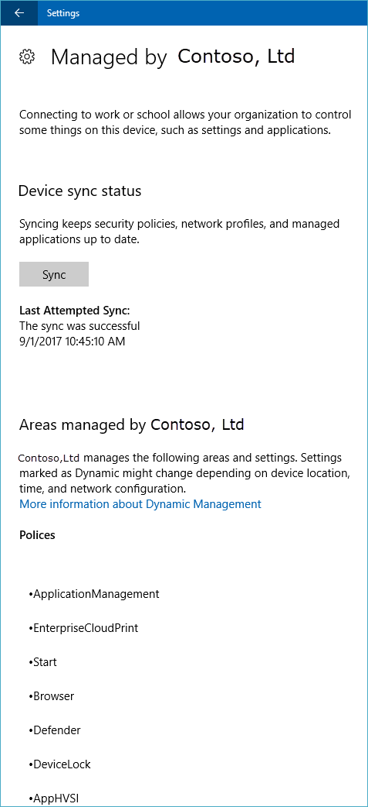

### Disconnect

The **Disconnect** button can be found on all work connections. Generally, selecting the **Disconnect** button removes the connection from the device. There are a few exceptions to this functionality:

- Devices that enforce the AllowManualMDMUnenrollment policy don't allow users to remove MDM enrollments. These connections must be removed by a server-initiated unenroll command.
- On mobile devices, you can't disconnect from Microsoft Entra ID. These connections can only be removed by wiping the device.

> [!WARNING]
> Disconnecting might result in the loss of data on the device.

## Collecting diagnostic logs

You can collect diagnostic logs around your work connections by going to **Settings** > **Accounts** > **Access work or school**, and then selecting the **Export your management logs** link under **Related Settings**. Next, select **Export**, and follow the path displayed to retrieve your management log files.

You can get the advanced diagnostic report by going to **Settings** > **Accounts** > **Access work or school**, and selecting the **Info** button. At the bottom of the Settings page, you see the button to create a report.

For more information, see [Collect MDM logs](mdm-collect-logs.md).
