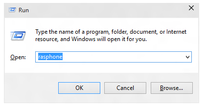
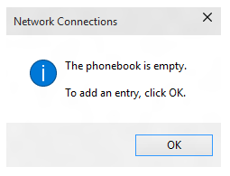
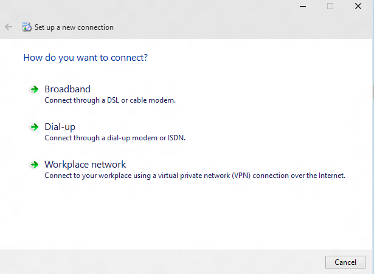
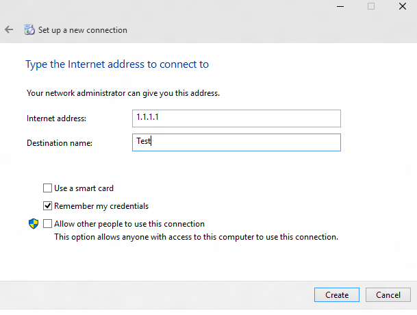
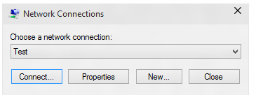
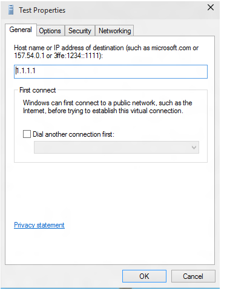
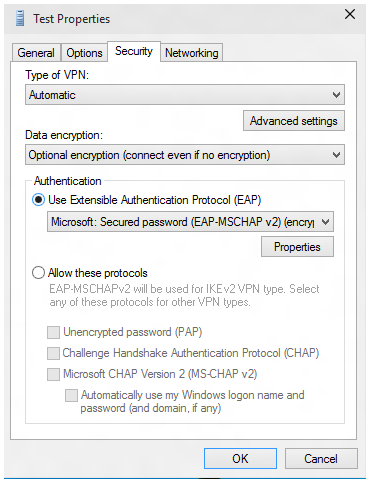
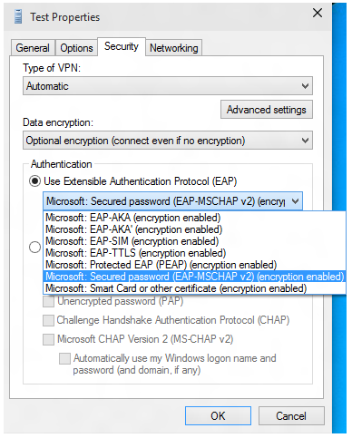
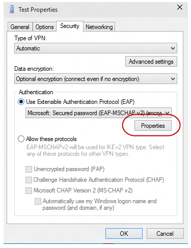
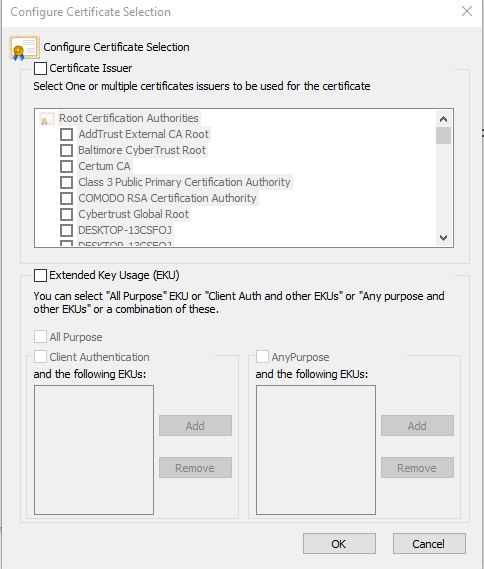

# EAP configuration

This article provides a step-by-step guide for creating an Extensible Authentication Protocol (EAP) configuration XML for a VPN profile, including information about EAP certificate filtering in Windows 10.

## Create an EAP configuration XML for a VPN profile

To get the EAP configuration from your desktop using the rasphone tool that is shipped in the box:

1.  Run rasphone.exe.

    

1.  If you don't currently have a VPN connection and you see the following message, select **OK**.

    

1.  In the wizard, select **Workplace network**.

    

1.  Enter an Internet address and connection name. These details can be fake since it doesn't impact the authentication parameters.

    

1.  Create a fake VPN connection. In the UI shown here, select **Properties**.

    

1.  In the **Test Properties** dialog, select the **Security** tab.

    

1.  On the **Security** tab, select **Use Extensible Authentication Protocol (EAP)**.

    

1.  From the drop-down menu, select the EAP method that you want to configure, and then select **Properties** to configure as needed.

    

1.  Switch over to PowerShell and use the following cmdlets to retrieve the EAP configuration XML.

    ```powershell
    Get-VpnConnection -Name Test
    ```

    <a href="" id="pow"></a>Here's an example output.

    ``` syntax
    Name                  : Test
    ServerAddress         : 1.1.1.1
    AllUserConnection     : False
    Guid                  : {EC87F6C9-8823-416C-B92B-517D592E250F}
    TunnelType            : Automatic
    AuthenticationMethod  : {Eap}
    EncryptionLevel       : Optional
    L2tpIPsecAuth         : Certificate
    UseWinlogonCredential : False
    EapConfigXmlStream    : #document
    ConnectionStatus      : Disconnected
    RememberCredential    : True
    SplitTunneling        : False
    DnsSuffix             :
    IdleDisconnectSeconds : 0
    ```

    ```powershell
    $a = Get-VpnConnection -Name Test
    ```

    ```powershell
    $a.EapConfigXmlStream.InnerXml
    ```

    Here's an example output.

    ```xml
    <EapHostConfig xmlns="http://www.microsoft.com/provisioning/EapHostConfig"><EapMethod><Type xmlns="http://www.microsoft.co
    m/provisioning/EapCommon">13</Type><VendorId xmlns="http://www.microsoft.com/provisioning/EapCommon">0</VendorId><VendorTy
    pe xmlns="http://www.microsoft.com/provisioning/EapCommon">0</VendorType><AuthorId xmlns="http://www.microsoft.com/provisi
    oning/EapCommon">0</AuthorId></EapMethod><Config xmlns="http://www.microsoft.com/provisioning/EapHostConfig"><Eap xmlns="h
    ttp://www.microsoft.com/provisioning/BaseEapConnectionPropertiesV1"><Type>13</Type><EapType xmlns="http://www.microsoft.co
    m/provisioning/EapTlsConnectionPropertiesV1"><CredentialsSource><CertificateStore><SimpleCertSelection>true</SimpleCertSel
    ection></CertificateStore></CredentialsSource><ServerValidation><DisableUserPromptForServerValidation>false</DisableUserPr
    omptForServerValidation><ServerNames></ServerNames></ServerValidation><DifferentUsername>false</DifferentUsername><Perform
    ServerValidation xmlns="http://www.microsoft.com/provisioning/EapTlsConnectionPropertiesV2">true</PerformServerValidation>
    <AcceptServerName xmlns="http://www.microsoft.com/provisioning/EapTlsConnectionPropertiesV2">true</AcceptServerName><TLSEx
    tensions xmlns="http://www.microsoft.com/provisioning/EapTlsConnectionPropertiesV2"><FilteringInfo xmlns="http://www.micro
    soft.com/provisioning/EapTlsConnectionPropertiesV3"><ClientAuthEKUList Enabled="true" /><AnyPurposeEKUList Enabled="true"
    /></FilteringInfo></TLSExtensions></EapType></Eap></Config></EapHostConfig>
    ```

    > [!NOTE]
    > You should check with Mobile Device Management (MDM) vendor, if you need to pass this XML in escaped format. The XSDs for all EAP methods are shipped in the box and can be found at the following locations:
    > -   C:\\Windows\\schemas\\EAPHost
    > -   C:\\Windows\\schemas\\EAPMethods


## EAP certificate filtering

In your deployment, if you have multiple certificates provisioned on the device and the Wi-Fi profile provisioned doesn't have a strict filtering criteria, you might see connection failures when connecting to Wi-Fi. The solution is to ensure that the Wi-Fi profile provisioned has strict filtering criteria so that it matches only one certificate.

Enterprises deploying certificate-based EAP authentication for VPN and Wi-Fi can encounter a situation where there are multiple certificates that meet the default criteria for authentication. This situation can lead to issues such as:

-   The user might be prompted to select the certificate.
-   The wrong certificate might be auto-selected and cause an authentication failure.

A production ready deployment must have appropriate certificate details as part of the profile being deployed. The following information explains how to create or update an EAP configuration XML such that the extraneous certificates are filtered out and appropriate certificate can be used for the authentication.

EAP XML must be updated with relevant information for your environment. This task can be done manually by editing the following XML sample or by using the step-by-step UI guide. After the EAP XML is updated, refer to instructions from your MDM to deploy the updated configuration as follows:

-   For Wi-Fi, look for the `<EAPConfig>` section of your current WLAN Profile XML. (This section is what you specify for the WLanXml node in the Wi-Fi CSP.) Within these tags, you'll find the complete EAP configuration. Replace the section under `<EAPConfig>` with your updated XML and update your Wi-Fi profile. You can refer to your MDM’s guidance on how to deploy a new Wi-Fi profile.
-   For VPN, EAP configuration is a separate field in the MDM configuration. Work with your MDM provider to identify and update the appropriate field.

For information about EAP settings, see <https://technet.microsoft.com/library/hh945104.aspx#BKMK_Cfg_cert_Selct>.

For information about generating an EAP XML, see the EAP configuration article.

For more information about extended key usage (EKU), see <http://tools.ietf.org/html/rfc5280#section-4.2.1.12>.

For information about adding EKU to a certificate, see <https://technet.microsoft.com/library/cc731792.aspx>.

The following list describes the prerequisites for a certificate to be used with EAP:

-   The certificate must have at least one of the following EKU properties:

    -   Client Authentication: As defined by RFC 5280, this property is a well-defined OID with value 1.3.6.1.5.5.7.3.2.
    -   Any Purpose: This property is an EKU-defined one and is published by Microsoft. It is a well-defined OID with value 1.3.6.1.4.1.311.10.12.1. The inclusion of this OID implies that the certificate can be used for any purpose. The advantage of this EKU over the All Purpose EKU is that other non-critical or custom EKUs can still be added to the certificate for effective filtering.
    -   All Purpose: As defined by RFC 5280, if a CA includes EKUs to satisfy some application needs, but doesn't want to restrict usage of the key, the CA can add an EKU value of 0. A certificate with such an EKU can be used for all purposes.
    
-   The user or the computer certificate on the client must chain to a trusted root CA.
-   The user or the computer certificate doesn't fail any one of the checks that are performed by the CryptoAPI certificate store, and the certificate passes requirements in the remote access policy.
-   The user or the computer certificate doesn't fail any one of the certificate object identifier checks that are specified in the Internet Authentication Service (IAS)/Radius Server.
-   The Subject Alternative Name (SubjectAltName) extension in the certificate contains the user principal name (UPN) of the user.

The following XML sample explains the properties for the EAP TLS XML, including certificate filtering.

> [!NOTE]
> For PEAP or TTLS profiles, the EAP TLS XML is embedded within some PEAP-specific or TTLS-specific elements.

 
```xml
<EapHostConfig xmlns="http://www.microsoft.com/provisioning/EapHostConfig">
 <EapMethod>
  <Type xmlns="http://www.microsoft.com/provisioning/EapCommon">13</Type>
  <!--The above property defines the Method type for EAP, 13 means EAP TLS -->

  <VendorId xmlns="http://www.microsoft.com/provisioning/EapCommon">0</VendorId>
  <VendorType xmlns="http://www.microsoft.com/provisioning/EapCommon">0</VendorType>
  <AuthorId xmlns="http://www.microsoft.com/provisioning/EapCommon">0</AuthorId>
  <!--The 3 properties above define the method publishers, this is seen primarily in 3rd party Vendor methods.-->
  <!-- For Microsoft EAP TLS the value of the above fields will always be 0 --> 
 </EapMethod>
 <!-- Now that the EAP Method is Defined we will go into the Configuration --> 
 <Config xmlns="http://www.microsoft.com/provisioning/EapHostConfig">
  <Eap xmlns="http://www.microsoft.com/provisioning/BaseEapConnectionPropertiesV1">
   <Type>13</Type>
   <EapType xmlns="http://www.microsoft.com/provisioning/EapTlsConnectionPropertiesV1">
    <CredentialsSource>
     <!-- Credential Source can be either CertificateStore or SmartCard --> 
     <CertificateStore>
      <SimpleCertSelection>true</SimpleCertSelection>
      <!--SimpleCertSelection automatically selects a cert if there are mutiple identical (Same UPN, Issuer, etc.) certs.-->
      <!--It uses a combination of rules to select the right cert-->
     </CertificateStore>
    </CredentialsSource>
    <ServerValidation>
     <!-- ServerValidation fields allow for checks on whether the server being connected to and the server cert being used are trusted -->
     <DisableUserPromptForServerValidation>false</DisableUserPromptForServerValidation>
     <ServerNames/>
    </ServerValidation>
    <DifferentUsername>false</DifferentUsername>
    <PerformServerValidation xmlns="http://www.microsoft.com/provisioning/EapTlsConnectionPropertiesV2">false</PerformServerValidation>
    <AcceptServerName xmlns="http://www.microsoft.com/provisioning/EapTlsConnectionPropertiesV2">false</AcceptServerName>
    <TLSExtensions xmlns="http://www.microsoft.com/provisioning/EapTlsConnectionPropertiesV2">
     <!-- For filtering the relevant information is below -->
     <FilteringInfo xmlns="http://www.microsoft.com/provisioning/EapTlsConnectionPropertiesV3">
      <CAHashList Enabled="true">
       <!-- The above implies that you want to filter by Issuer Hash -->
       <IssuerHash>ff ff ff ff ff ff ff ff ff ff ff ff ff ff ff ff ff ff ff ff
        <!-- Issuing certs thumbprint goes here-->
       </IssuerHash>
       <!-- You can add multiple entries and it will find the list of certs that have at least one of these certs in its chain--> 
      </CAHashList>
      <EKUMapping>
       <!-- This section defines Custom EKUs that you may be adding-->
       <!-- You do not need this section if you do not have custom EKUs -->
       <!-- You can have multiple EKUs defined here and then referenced below as shown -->
       <EKUMap>
        <EKUName>
         <!--Add a friendly Name for an EKU here for example -->ContostoITEKU</EKUName> 
        <EKUOID>
         <!--Add the OID Value your CA adds to the certificate here, for example -->1.3.6.1.4.1.311.42.1.15</EKUOID> 
       </EKUMap>
        <!-- All the EKU Names referenced in the example below must first be defined here
       <EKUMap>
        <EKUName>Example1</EKUName>
        <EKUOID>2.23.133.8.3</EKUOID>
      
       </EKUMap>
       <EKUMap>
        <EKUName>Example2</EKUName>
        <EKUOID>1.3.6.1.4.1.311.20.2.1</EKUOID>
       </EKUMap>
       -->
      </EKUMapping>
      <ClientAuthEKUList Enabled="true">
       <!-- The above implies that you want certs with Client Authentication EKU to be used for authentication -->
       <EKUMapInList>
        <!-- This section implies that the certificate should have the following custom EKUs in addition to the Client Authentication EKU -->
        <EKUName>
         <!--Use the name from the EKUMap Field above-->ContostoITEKU</EKUName> 
       </EKUMapInList>
       <!-- You can have multiple Custom EKUs mapped here, Each additional EKU will be processed with an AND operand -->
       <!-- For example, Client Auth EKU AND ContosoITEKU AND Example1 etc. -->
       <EKUMapInList>
        <EKUName>Example1</EKUName>
       </EKUMapInList>
      </ClientAuthEKUList>
      <AllPurposeEnabled>true</AllPurposeEnabled>
      <!-- Implies that a certificate with the EKU field = 0 will be selected --> 
      <AnyPurposeEKUList Enabled="true"/>
      <!-- Implies that a certificate with the EKU oid Value of 1.3.6.1.4.1.311.10.12.1 will be selected --> 
      <!-- Like for Client Auth you can also add Custom EKU properties with AnyPurposeEKUList (but not with AllPurposeEnabled) -->
      <!-- So here is what the above policy implies. 
      The certificate selected will have
      Issuer Thumbprint = ff ff ff ff ff ff ff ff ff ff ff ff ff ff ff ff ff ff ff ff
      AND
      ((Client Authentication EKU AND ContosoITEKU) OR (AnyPurposeEKU) OR AllPurpose Certificate)
      
      Any certificate(s) that match these criteria will be utilised for authentication
      -->
     </FilteringInfo>
    </TLSExtensions>
   </EapType>
  </Eap>
 </Config>
</EapHostConfig>
```

> [!NOTE]
> The EAP TLS XSD is located at %systemdrive%\\Windows\\schemas\\EAPMethods\\eaptlsconnectionpropertiesv3.xsd.

 
Alternatively, you can use the following procedure to create an EAP configuration XML:

1.  Follow steps 1 through 7 in the EAP configuration article.
1.  In the **Microsoft VPN SelfHost Properties** dialog box, select **Microsoft: Smart Card or other Certificate** from the drop-down menu (this value selects EAP TLS).

    

    > [!NOTE]
    > For PEAP or TTLS, select the appropriate method and continue following this procedure.

     

1.  Select the **Properties** button underneath the drop-down menu.
1.  On the **Smart Card or other Certificate Properties** menu, select the **Advanced** button.

    

1.  On the **Configure Certificate Selection** menu, adjust the filters as needed.

    

1.  Select **OK** to close the windows and get back to the main rasphone.exe dialog box.
1.  Close the rasphone dialog box.
1.  Continue following the procedure in the EAP configuration article from step 9 to get an EAP TLS profile with appropriate filtering.

> [!NOTE]
> You can also set all the other applicable EAP Properties through this UI as well. A guide for what these properties mean can be found in the [Extensible Authentication Protocol (EAP) Settings for Network Access](/previous-versions/windows/it-pro/windows-server-2012-R2-and-2012/hh945104(v=ws.11)) article.


## Related topics

[Configuration service provider reference](configuration-service-provider-reference.md)
