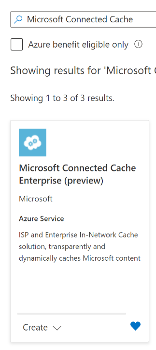
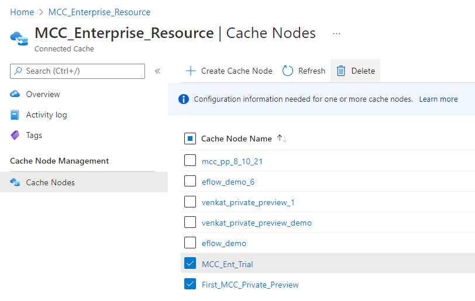
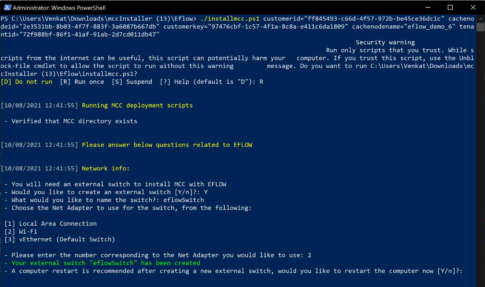
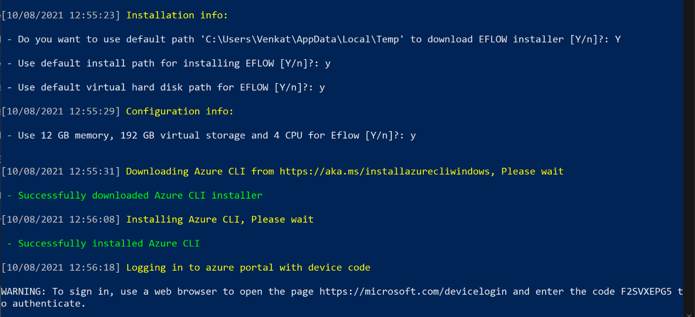
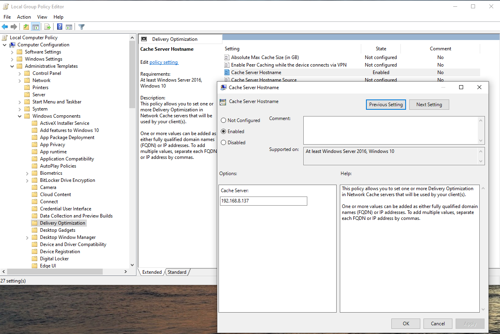
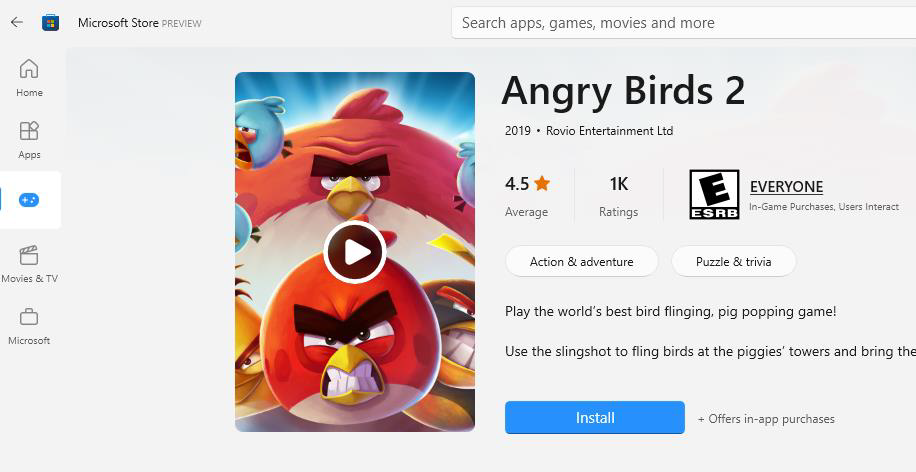
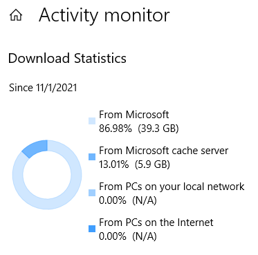

# Microsoft Connected Cache for Enterprises

**Applies to**

- Windows 10
- Windows 11

## Overview

Microsoft Connected Cache (MCC) preview is a software-only caching solution that delivers Microsoft content within Enterprise networks. MCC can be deployed to as many bare-metal servers or VMs as needed and is managed from a cloud portal. Cache nodes are created in the cloud portal and are configured by applying the [client policy](/mem/intune/configuration/delivery-optimization-settings.md#local-server-caching) using your management tool, such as Intune.

Microsoft Connected Cache is a Hybrid (mix of on-prem and cloud resources) SaaS solution built as an Azure IoT Edge module, a Docker compatible Linux container, that is deployed to your Windows devices. The Delivery Optimization team chose IoT Edge for Linux on Windows (EFLOW) as a secure, reliable container management infrastructure. EFLOW is a Linux virtual machine, based on Microsoft's first party CBL-Mariner operating system. It’s built with the IoT Edge runtime and validated as a tier 1 supported environment for IoT Edge workloads. Microsoft Connected Cache will be a Linux IoT Edge module running on the Windows Host OS.

Even though your Microsoft Connected Cache scenario is not related to IoT, Azure IoT Edge is used as a more generic Linux container deployment and management infrastructure. The Azure IoT Edge runtime sits on your designated MCC device and performs management and communication operations. The runtime performs several functions important to manage Microsoft Connected Cache on your edge device: 

1. Installs and updates Microsoft Connected Cache on your edge device. 
2. Maintains Azure IoT Edge security standards on your edge device. 
3. Ensures that Microsoft Connected Cache is always running. 
4. Reports Microsoft Connected Cache health and usage to the cloud for remote monitoring.

To deploy a functional Microsoft Connected Cache to your device, you must obtain the necessary keys that will provision the Connected Cache instance to communicate with Delivery Optimization services and enable the device to cache and deliver content.
Figure 1 below describes the architecture of Microsoft Connected Cache built using IoT Edge.

For more details information on Azure IoT Edge, please see the [Azure IoT Edge documentation](/azure/iot-edge/about-iot-edge).

## How Microsoft Connected Cache Works

1. The Azure Management Portal used to create the Microsoft Connected Cache nodes.
2. The Microsoft Connected Cache container deployed and provisioned to the server using the installer provided in the portal.
3. Set the client policy in your management solution to point to the IP Address/FQDN of the cache server
4. Microsoft end-user devices make the range requests for content from the Microsoft Connected Cache node.
5. Microsoft Connected Cache node pulls content from the CDN, seeds its local cache stored on disk and delivers the content to the client.
6. Subsequent requests from end-user devices for content will now come from cache.
7. If the Microsoft Connected Cache node is unavailable, the client will pull content from CDN to ensure uninterrupted service for your subscribers.

Figure 1: Each number in the diagram corresponds to the steps above

## Enterprise Requirements for Microsoft Connected Cache

1. **Azure subscription** – Microsoft Connected Cache management portal is hosted within Azure and is used to create the Connected Cache [Azure resource](/azure/cloud-adoption-framework/govern/resource-consistency/resource-access-management.md) and IoT Hub resource – both are free services.

We will use your Azure subscription ID to take care of some provisioning with our services, first, to give you access to the preview. The Microsoft Connected Cache server requirement for an Azure subscription will cost you nothing. If you do not have an Azure subscription already, you can create an Azure [Pay-As-You-Go](https://azure.microsoft.com/offers/ms-azr-0003p/) account which requires a credit card for verification purposes. For more information, see the [Azure Free Account FAQ](https://azure.microsoft.com/free/free-account-faq/).

The resources used for the preview and in the future when this product is ready for production will be completely free to you, like other caching solutions.
2. **Hardware to host MCC** - The recommended configuration will serve approximately 35,000 managed devices downloading a 2GB payload in 24-hour timeframe at a sustained rate of 6.5 Gbps.

**EFLOW Requires Hyper-V support**
- On Windows 10, enable Hyper-V
- On Windows Server, install the Hyper-V role and create a default network switch

Disk recommendations:
- Using an SSD is recommended as cache read speed of SSD is superior to HDD

NIC requirements:
- Multiple NICs on a single MCC instance are not supported.
- 1 Gbps NIC is the minimum speed recommended but any NIC is supported.
- For best performance, NIC and BIOS should support SR-IOV

Networking support:
- External virtual switch to support outbound and inbound network communication (we will create this during the installation process)

| Minimum requirement  | Branch Office / Small Enterprise | Large Enterprise |
| -- | --- | --- |
| OS|  Windows Server 2019*/2022   Windows 10*/11 (Pro or Enterprise) with Hyper-V Support   * Windows 10 and Windows Server 2019 build 17763 or later | Same |
|NIC | 1 Gbps | 5 Gbps |
|Disk | SSD  1 drive  50GB each  |SSD  1 drive  200GB each  |
|Memory | 4GB | 8GB |
|Cores | 4 | 8  |

## Steps to Set Up Microsoft Connected Cache

Summary of steps required to deploy Microsoft Connected Cache to your server:
1. Provide Microsoft with the Azure subscription you will use for Microsoft Connected Cache
2. Create the Microsoft Connected Cache Resource in Azure
3. Create a Microsoft Connected Cache Node
4. Edit Cache Node Information
5. Install Microsoft Connected Cache on a Server or VM
6. Verify Proper Functioning Microsoft Connected Cache Server
7. Common Issues

For any questions regarding these instructions contact: msconnectedcache@microsoft.com
Provide Microsoft with the Azure Subscription ID
As part of the Microsoft Connected Cache preview onboarding process the Azure subscription ID will have been provided to Microsoft. Instructions to create a subscription id are here: https://aka.ms/MCC-Azure-Subscription
NOTE:
Please contact Microsoft and provide this information if you have not already. You will not be able to proceed if you skip this step.
Create the Microsoft Connected Cache Resource in Azure
The Microsoft Connected Cache Azure management portal is used to create and manage Microsoft Connected Cache nodes. An Azure Subscription ID is used to grant access to the preview and to create the Microsoft Connected Cache resource in Azure and Cache nodes.
Use the following link and log in to Azure
https://portal.azure.com/?microsoft_azure_marketplace_ItemHideKey=Microsoft_ConnectedCache_EntHidden

1. On the Azure Portal home page, Choose Create a resource
2. Type "Microsoft Connected Cache" into the search box and be sure to hit the Enter key to show search results.
NOTE:
You will not see Microsoft Connected Cache in the drop down box, you need to type it and press enter to see the result
3. Select “Microsoft Connected Cache” and select “Create” on the next screen to start the process of creating the Microsoft Connected Cache resource.
4. Fill in the required fields to create the Microsoft Connected Cache resource.
• Choose the subscription provided to Microsoft.
• Azure resource groups are logical groups of resources. Create a new resource group and choose a name for your resource group.
• Choose “(US) West US” for the location of the resource. This choice will not impact Microsoft Connected Cache if the physical location is not in the West US, it is just a limitation of the preview.
NOTE:
Your MCC resource will not be created properly if you do not select “(US) West US”
• Choose a name for the Microsoft Connected Cache resource. NOTE:
Your MCC resource must not contain the word “Microsoft” in it
5. Once all the information has been entered, click on the “Review + Create” button. Once validation is complete, click the “Create” button to start the resource creation.
Error: Validation failed
• If you get a Validation failed error message on your portal, it is likely because you selected the Location as US West 2 or another location.
• To bypass this error, navigate to the previous step and choose (US) West US.
Create a Microsoft Connected Cache Node in Azure
Creating a Microsoft Connected Cache node is a multi-step process and the first step is to access the Microsoft Connected Cache private preview management portal.
1. After the successful resource creation click on the "Go to resource".
2. Under Cache Node Management section on the leftmost panel, click on Cache Nodes.
3. On the Cache Nodes blade, click on the Create Cache Node button.
4. Clicking the Create Cache Node button will open the Create Cache Node page, Cache Node Name is the only field required for cache node creation.
Field Name
Expected Value
Description
Cache Node Name
Alphanumeric name that includes no spaces.
The name of the cache node. You may choose names based on location like Seattle-1. This name must be unique cannot be changed later.
5. Enter the information for the Cache Node and click on the Create button.
If there are errors, the form will provide guidance on how to correct the errors.
Once the Microsoft Connected Cache Node has been created, the installer instructions will be exposed. More details on the installer instructions will be addressed later in this doc can be found at the Install Connected Cache section.
Edit Cache Node Information
Cache nodes can be deleted here by clicking the check box to the left of a Cache Node Name and then clicking the delete toolbar item. Be aware that if a cache node is deleted, there is no way to recover the cache node or any of the information related to the cache node.
Install Microsoft Connected Cache on Windows
Installing Microsoft Connected Cache on your Windows machine is a straightforward process. A PowerShell script performs the following tasks:
• Installs the Azure CLI
• Downloads, Installs, and Deploys EFLOW
• Enables Microsoft Update so EFLOW can stay up to date
• Creates a Virtual Machine
• Enables the firewall and opens ports 80 and 22 for inbound and outbound traffic. Port 80 is used by Microsoft Connected Cache and port 22 is used for SSH communications.
• Configures Connected Cache tuning settings.
• Creates the necessary FREE Azure resource - IoT Hub/IoT Edge.
• Deploys the Microsoft Connected Cache container to server.
Running the installer
1. Download and unzip mccinstaller.zip from the create cache node page or cache node configuration page which contains the necessary installation files
Files contained in the mccinstaller.zip file:
• installmcc.ps1 – main installer file.
• installEflow.ps1 – Installs the necessary prerequisites like the Linux VM, IoT Edge runtime and Docker and makes necessary host OS settings to optimization caching performance.
• resourceDeploymentForConnectedCache.ps1 – Creates Azure cloud resources required to support MCC control plane.
• mccdeployment.json – Deployment manifest used by IoT Edge to deploy the MCC container and configure settings on the container like cache drive(s) location size(s).
• updatemcc.ps1 – The update script used to upgrade MCC to a particular version
• mccupdate.json – Used as part of the update script
2. Open Windows PowerShell as administrator and navigate to the location of these files
NOTE:
Ensure that Hyper-V is enabled on your machine:
Windows 10: Enable Hyper-V on Windows 10 | Microsoft Docs
Windows Server: Install the Hyper-V role on Windows Server | Microsoft Docs
DO NOT use PowerShell ISE, PowerShell 6.x, or PowerShell 7.x. Only Windows PowerShell version 5.x is supported.
NOTE:
If you are installing MCC on a local Virtual Machine:
1. Enable Nested Virtualization
Set -VMProcessor -VMName <"VM name"> -ExposeVirtualizationExtensions $true
2. Enable Mac Spoofing
Get-VMNetworkAdapter -VMName <"VM name">| Set-VMNetworkAdapter -MacAddressSpoofing On
Virtual Machine should be in the OFF state while enabling Nested Virtualization and Mac Spoofing
3. Set the execution policy
Set-ExecutionPolicy -ExecutionPolicy Unrestricted -Scope Process
NOTE:
After setting the execution policy, you will see the following message. Please select [A] Yes to all to proceed.
Execution Policy Change
The execution policy helps protect you from scripts that you do not trust. Changing the execution policy might expose you to the security risks described in the about_Execution_Policies help topic at https:/go.microsoft.com/fwlink/?LinkID=135170. Do you want to change the execution policy?
[Y] Yes [A] Yes to All [N] No [L] No to All [S] Suspend [?] Help (default is "N"):
4. Copy the command from the portal and run it in Windows PowerShell
NOTE:
After running the command, and multiple times throughout the installation process, you will receive the following notice. Please select [R] Run once to proceed.
Security warning
Run only scripts that you trust. While scripts from the internet can be useful, this script can potentially harm your computer. If you trust this script, use the Unblock-File cmdlet to allow the script to run without this warning message. Do you want to run C:\Users\mccinstaller\Eflow\installmcc.ps1?
[D] Do not run [R] Run once [S] Suspend [?] Help (default is "D"):
5. Choose whether you would like to create a new virtual switch or select an existing one. Name your switch and select the Net Adapter to use for the switch. A computer restart will be required if you are creating a new switch.
NOTE:
Restarting your computer after creating a switch is recommended. You will notice network delays during installation if the computer has not been restarted.
If you restarted your computer after creating a switch, start from Step 2 above and skip step 5.
6. Re-run the script after the restart. This time, select “No” when asked to create a new switch. Enter the number corresponding to the switch you previously created.
7. Decide whether you would like to use dynamic or static address for the Eflow VM
NOTE:
Choosing a dynamic IP address will allow your DHCP server to assign the IP to the MCC. Every time the MCC restarts, there will be a new IP address assigned.
We recommend using a static IP address so you do not have to change this value in your management solution for every MCC restart.
8. Choose where you would like to download, install, and store the virtual hard disk for EFLOW. You will also be asked how much memory, storage, and cores you would like to allocate for the VM. In this example, we chose the default values for all prompts
9. Follow the Azure Device Login link and sign into the Azure Portal
10. If this is your first MCC deployment, please select ‘n’ so that we can create a new IoT Hub. If you have already configured MCC before, we want to group your MCCs in the same IoT Hub, select “y”.
a. You will be shown a list of existing IoT Hubs in your Azure Subscription, enter the number corresponding to the IoT Hub to select it. (You will likely have only 1 IoT Hub in your subscription, in which case you want to enter “1”)
11. Your MCC deployment is now complete
a. If you do not see any errors, please continue to the next section to validate your MCC deployment
b. After validating your MCC is properly functional, please visit your management solution (e.g., Intune) to set the cache host policy to the IP address of your MCC.
Delivery Optimization settings for Windows 10 in Microsoft Intune | Microsoft Docs
c. If you had errors during your deployment, visit the Troubleshooting section in this document
Verify Proper Functioning Microsoft Connected Cache Server
Verify Client Side
Let’s connect to the EFLOW VM and check if MCC is properly running
1. Open PowerShell as an Administrator
2. Enter the following commands:
Connect-EflowVm
sudo -s
iotedge list
You should see MCC, edgeAgent, and edgeHub running. If you see edgeAgent or edgeHub but not MCC, please try this command in a few minutes. The MCC container can take a few minutes to deploy
Verify Server Side
For a validation of properly functioning Microsoft Connected Cache, execute the following command in the EFLOW VM or any device in the network. Replace <CacheServerIP> with the IP address of the cache server.
wget http://<CacheServerIP>/mscomtest/wuidt.gif?cacheHostOrigin=au.download.windowsupdate.com
A successful test result will look like this:
OR
Similarly, enter this URL from a browser in the network:
http://YourCacheServerIP/mscomtest/wuidt.gif?cacheHostOrigin=au.download.windowsupdate.com
If the test fails, see the common issues section for more information.
Intune (or other management software) configuration for MCC
Example of setting the cache host policy to the MCC’s IP address / FQDN:
Common Issues
PowerShell Issues
If you are seeing errors similar to this: “The term ‘Get-Something’ is not recognized as the name of a cmdlet, function, script file, or operable program.”
1. Ensure you are running Windows PowerShell version 5.x.
2. Run $PSVersionTable and ensure you’re running version 5.x and NOT version 6 or 7
3. Ensure you have Hyper-V enabled:
Windows 10: Enable Hyper-V on Windows 10 | Microsoft Docs
Windows Server: Install the Hyper-V role on Windows Server | Microsoft Docs
Verify Running Microsoft Connected Cache Container
Connect to the Connected Cache server and check the list of running IoT Edge modules using the following commands:
Connect-EflowVm
sudo iotedge list
If edgeAgent and edgeHub containers are listed, but not “MCC”, you may view the status of the IoTEdge security manager using the command:
sudo journalctl -u iotedge -f
For example, this command will provide the current status of the starting, stopping of a container, or the container pull and start as is shown in the sample below:
Use this command to check the IoT Edge Journal
sudo journalctl -u iotedge –f
Please note: You should consult the IoT Edge troubleshooting guide (Common issues and resolutions for Azure IoT Edge) for any issues you may encounter configuring IoT Edge, but we have listed a few issues below that we hit during our internal validation.
Diagnostics Script
If you are having issues with your MCC, we included a diagnostics script which will collect all your logs and zip them into a single file. You can then send us these logs via email for the MCC team to debug.
To run this script:
1. Navigate to the following folder in the MCC installation files:
mccinstaller > Eflow > Diagnostics
2. Run the following commands:
"Set-ExecutionPolicy -ExecutionPolicy Unrestricted -Scope Process"
./collectMccDiagnostics.ps1
3. The script stores all the debug files into a folder and then creates a tar file. After the script is finished running, it will output the path of the tar file which you can share with us (should be “<currentpath>\mccdiagnostics\support_bundle_$timestamp.tar.gz”)
4. Email the MCC team and attach this file asking for debugging support. Screenshots of the error along with any other warnings you saw will be helpful during out debugging process.
Updating Microsoft Connected Cache
Throughout the private preview phase, we will send you security and feature updates for MCC. Please follow these steps to perform the update.
Run the following command with the arguments we provided in the email to update your MCC:
.\updatemcc.ps1 version="<VERSION>" tenantid="<TENANTID>" customerid="<CUSTOMERID>" cachenodeid="<CACHENODEID>" customerkey="<CUSTOMERKEY>"
E.g. ./updatemcc.ps1 version="msconnectedcacheprod.azurecr.io/mcc/linux/iot/mcc-ubuntu-iot-amd64:1.2.1.659" tenantid="72f988bf-86f1-41af-91ab-2d7cd011db47" customerid="99d897gg-86f1-41af-91ab-4jau6ske0sdf" cachenodeid=" cd01sdfh-435n-0das-56gh90dfrt67 " customerkey="h90d234f-vbnm-lk43-0742khsd45hj”
Uninstalling Microsoft Connected Cache
Please contact the MCC Team before uninstalling to let us know if you are facing issues.
This script will remove the following:
1. EFLOW + Linux VM
2. IoT Edge
3. Edge Agent
4. Edge Hub
5. MCC
6. Moby CLI
7. Moby Engine
To delete MCC, go to Control Panel > Uninstall a program > Select Azure IoT Edge LTS > Uninstall
Appendix
IoT Edge runtime The Azure IoT Edge runtime enables custom and cloud logic on IoT Edge devices. The runtime sits on the IoT Edge device, and performs management and communication operations. The runtime performs several functions: • Installs and update workloads (Docker containers) on the device. • Maintains Azure IoT Edge security standards on the device. • Ensures that IoT Edge modules (Docker containers) are always running. • Reports module (Docker containers) health to the cloud for remote monitoring. • Manages communication between an IoT Edge device and the cloud. For more information on Azure IoT Edge, please see the Azure IoT Edge documentation https://docs.microsoft.com/azure/iot-edge/about-iot-edge.
EFLOW
What is Azure IoT Edge for Linux on Windows | Microsoft Docs
Install Azure IoT Edge for Linux on Windows | Microsoft Docs
PowerShell functions for Azure IoT Edge for Linux on Windows | Microsoft Docs
EFLOW FAQ and Support: Support · Azure/iotedge-eflow Wiki (github.com)
Now ready for Production: Linux IoT Edge Modules on Windows - YouTube
Routing local Windows Clients to an MCC
Get the IP address of your Microsoft Connected Cache using ifconfig
There are multiple methods that can be used to apply a policy to PCs that should participate in downloading from the Microsoft Connected Cache .
Registry Key
You can either set your Microsoft Connected Cache IP or FQDN using:
1. Registry Key in 1709 and higher - [HKEY_LOCAL_MACHINE\SOFTWARE\Policies\Microsoft\Windows\DeliveryOptimization] "DOCacheHost"=" " From an elevated PowerShell or command shell: reg add "HKEY_LOCAL_MACHINE\SOFTWARE\Policies\Microsoft\Windows\DeliveryOptimization" /v DOCacheHost /t REG_SZ /d "10.137.187.38" /f
2. MDM Path in 1809 or higher- .Vendor/MSFT/Policy/Config/DeliveryOptimization/DOCacheHost
3. In build 1809 (RS5) and higher you can apply the policy via Group Policy Editor. The policy to apply is DOCacheHost. To configure the clients to pull content from the Microsoft Connected Cache by Group Policy setting the Cache Server Hostname (Setting found under Computer Configuration, Administrative Templates, Windows Components, Delivery Optimization) to the IP of your Microsoft Connected Cache For example 10.137.187.38.
Verify Content using the DO Client
To verify that Delivery Optimization client can download content using Microsoft Connected Cache you can execute the following steps:
1. Download a game or application from the Microsoft Store.
2. Verify downloads came from Microsoft Connected Cache by one of two methods
a. Using PowerShell Cmdlet Get-DeliveryOptimizationStatus you should see BytesFromCacheServer test
b. Looking at the Delivery Optimization Activity Monitor