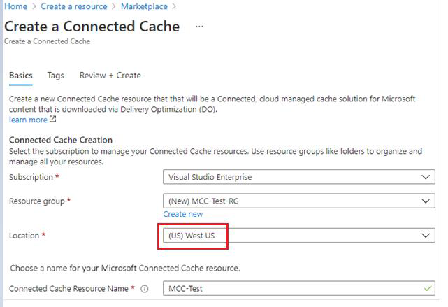
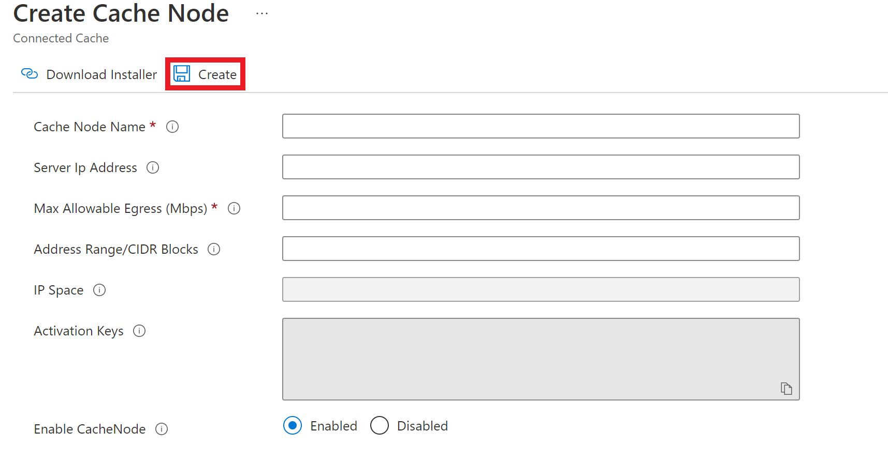
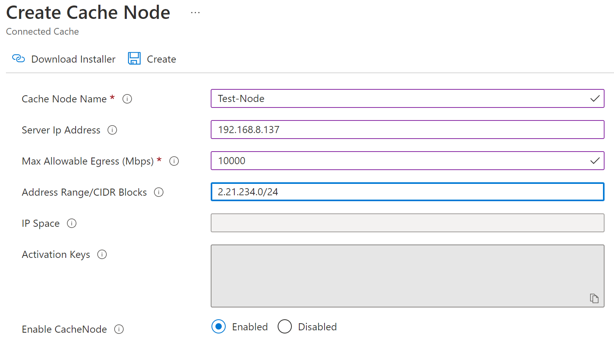
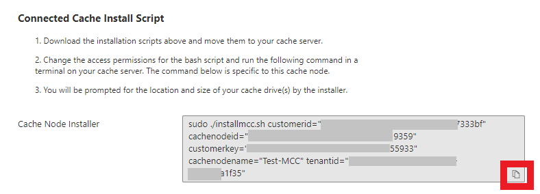
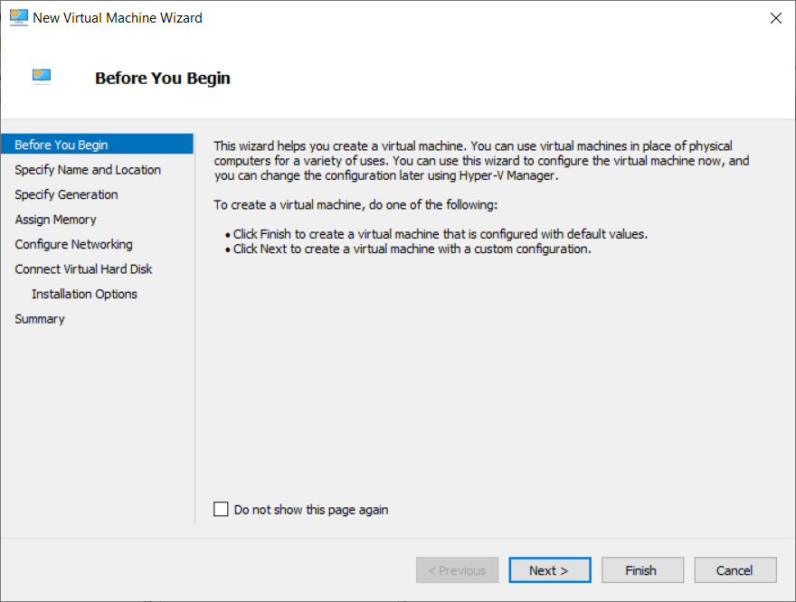
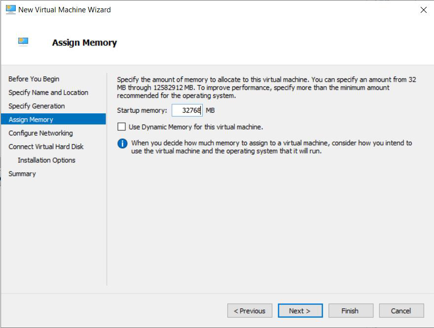
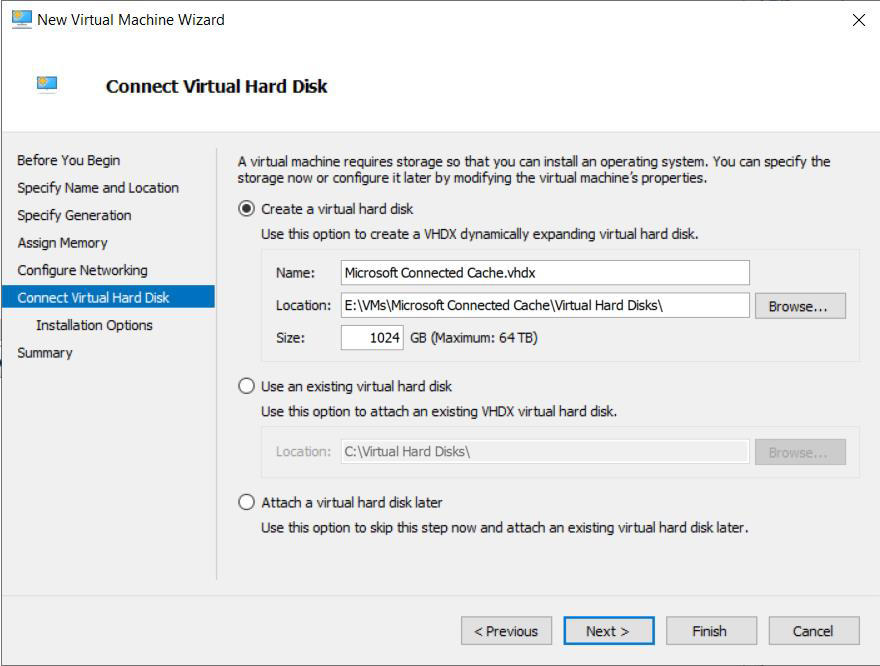
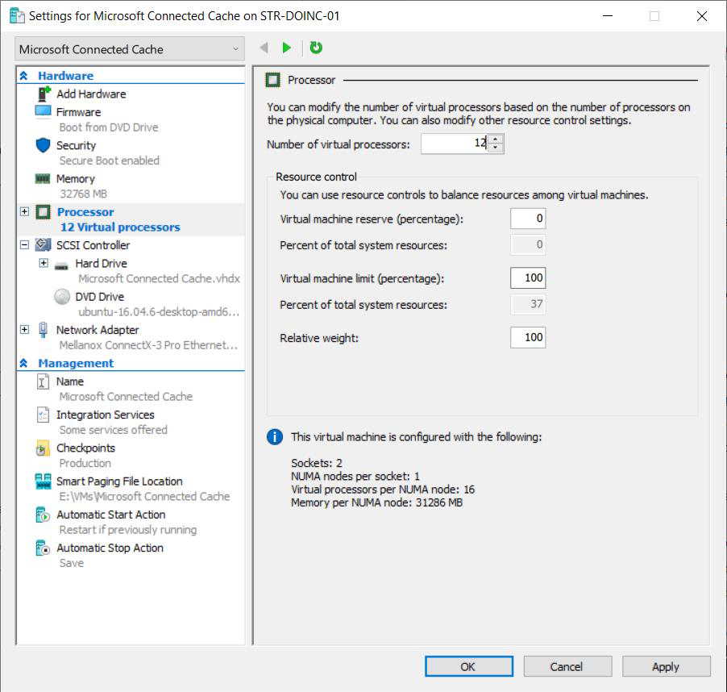
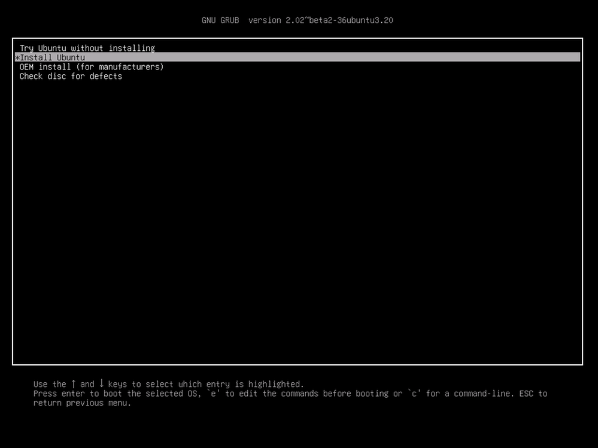
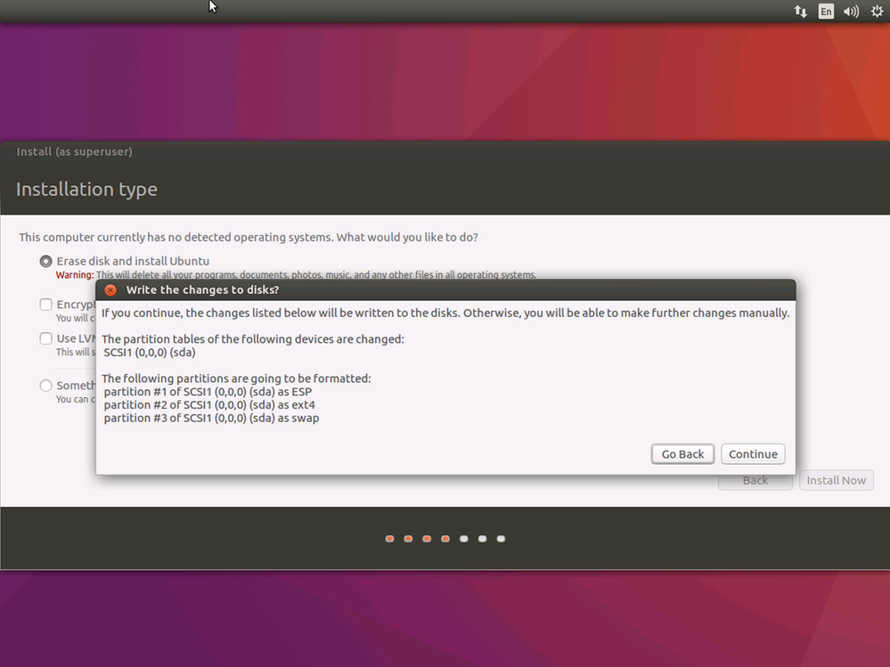

# Microsoft Connected Cache for Internet Service Providers (ISPs)

**Applies to**

- Windows 10
- Windows 11

## Overview

> [!IMPORTANT]
> Microsoft Connected Cache is currently a private preview feature. During this phase we invite customers to take part in early access for testing purposes. This phase does not include formal support and should not be used for production workloads. For more information, see [Supplemental Terms of Use for Microsoft Azure Previews](https://azure.microsoft.com/support/legal/preview-supplemental-terms/).

Microsoft Connected Cache (MCC) preview is a software-only caching solution that delivers Microsoft content within operator networks. MCC can be deployed to as many physical servers or VMs as needed and is managed from a cloud portal. Microsoft cloud services handle routing of consumer devices to the cache server for content downloads.

Microsoft Connected Cache is a Hybrid (mix of on-prem and cloud resources) application application composed of a Docker compatible Linux container deployed to your server and a cloud management portal. Microsoft chose Azure IoT Edge (more information on IoT Edge in the [appendix](#appendix)) as a secure and reliable control plane. Even though your scenario is not related to IoT, Azure IoT Edge is our secure Linux container deployment and management infrastructure. 


## How MCC works


The following steps describe how MCC is provisioned and used.

1. The Azure Management Portal is used to create and manage MCC nodes.
2. A shell script is used to provision the server and deploy the MCC application.
3. A combination of the Azure Management Portal and shell script are used to configure Microsoft Delivery Optimization Services to route traffic to the MCC server.
    - The publicly accessible IPv4 address of the server is configured on the portal.
    - **Manual Routing:** Providing the CIDR blocks that represent the client IP address space, which should be routed to the MCC node.
    - **BGP Routing:** A shell script is used to initiate a peering session with a router in the operator network, and the operator initiaties a session with the MCC node.
    - **Note:** Only IPv4 addresses are supported at this time. Entering IPv6 addresses will result in an error.
4. Microsoft end-user devices (clients) periodically connect with Microsoft Delivery Optimization Services, and the services match the IP address of the client with the IP address of the corresponding MCC node.
5. Microsoft clients make the range requests for content from the MCC node.
6. A MCC node pulls content from the CDN, seeds its local cache stored on disk, and delivers the content to the client.
7. Subsequent requests from end-user devices (clients) for content will be served from cache.
8. If the MCC node is unavailable, the client will pull content from CDN to ensure uninterrupted service for your subscribers.


## ISP Requirements for MCC

1. **Azure subscription**: The MCC management portal is hosted within Azure and is used to create the Connected Cache Azure resource and IoT Hub resource. Both are **free** services.

    Your Azure subscription ID is first used to provision MCC services and enable access to the preview. The MCC server requirement for an Azure subscription will cost you nothing. If you don't have an Azure subscription already, you can create an Azure [Pay-As-You-Go](https://azure.microsoft.com/offers/ms-azr-0003p/) account which requires a credit card for verification purposes. For more information, see the [Azure Free Account FAQ](https://azure.microsoft.com/free/free-account-faq/). *Please do not submit a trial subscription* as you will lose access to your Azure resources after the trial period ends.

    The resources used for the preview, and in the future when this product is ready for production, will be completely free to you - like other caching solutions. 
    
    > [!NOTE]
    > If you request Exchange or Public peering in the future, business email addresses must be used to register ASN's, because Microsoft does not accept Gmail or other non-business email addresses.

2. **Hardware to host MCC**: The recommended configuration will serve approximately 35,000 consumer devices, downloading a 2GB payload in 24-hour timeframe at a sustained rate of 9 Gbps with a 10 Gbps NIC.

**Disk requirements:**
- SSDs are recommended due to improved cache read speeds of SSD, compared to HDD.
- Using multiple disks is recommended to improve cache performance.
- RAID disk configurations are discouraged because cache performance will be impacted. If you're using RAID disk configurations, ensure striping.
- The maximum number of disks supported is 10.

**NIC requirements:**
- Multiple NICs on a single MCC instance are supported using a Link Aggregated configuration.
- 10Gbps NIC is the minimum speed recommended, but any NIC is supported.

### Sizing recommendations

The MCC module is optimized for Ubuntu 20.04 LTS. Install Ubuntu 20.04 LTS on a physical server or VM of your choice. As discussed earlier, the recommended configuration (details below) will serve approximately 35,000 consumer devices downloading a 2GB payload in 24-hour timeframe at a sustained rate of 9 Gbps with a 10 Gbps NIC.

| Component  | Minimum | Recommended |
| -- | --- | --- |
| OS |  Ubuntu 20.04 LTS VM or physical server | Ubuntu 20.04 LTS VM or physical server (preferred) |
| NIC | 10 Gbps| at least 10 Gbps |
| Disk | SSD <br>1 drive <br>2TB each  |SSD <br>2-4 drives <br>at least 2TB each  |
| Memory | 8GB | 32GB or greater |
| Cores | 4 | 8 or more  |

## Steps to deploy MCC

To deploy MCC:

1. [Provide Microsoft with your Azure subscription ID](#provide-microsoft-with-your-azure-subscription-id)
2. [Create the MCC Resource in Azure](#create-the-mcc-resource-in-azure)
3. [Create a MCC Node](#create-a-mcc-node-in-azure)
4. [Edit Cache Node Information](#edit-cache-node-information)
5. [Set up your server](#set-up-a-server-with-ubuntu)
6. [Install MCC on a physical server or VM](#install-mcc)
7. [Verify proper functioning MCC server](#verify-proper-functioning-mcc-server)
8. [Configure BGP Routing](#configure-bgp-routing)
9. [Review the MCC summary report](#verify-server-side) 
10. [Review common issues if needed](#common-issues)

For questions regarding these instructions, contact [msconnectedcache@microsoft.com](mailto:msconnectedcache@microsoft.com).

## Provide Microsoft with your Azure Subscription ID

As part of the MCC preview onboarding process, an Azure subscription ID must be provided to Microsoft.

> [!IMPORTANT]
> [Contact Microsoft](mailto:mccforenterprise@microsoft.com?subject=[MCC%20for%20Enterprise]%20Please%20add%20our%20Azure%20subscription%20to%20the%20allow%20list) and provide your Azure subscription ID if you have not already. You'll not be able to proceed if you skip this step.


For information about creating or locating your subscription ID, see [Steps to obtain an Azure Subscription ID](#steps-to-obtain-an-azure-subscription-id).

### Create the MCC resource in Azure

The MCC Azure management portal is used to create and manage MCC nodes. An Azure Subscription ID is used to grant access to the preview and to create the MCC resource in Azure and Cache nodes. 

Operators who have been given access to the program will be sent a link to the Azure portal, which will allow you to create the resource described below.

1. Choose **Create a resource**.  

    

2. Type **Microsoft Connected Cache** into the search box and hit **Enter** to show search results.

3.  Select **Microsoft Connected Cache** and choose **Create** on the next screen to start the process of creating the MCC resource.
    -   **Note:** DO NOT selected "Connected Cache Resources", which is different from Microsoft Connected Cache.

    
    

4.  Fill in the required fields to create the MCC resource.

    -   Choose the subscription that you provided to Microsoft.
    -   Azure resource groups are logical groups of resources. Create a new resource group and choose a name for your resource group.
    -   Choose **(US) West US** for the location of the resource. This choice will not impact MCC if the physical location isn't in the West US, it is just a limitation of the preview.

       > [!NOTE]
       > Your MCC resource will not be created properly if you don't select **(US) West US**

    -   Choose a name for the MCC resource.

        

5.  Once all the information has been entered, click the **Review + Create** button. Once validation is complete, click the **Create** button to start the resource creation.

    

#### Error: Validation failed

-   If you get a "Validation failed" error message on your portal, it is likely because you selected the **Location** as **US West 2** or some other location that isn't **(US) West US**.
-   To resolve this error, go to the previous step and choose **(US) West US**.

    

#### Error: Could not create Marketplace item

- If you receive a "Could not create marketplace item" error message in your Azure portal:
    -   Ensure that you have selected "Microsoft Connected Cache" and not "Connected Cache resources" while trying to create a MCC resource
    -   Ensure that you are using the same subscription that you provided to Microsoft and you have privileges to create an Azure resource
    -   Clear your browser cache and start in a new window if the issue persists

### Create a MCC node in Azure

Creating a MCC node is a multi-step process, and the first step is to access the MCC private preview management portal.

1.  After the successful resource creation click on **Go to resource**.
2.  Under **Cache Node Management** section on the leftmost panel, click on **Cache Nodes**.

    

3.  On the **Cache Nodes** blade, click on the **Create Cache Node** button.

    

4.  Clicking the **Create Cache Node** button will open the **Create Cache Node** page; **Cache Node Name** and **Max Allowable Egress** are the only fields required for cache node creation.

| **Field Name**                | **Expected Value**                         | **Description**                                                                                                                                                                                         |
|-------------------------------|--------------------------------------------|---------------------------------------------------------------------------------------------------------------------------------------------------------------------------------------------------------|
| **Cache Node Name**           | Alphanumeric name that includes no spaces. | The name of the cache node. You may choose names based on location like Seattle-1. This name must be unique and can't be changed later.                                                                    |
| **Server IP Address**         | IPv4 Address                               | IP address of your MCC server. This is used to route end-user devices in your network to the server for Microsoft content downloads. **The IP address must be publicly accessible.** |
| **Max Allowable Egress (Mbps)** | Integer in Mbps | The maximum egress (Mbps) of your MCC based on the specifications of your hardware (i.e. 10000 Mbps).|
| **Address Range/CIDR Blocks** | IPv4 CIDR notation                         | IP Address range/CIDR blocks that should be routed to the MCC server as a comma separated list. For example: 2.21.234.0/24 , 3.22.235.0/24 , 4.23.236.0/24                        |
| **Enable Cache Node**         | Enable/Disable Radio Button                | **Enable** permits the cache node to receive content requests. <br>**Disable** prevents the cache node from receiving content requests. <br>Cache nodes are enabled by default.          |

  

Hovering your cursor next to each field will populate the details of that field.

  

There are two other read-only fields on this page that are populated after the cache node is created:

| **Field Name**      | **Description**                                                                                                                                                          |
|---------------------|--------------------------------------------------------------------------------------------------------------------------------------------------------------------------|
| **IP Space**        | Number of IP addresses that will be routed to your cache server.                                                                                                        |
| **Activation Keys** | Set of keys to activate your cache node with the MCC services. Copy the keys for use during install. The CustomerID is your Azure subscripiton ID. |

5.  Enter the information for the Cache Node and click on the Create button. **Cache Node Name** and **Max Allowable Egress (Mbps)** are required fields, but all information can be included if desired.

    

    If there are errors, the form will provide guidance on how to correct the errors. For example:

    - The cache node name is in use in the resource or is an incorrect format.
    - The CIDR block notation or list is incorrect.
    - The server IP address or CIDR block are already in use.

    See the following example with all information entered:

    

    Once the MCC Node has been created, the installer instructions will be exposed. More details on the installer instructions can be found at the [Install Connected Cache](#install-mcc) section.

    

### IP address space approval

There are three states for IP address space that are explained in the table below. MCC configuration supports BGP and has automatic routing capabilities.

| **IP address space status**    | **Description**     |
|------------------------|------------------------------------|
| **Valid**              | The IP address space is approved.    |
| **In Review**    | The IP address space is under review with Microsoft to ensure valid IP address space.   |
| **Attention Required** | The IP address space has been reviewed and an issue was discovered. Some examples include: 1) IP address space overlap with existing cache node belonging to another customer, 2) IP address space was exceedingly large.  Contact Microsoft for more information if your IP address space has this status. |

See the following example:


## Edit Cache Node Information

IP address or CIDR information can be modified for existing MCC nodes in the portal.

To edit IP address or CIDR information, click on the Cache Node Name which will open the Cache Node Configuration page. Cache nodes can be deleted here by clicking the check box to the left of a Cache Node Name and then clicking the delete toolbar item. Be aware that if a cache node is deleted, there is no way to recover the cache node or any of the information related to the cache node.


The **Server IP Address**, **Address Range/CIDR Blocks**, and **Enable Cache Node** are all editable as shown below:


## Install MCC

Installing MCC on your physical server or VM is a straightforward process. A Bash script installer performs the following tasks:

-   Azure IoT Edge relies on an OCI-compatible container runtime. The script will install the Moby engine and CLI.
-   Installs IoT Edge.
-   Installs SSH to support remote access to the server
-   Enables the firewall and opens port 80 for inbound and outbound traffic. Port 80 is used by MCC.
-   Configures Connected Cache tuning settings.
-   Creates the necessary free Azure resource - IoT Hub/IoT Edge.
-   Deploys the MCC container to server.

> [!IMPORTANT]
> Ensure that ports 80, 179, 443, 5000, 5671, and 8883 are open so Microsoft can verify proper functioning of the cache server

### Steps to install MCC

1.  Download and unzip mccinstaller.zip from the **Create Cache Node** page or **Cache Node Configuration** page which contains the necessary installation files.

    

    Files and folders contained in the **mccinstaller.zip** file:

    - Diagnostics folder
    - **installmcc.sh** – Main installer file.
    - **installIotEdge.sh** – Installs the necessary prerequisites like IoT Edge runtime and Docker and makes necessary host OS settings to optimize caching performance.
    - **resourceDeploymentForConnectedCache.sh** – Creates Azure cloud resources required to support MCC control plane.
    - **mccdeployment.json** – Deployment manifest used by IoT Edge to deploy the MCC container and configure settings on the container like cache drives location and sizes.
    - **mccupdate.json**
    - **packagever.txt**
    - **uninstallmcc.sh** - Main uninstaller file
    - **updatemcc.sh** - Main update file

2.  Copy all 4 installation files to your Linux server (physical or VM).

3.  Before proceeding, ensure that you have a data drive configured on your server. You'll need to specify the location for this cache drive on **Step 9**. Mimimum size for the data drive is 100GB. For instructions to mount a disk on a Linux VM, see [Attach a data disk to a Linux VM](/azure/virtual-machines/linux/attach-disk-portal#find-the-disk).

4.  Open a terminal window and change the access permissions to execute on the **installmcc.sh** Bash script file using chmod.

    ```bash
    sudo chmod +x installmcc.sh
    ```

5.  Copy the Bash script line provided and run the Bash script from the terminal. 

    

6.  You'll be prompted to sign in to the Azure Portal using a device code.

    

7.  You'll be prompted to enter the Azure Container Registry (ACR) password for access to the MCC container.

    

8.  You'll then be prompted with the number of drives to configure.

    

9.  The script will prompt for location and size of the cache drives.

    

> [!IMPORTANT]
> The permissions / ownerships on the cache drive location will be changed to everyone via chmod 777<br>
> **Don't** point the cache drive location to any of the following: “**.**”, “**./var**”, “**/**”, “**\<space\>**”

Specifying any of the directories mentioned above will corrupt the VM, and you will need to provision a new one.


10.  If this is your first MCC deployment, select “n” when prompted for an IoT Hub. If this is **not** your first MCC deployment, you can use an existing IoT hub from your previous MCC installation. After selecting “y”, we will display your existing IoT Hubs, and you can copy and paste the resulting IoT Hub name to continue.


11.  If there are no errors, go to the next step.

-  If there are errors, inspect the installer logs which are under /etc/mccresourcecreation/.
-  If there are errors, follow the instructions to [Troubleshoot your IoT Edge device](/azure/iot-edge/troubleshoot).

## Verify Proper Functioning MCC Server

### Verify client side

Sign in to the Connected Cache server or ssh and run the following command from a terminal to see the running modules (containers):

```bash
sudo iotedge list​
```


If **edgeAgent** and **edgeHub** containers are listed, but not **“MCC”**, you may view the status of the IoTEdge security manager using the command:

```bash
sudo journalctl -u iotedge -f
```

For example, this command provides the current status of the starting and stopping of a container, or the container pull and start as is shown in the sample below:


### Verify server side

It can take a few minutes for the container to deploy.

For a validation of properly functioning MCC, run the following command in the terminal of the cache server or any device in the network. Replace \<CacheServerIP\> with the IP address of the cache server.

```bash
wget http://<CacheServerIP>/mscomtest/wuidt.gif?cacheHostOrigin=au.download.windowsupdate.com
```

A successful test result will look like this:


Similarly, enter the following URL into a web browser on the network:

```http
http://<CacheServerIP>/mscomtest/wuidt.gif?cacheHostOrigin=au.download.windowsupdate.com
```

If the test fails, see the [common issues](#common-issues) section below for more information.

## Configure BGP Routing

If you have a MCC that is already active and running, follow **Method 1** to configure BGP using the Update Script. If you are installing MCC for the first time, configure BGP Routing with **Method 2**. 

### Method 1: Configure BGP with the Update Script

Use this method if you already have a MCC that is active and running.

1. Navigate to the Azure portal to download the installer. Detailed steps on how to download: From the Azure portal, navigate to your existing Connected Cache Resource. Under "Cache Node Management" section on the leftmost panel, click on "Cache Nodes". Select one of your existing Cache Nodes and click on the "Download Installer" button. 


2. Run the following commands to give permissions to the update script:

    ```
    sudo chmod +x updatemcc.sh
    sudo chmod +x installIoTEdge.sh
    ```

3. Copy the cache node update script located at the bottom of the same page and run it on your Linux machine at the same location as **Step 2**. 


4. Log in with your Azure credentials using the Device Login Code.

5. Continue with **Method 2** to finish configuring your MCC with BGP Routing.

### Method 2: Configure BGP during the Initial Installation

1. Enter "y" when asked if you would like to configure BGP.
    a. Enter the number of BGP neighbors you would like to configure
    b. Enter the IP address for the neighbor
    c. Enter the ASN corresponding to that neighbor (this should be the same ASN as the MCC -iBGP connection)
    d. Repeat steps 1.b and 1.c for each neighbor you would like to configure

2. BGP is now configured from the MCC side. From your end, please establish a neighborship from your router to MCC's host machine (use the IP address of the host machine that is running the MCC container)
    a. Please ensure there aren't any firewall rules blocking this connection
    b. Verify that the BGP connection has been established and that you are advertising routes to the MCC
    c. Wait 5 minutes to refresh the cache node page in the Azure portal to see the BGP routes

3. Confirm the update is complete by running the following command. Ensure MCC is running on **1.2.1.1070**. If you only see **edgeAgent** and **edgeHub**, wait 5 minutes and run this command again.

    ```
    sudo iotedge list
    ```

4. Ensure MCC is reachable. Replace <CacheServerIp> with the IP Address of your MCC (or localhost)
    ```
    wget http://<CacheServerIP>/mscomtest/wuidt.gif?cacheHostOrigin=au.download.windowsupdate.com
    ```

5. After successfully completing the update, navigate to the portal and select “Download JSON” to check the routes being reported. Change the radio button from “Manually Entered” to “Use BGP” to start routing using BGP.


## Common Issues

> [!NOTE]
> Consult the [IoT Edge troubleshooting guide](/azure/iot-edge/troubleshoot) for any issues you may encounter configuring IoT Edge. A few common issues are listed below.

Use the following command to check the IoT Edge Journal:

```bash
sudo journalctl -u iotedge –f
```

## DNS needs to be configured

Run the following IoT Edge setup/install state check:

```bash
sudo iotedge check --verbose
```

If you see issues with ports 5671, 443, and 8883 similar to the screenshot below, it means that your IoT Edge device needs to update the DNS for Docker.


Follow the steps below to configure the device to work with your DNS:

1.  Use ifconfig to find appropriate NIC adapter name.

    ```bash
    ifconfig​
    ```
2.  Run nmcli device show \<network adapter\> to show you the DNS name for Ethernet adapter. For example to show DNS
    information for eno1:

    ```bash
    nmcli device show eno1 
    ``` 

    

3.  Open/create the Docker configuration file used to configure the DNS server

    ```bash
    sudo nano /etc/docker/daemon.json​
    ```

4.  Paste the following into the daemon.json file (In the example above IP4.DNS[1] is used)  

    ```bash
    { "dns": ["x.x.x.x"]}
    ```
5.  Save the file changes to daemon.json. **Note**: You might need to change permissions on this file. For example:  

    ```bash
    sudo chmod 555 /etc/docker/daemon.json​
    ```

6.  Restart Docker (to pick up the new DNS) and restart IoTEdge  
    
    ```bash
    sudo systemctl restart dockersudo systemctl daemon-reloadsudo restart IoTEdge
    ```

## Diagnostics Script

If you're having issues with your MCC, we included a diagnostics script which will collect all your logs and zip them into a single file. You can then send us these logs via email for the MCC team to debug.

To run this script:

1.  Navigate to the following folder in the MCC installation files:

    **mccinstaller** \> **MccResourceInstall** \> **Diagnostics**

2.  Run the following commands:

    ```bash
    sudo chmod +x collectMccDiagnostics.sh
    sudo ./collectMccDiagnostics.sh
    ```
3.  The script stores all the debug files into a folder and creates a tar file. After the script is finished running, it will output the path of the tar file that you can share with the MCC team. The file should be **/etc/mccdiagnostics/support_bundle_\$timestamp.tar.gz**.

4.  [Email the MCC team](mailto:msconnectedcache@microsoft.com?subject=Debugging%20Support%20Request%20for%20MCC) and attach this tar file, asking for debugging support. Screenshots of the error along with any other warnings you saw will be helpful during our debugging process.

## Updating your MCC

Throughout the private preview phase, we will send you security and feature updates for MCC. Please follow these steps to perform the update.

Run the following commands with the **arguments** we provided in the email to update your MCC:

```bash
sudo chmod +x updatemcc.sh
sudo chmod +x installIoTEdge.sh
sudo ./updatemcc.sh version="\<**VERSION**\>" tenantid="\<**TENANTID**\>" customerid="\<**CUSTOMERID**\>" cachenodeid="\<**CACHENODEID**\>" customerkey="\<**CUSTOMERKEY**\>"
```

For example:
```bash
sudo ./updatemcc.sh version="msconnectedcacheprod.azurecr.io/mcc/linux/iot/mcc-ubuntu-iot-amd64:1.2.1.981" tenantid="799a999aa-99a1-99aa-99aa-9a9aa099db99" customerid="99a999aa-99a1-99aa-99aa-9aaa9aaa0saa" cachenodeid=" aa99aaaa-999a-9aas-99aa99daaa99 " customerkey="a99d999a-aaaa-aa99-0999aaaa99aa”
```

## Uninstalling MCC

In the zip file, you'll find the file **uninstallmcc.sh** which uninstalls MCC and all the related components. Please contact the MCC Team before running this script and only run this script if you're facing issues with MCC installation. **Exercise caution before running this script as existing IoT workflows in this VM will also be erased.**

The **uninstallmcc.sh** script will remove the following:

- IoT Edge
- Edge Agent
- Edge Hub
- MCC
- Moby CLI
- Moby Engine

To run the script, enter the following commands:

```bash
sudo chmod +x uninstallmcc.sh
sudo ./uninstallmcc.sh
```
## Appendix

### Steps to obtain an Azure Subscription ID

1. Sign in to https://portal.azure.com/ and navigate to the Azure services section.
2. Click on **Subscriptions**. If you don't see **Subscriptions**, click on the **More Services** arrow and search for **Subscriptions**. 
3. If you already have an Azure Subscription, skip to step 5. If you don't have an Azure Subscription, select **+ Add** on the top left. 
4. Select the **Pay-As-You-Go** subscription. You'll be asked to enter credit card information, but you'll not be charged for using the MCC service. 
5. On the **Subscriptions** blade, you'll find details about your current subscription. Click on the subscription name. 
6. After you select the subscription name, you'll find the subscription ID in the **Overview** tab. Click on the **Copy to clipboard** icon next to your Subscription ID to copy the value. 

### Performance of MCC in VM/Hypervisor environments

We have observed in hypervisor environments the cache server peak egress at around 1.1 Gbps. If you wish to maximize the egress in hypervisor environments, it is critical to make two settings changes.

1. Enable **SR-IOV** in the BIOS AND enable **SR-IOV** in the NIC properties. Finally, enable **SR-IOV** in the hypervisors for the MCC VM. Microsoft has found these settings to double egress when using a Microsoft Hyper-V deployment.

2. Enable “high performance” in the BIOS as opposed to energy savings. Microsoft has found this setting nearly doubled egress in a Microsoft Hyper-V deployment.

### Setting up a VM on Windows Server

You can use hardware that will natively run Ubuntu 20.04 LTS, or you can run an Ubuntu VM. The following steps describe how to set up a VM on Hyper-V.

1.  Download the ISO. You can use either Ubuntu Desktop or Ubuntu Server.

    1.  [Download Ubuntu Desktop](https://ubuntu.com/download/desktop)
    2.  [Download Ubuntu Server](https://mirror.cs.jmu.edu/pub/ubuntu-iso/20.04.2/ubuntu-20.04.2-live-server-amd64.iso)

2.  Start the **New Virtual Machine Wizard**, give your VM a name, and choose a location.  
    
    
    

3.  Choose a **Generation 2** VM, and specify the startup memory. You can't change the VM generation 2 later.  
    
    
    

4.  Choose the network adapter.  
    
    

5.  Set the virtual hard disk parameters. You should specify enough space for the OS and the content that will be cached. That example below allocates one terabyte.  
    
    

6.  Install from the ISO for Ubuntu 20.04 LTS that you downloaded.  
    
    

7.  Finish the creation of the Ubuntu VM.  
    
    

8.  Before you start the Ubuntu VM, make sure "Secure Boot" is **disabled** and that you have allocated multiple cores to the VM. The example below has allocated 12, but your configuration may vary.  
    
    
    
    

9.  Start the VM and choose the option that will Install Ubuntu. Choose your default language.  
    
    
    

10. Choose the options you wish for installing updates and third party hardware. In the example below, we have chosen to download updates and install
    third party software drivers.  
    
    

11. If you had a previous version of Ubuntu installed, we recommend erasing and installing Ubuntu 16.04. Choose your time zone, and keyboard layout.  
    
    
    
    
    

12. Choose your username, a name for your computer, and a password. Remember, everything is case sensitive in Linux. You'll be asked to reboot in order to complete the installation.  
    
    
    

13. **Important**: When prompted with the option to upgrade, decline.

    
    

Your Ubuntu VM should now be ready to [Install MCC](#install-mcc).

### IoT Edge runtime

The Azure IoT Edge runtime enables custom and cloud logic on IoT Edge devices. The runtime sits on the IoT Edge device, and performs management and communication operations. The runtime performs several functions:

-   Installs and updates workloads (Docker containers) on the device.
-   Maintains Azure IoT Edge security standards on the device.
-   Ensures that IoT Edge modules (Docker containers) are always running.
-   Reports module (Docker containers) health to the cloud for remote
    monitoring.
-   Manages communication between an IoT Edge device and the cloud.

For more information on Azure IoT Edge, please see the [Azure IoT Edge documentation](/azure/iot-edge/about-iot-edge).

## Also see

[Microsoft Connected Cache for Enterprise and Education](mcc-enterprise.md)<br>
[Introducing Microsoft Connected Cache](https://techcommunity.microsoft.com/t5/windows-it-pro-blog/introducing-microsoft-connected-cache-microsoft-s-cloud-managed/ba-p/963898)
