# Microsoft Connected Cache for Internet Service Providers

**Applies to**

- Windows 10
- Windows 11

## Overview

Microsoft Connected Cache (MCC) preview is a software-only caching solution that delivers Microsoft content within ISP networks. MCC can be deployed to as many bare-metal servers or VMs as needed and is managed from a cloud portal. Microsoft cloud services handle routing of consumer devices to the cache server for content downloads.
Microsoft Connected Cache is a Hybrid (mix of on-prem and cloud resources) solution composed of a Docker compatible Linux container deployed to your server and a cloud management portal. Microsoft chose Azure IoT Edge (more information on IoT Edge in the appendix) as a secure and reliable control plane, and even though your scenario is not related to IoT, Azure IoT Edge is our secure Linux container deployment and management infrastructure. Azure IoT Edge consists of three components that the Microsoft Connected Cache infrastructure will utilize:
1. A cloud-based interface that enables secure, remote installation, monitoring, and management of Microsoft Connected Cache nodes.
2. A runtime that securely manages the modules deployed to each device.
3. Modules/containers that run the Microsoft Connected Cache functionality on your device.

## How Microsoft Connected Cache Works

1. The Azure Management Portal used to create and manage Microsoft Connected Cache nodes.
2. The Microsoft Connected Cache container deployed and provisioned to the server.
3. The Azure Management Portal used to configure Microsoft Delivery Optimization Services to route traffic to the Microsoft Connected Cache server by providing two pieces of information:
  a. The publicly accessible IPv4 address of the server hosting the Microsoft Connected Cache container.
  b. The CIDR blocks that represent the client IP address space, which should be routed to the Microsoft Connected Cache node.
4. Microsoft end-user devices periodically connect with Microsoft Delivery Optimization Services, and the services match the IP address of the client with the IP address of the corresponding Microsoft Connected Cache node.
5. Microsoft end-user devices make the range requests for content from the Microsoft Connected Cache node.
6. Microsoft Connected Cache node pulls content from the CDN, seeds its local cache stored on disk and delivers the content to the client.
7. Subsequent requests from end-user devices for content will now come from cache.
8. If the Microsoft Connected Cache node is unavailable, the client will pull content from CDN to ensure uninterrupted service for your subscribers.

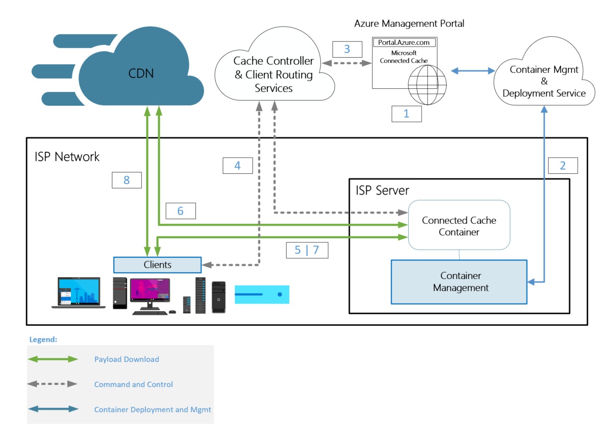

## ISP Requirements for Microsoft Connected Cache

1. Azure subscription – Microsoft Connected Cache management portal is hosted within Azure and is used to create the Connected Cache Azure resource and IoT Hub resource – both are free services.
We will use your Azure subscription ID to take care of some provisioning with our services, first, to give you access to the preview. The Microsoft Connected Cache server requirement for an Azure subscription will cost you nothing. If you do not have an Azure subscription already, you can create an Azure Pay-As-You-Go account which requires a credit card for verification purposes. Please visit Azure Free Account FAQ | Microsoft Azure for more information.
Again, the resources used for the preview and in the future when this product is ready for production will be completely free to you, like other caching solutions.
Please note: If you request Exchange or Public peering in the future, business emails must be used to register ASN's as Microsoft does not accept gmail or other non-business emails.
2. Hardware to host MCC - The recommended configuration will serve approximately 35,000 consumer devices downloading a 2GB payload in 24-hour timeframe at a sustained rate of 6.5 Gbps.
Some notes on the disk requirements:
• Using SSDs is recommended as cache read speed of SSD is superior to HDD.
• Using multiple disks is recommended to improve cache performance.
• RAID disk configurations are discouraged as cache performance will be impacted. If using RAID disk configurations ensure striping.
• Maximum number of disks supported is 10.
Some notes on the NIC requirements:
• Multiple NICs on a single MCC instance are not supported.
• 10Gbps NIC is the minimum speed recommended but any NIC is supported.

Minimum Recommended Server Ubuntu 20.04 LTS VM or Physical Server Ubuntu 20.04 LTS VM or Physical Server (Preferred) NIC 10 Gbps > = 10 Gbps Disk • SSD • 1 – 2 drives minimum • 2 TB each minimum
• SSD • 2 – 4 drives minimum. Max 10 drives. • 2 TB each minimum
Memory 8 GB 32 GB or more Cores 4 8 or more

## Steps to Set Up Microsoft Connected Cache

Below is the summary of steps required to deploy Microsoft Connected Cache to your server. If you prefer following video instructions along with this document, here are part 1 (portal demo) and part 2 (installer demo).
1. Provide Microsoft with the Azure subscription you will use for Microsoft Connected Cache
2. Create the Microsoft Connected Cache Resource in Azure
3. Create a Microsoft Connected Cache Node
  -  IP space approval information
4. Edit Cache Node Information
5. Set up a server with Ubuntu 20.04 or an Ubuntu VM running on Windows Server 2019
6. Install Microsoft Connected Cache on a Server or VM
7. Verify Proper Functioning Microsoft Connected Cache Server
8. View the Microsoft Connected Cache Summary Report
9. Common Issues

For questions regarding these instructions contact: **msconnectedcache@microsoft.com**

## Provide Microsoft with the Azure Subscription ID

As part of the Microsoft Connected Cache preview onboarding process the Azure subscription ID will have been provided to Microsoft. Please contact Microsoft and provide this information if you have not already.

## Create the Microsoft Connected Cache Resource in Azure

Link to video instructions: https://aka.ms/MCC-ISP-PortalDemo

The Microsoft Connected Cache Azure management portal is used to create and manage Microsoft Connected Cache nodes. An Azure Subscription ID is used to grant access to the preview and to create the Microsoft Connected Cache resource in Azure and Cache nodes.

Use the following link and log in to Azure https://portal.azure.com/?microsoft_azure_marketplace_ItemHideKey=Microsoft_ConnectedCacheHidden
• Choose Create a resource

• Type " Microsoft Connected Cache" into the search box and be sure to hit the Enter key to show search results.
• Select “Microsoft Connected Cache” and select “Create” on the next screen to start the process of creating the Microsoft Connected Cache resource.

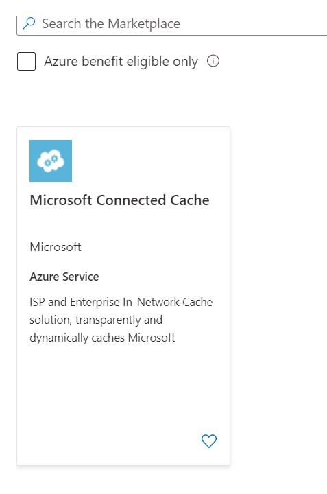

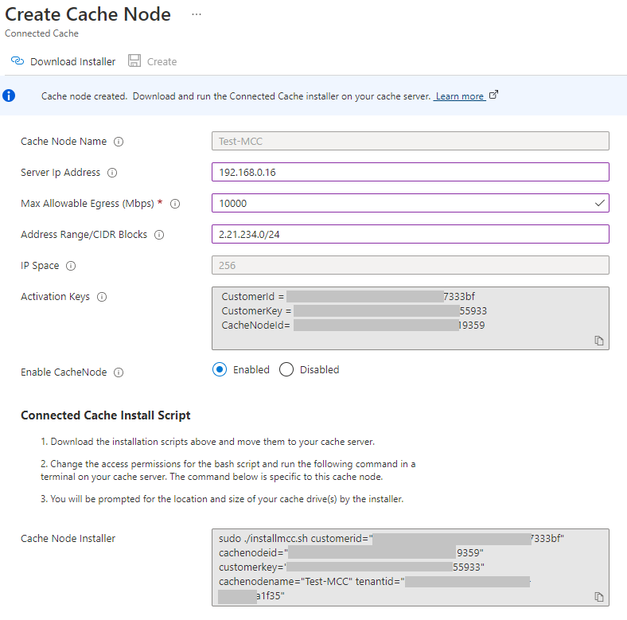

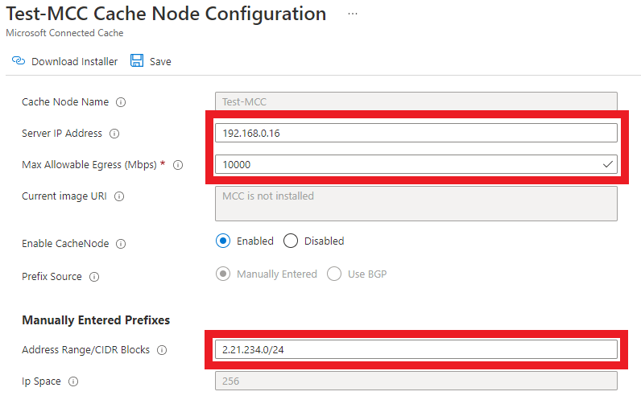

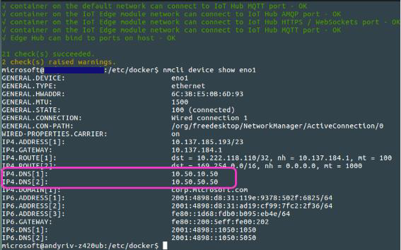

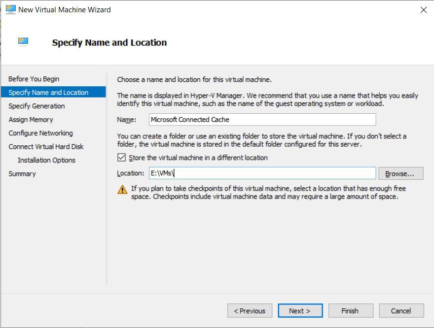
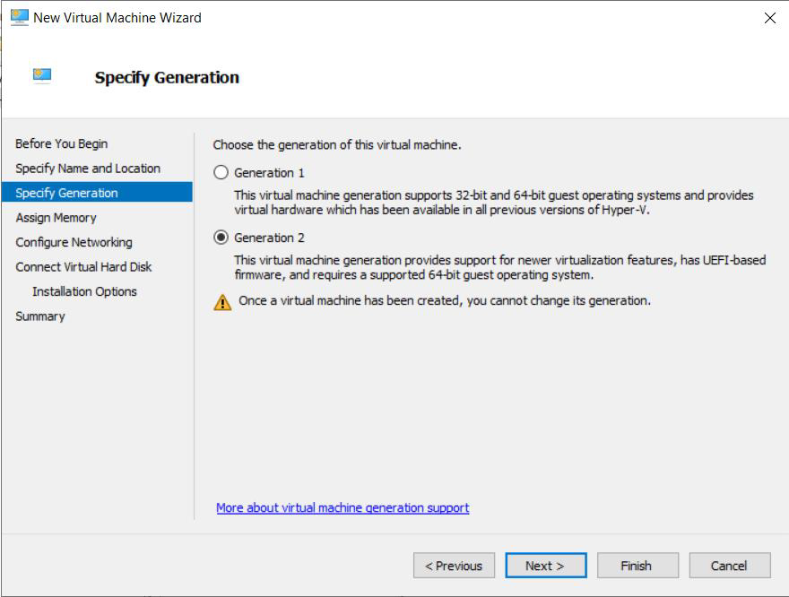

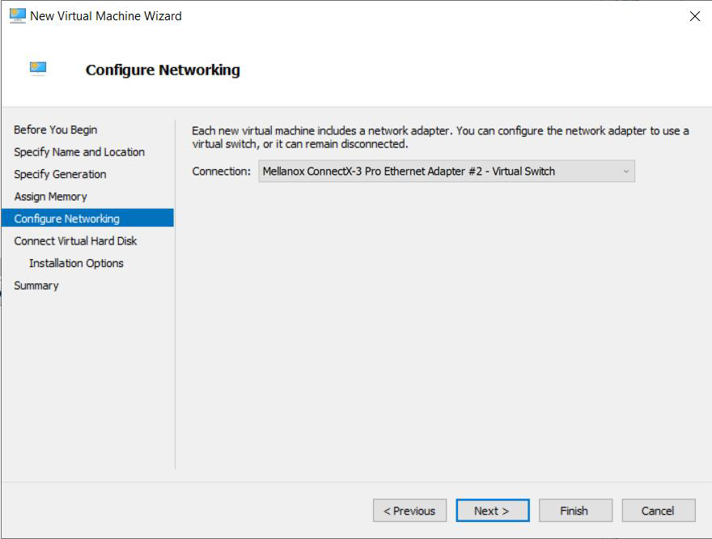

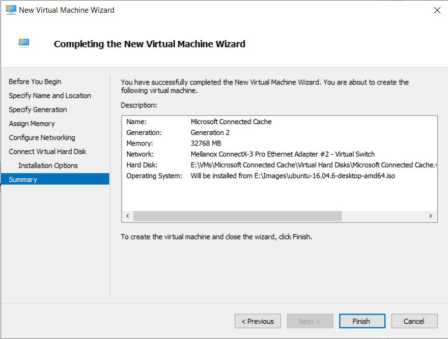

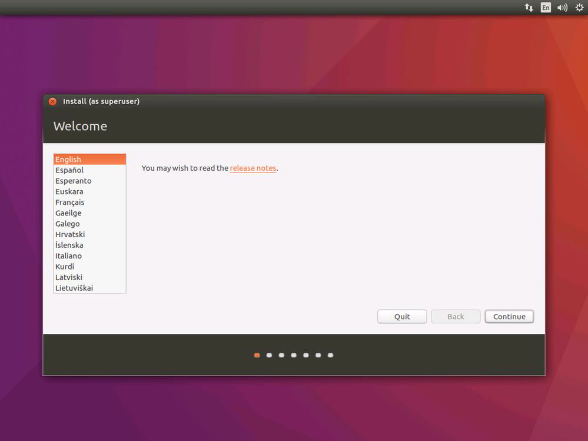
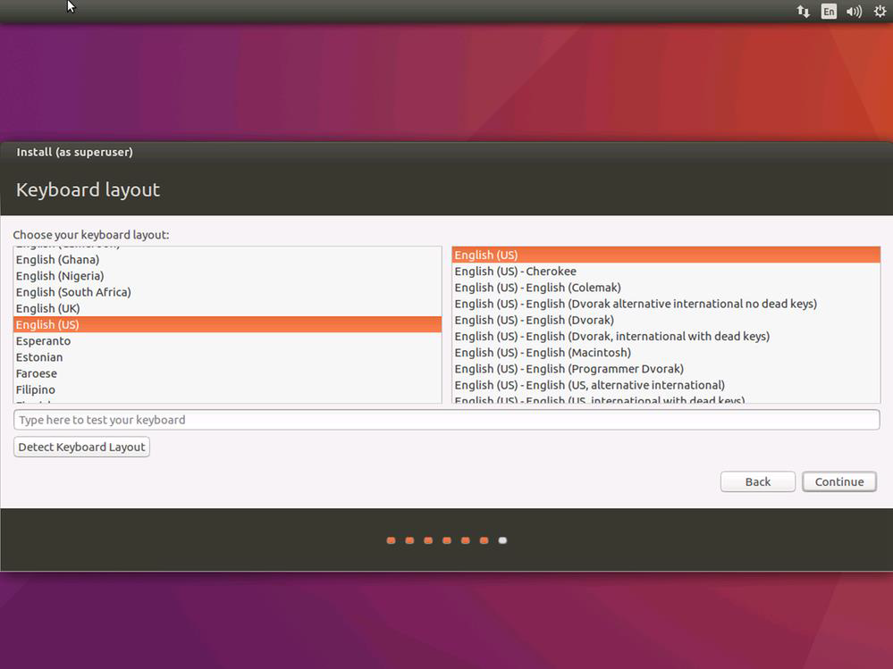

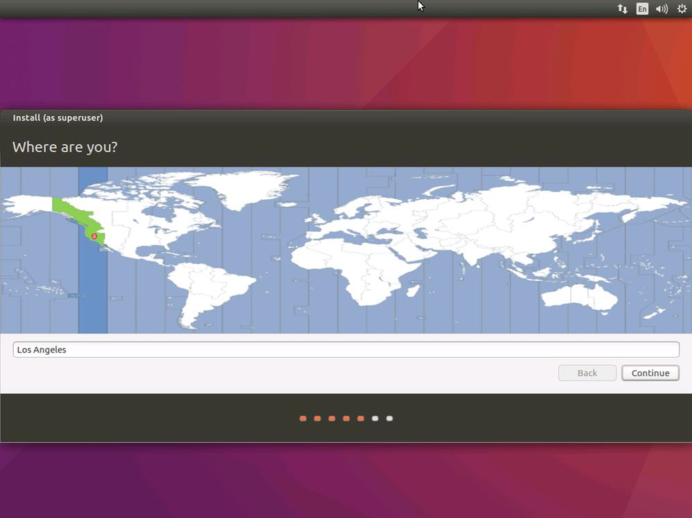

• Fill in the required fields to create the Microsoft Connected Cache resource.
• Choose the subscription provided to Microsoft.
• Azure resource groups are logical groups of resources. Create a new resource group and choose a name for your resource group.
• Choose “US West” for the location of the resource. This choice will not impact Microsoft Connected Cache if the physical location is not in the West US, it is just a limitation of the preview.
• Choose a name for the Microsoft Connected Cache resource.
• Once all the information has been entered, click on the “Review + Create” button. Once validation is complete, click the “Create” button to start the resource creation.
Error: Validation failed
• If you get a Validation failed error message on your portal, it is likely because you selected the Location as US West 2.
• To bypass this error, navigate to the previous step and choose (US) West US.
Create a Microsoft Connected Cache Node
Creating a Microsoft Connected Cache node is a multi-step process and the first step is to access the Microsoft Connected Cache private preview management portal.
1. After the successful resource creation click on the "Go to resource".
2. Under Cache Node Management section on the leftmost panel, click on Cache Nodes.
3. On the Cache Nodes blade, click on the Create Cache Node button.
4. Clicking the Create Cache Node button will open the Create Cache Node page, Cache Node Name is the only field required for initial cache node creation, but end-user devices will not request content without proper configuration of the other values. The table below describes the information required.
Field Name
Expected Value
Description
Cache Node Name
Alphanumeric name that includes no spaces.
The name of the cache node. You may choose names based on location like Seattle-1. This name must be unique cannot be changed later.
Server IP Address
IPv4 Address
IP address of your Microsoft Connected Cache server. Used to route end-user
devices in your network to the server for Microsoft content downloads. Please note: IP address must be publicly accessible.
Address Range/CIDR Blocks
IPv4 CIDR notation
IP Address Range/CIDR blocks that should be routed to the Microsoft Connected Cache server as a comma separated list. For example: 2.21.234.0/24 , 3.22.235.0/24 , 4.23.236.0/24
Enable Cache Node
Enable/Disable Radio Button
Enable and the cache node will receive content requests. Disable and the cache node will not receive content requests. Cache nodes are enabled by default.
Hovering on the info next to each field will populate the details of that field.
There are two other read-only fields on this page that are populated after the cache node is created.
Field Name
Description
IP Space
Number of Ips addresses that will be routed to your cache server.
Activation Keys
Set of keys to activate your cache node with the Microsoft Connected Cache services. Copy the keys for use during install. The CustomerID is your Azure subscripiton ID.
5. Enter the information for the Cache Node and click on the Create button. In the screenshot below only the Cache Node Name is provided, but all information can be included if desired.
If there are errors the form will provide guidance on how to correct the errors. For example:
• The cache node name is in use in the resource or is an incorrect format.
• If the CIDR block notation or list is incorrect.
• The server IP or CIDR block are already in use.
In the screenshot below all information is provided.
Once the Microsoft Connected Cache Node has been created, the installer instructions will be exposed. More details on the installer instructions will be addressed later in this doc can be found at the Install Connected Cache section.
IP Space Approval Information
There are three states for IP space (screenshot below) that are explained in the table below. The preview will require approval from Microsoft CIDR block ranges that contain more than 50,000 IP addresses. In the future Microsoft Connected Cache configuration will support BGP and will therefore have automatic routing capabilities.
IP Space Status
Description
Valid
The IP space is below the 50,000 IP space threshold and the space does not overlap with existing cache nodes.
In Review
The IP space exceeds the 50,000 IP space and is under review with Microsoft to ensure valid IP space.
Attention Required
The IP space has been reviewed and an issue was discovered. Some examples include:
• IP space overlap with existing cache node belonging to another customer.
• IP space was exceedingly large.
Contact Microsoft for more information if your IP space has this status.
Edit Cache Node Information
IP address or CIDR information can be modified for existing Microsoft Connected Cache nodes in the portal.
To edit IP address or CIDR information click on the Cache Node Name which will open the Cache Node Configuration page. Cache nodes can be deleted here by clicking the check box to the left of a Cache Node Name and then clicking the delete toolbar item. Be aware that if a cache node is deleted, there is no way to recover the cache node or any of the information related to the cache node.
The Server IP Address, Address Range/CIDR Blocks, and Enable Cache Node are all editable as show in the screenshot below.
Set up a server with SR or an Ubuntu VM running on Windows Server
The Microsoft Connected Cache module is optimized for Ubuntu 20.04 LTS. Install Ubuntu 20.04 LTS on bare metal or VM of your choice. As discussed earlier, the recommended configuration (details below) will serve approximately 35,000 consumer devices downloading a 2GB payload in 24-hour timeframe at a sustained rate of 6.5 Gbps. Minimum Recommended Server Ubuntu 20.04 LTS VM or Physical Server Ubuntu 20.04 LTS VM or Physical Server (Preferred) NIC 10 Gbps 10 Gbps Disk • SSD • 1 – 2 drives minimum • 2 TB each minimum
• SSD • 2 – 4 drives minimum • 2 TB each minimum
Memory 8 GB 32 GB or more
Cores 4 8 or more
Install Microsoft Connected Cache on a Server or VM
Link to video instructions: https://aka.ms/MCC-ISP-InstallerDemo
Installing Microsoft Connected Cache on your bare metal server or VM is a straightforward process. A Bash script installer performs the following tasks:
• Azure IoT Edge relies on an OCI-compatible container runtime. The script will install the Moby engine and CLI.
• Installs IoT Edge.
• Installs SSH to support remote access to the server
• Enables the firewall and opens ports 80 and 22 for inbound and outbound traffic. Port 80 is used by Microsoft Connected Cache and port 22 is used for SSH communications.
• Configures Connected Cache tuning settings.
• Creates the necessary FREE Azure resource - IoT Hub/IoT Edge.
• Deploys the Microsoft Connected Cache container to server.
Note
Please ensure Port 5000 is open so Microsoft can verify proper functioning of the cache server
Steps to install Microsoft Connected Cache
1. Download and unzip mccinstaller.zip from the create cache node page or cache node configuration page which contains the necessary installation files.
Files contained in the mccinstaller.zip file:
• installmcc.sh – main installer file.
• installIotEdge.sh – Installs the necessary prerequisites like IoT Edge runtime and Docker and makes necessary host OS settings to optimization caching performance.
• resourceDeploymentForConnectedCache.sh – Creates Azure cloud resources required to support MCC control plane.
• mccdeployment.json – Deployment manifest used by IoT Edge to deploy the MCC container and configure settings on the container like cache drive(s) location size(s).
2. Copy all 4 installation files to your server or Linux VM
3. Before proceeding any further, ensure that you have a data drive configured on your Linux VM. You will need to specify the location for this cache drive on step 9. For instructions on mounting a disk, follow these steps: Attach a data disk to a Linux VM | Microsoft Docs
4. Open a terminal and change the access permissions to execute on the installmcc.sh Bash script file using chmod.
sudo chmod +x installmcc.sh
5. Copy the Bash script line provided and run the Bash script from the terminal.
6. You will be prompted to login to the Azure Portal using a device code.
7. You will be prompted to enter the Azure Container Registry (ACR) password for access to the MCC container.
8. You will then be prompted with the number of drives to configure.
9. The script will prompt for location and size of the cache drive(s).
WARNING
The permissions / ownerships on the cache drive location will be changed to everyone via chmod 777
Do not point the cache drive location to any of the following: “.”, “./var”, “/”, “<space>”
Specifying any of the directories mentioned above will corrupt the VM and you will need to provision a new one.
10. If this is your first Microsoft Connected Cache deployment, select “n” when prompted for an IoT Hub. If this is not your first MCC deployment, you can use an existing IoT hub from your previous MCC installation. After selecting “Y”, we will display your existing IoT Hubs, you can copy and paste the resulting IoT Hub name to continue.
11. If there are no errors go to the next step.
• If there are errors, inspect the installer logs which are under /etc/mccresourcecreation/.
• If there were follow the instructions to trouble shoot IoT edge https://docs.microsoft.com/azure/iot-edge/troubleshoot
Verify Proper Functioning Microsoft Connected Cache Server
Verify Client Side
Log into to the Connected Cache server or ssh and run this command from a terminal to see the running modules (containers).
sudo iotedge list
If edgeAgent and edgeHub containers are listed, but not “MCC”, you may view the status of the IoTEdge security manager using the command:
sudo journalctl -u iotedge -f
For example, this command will provide the current status of the starting, stopping of a container, or the container pull and start as is shown in the sample below:
Verify Server Side
It can take a few minutes for the container to deploy.
For a validation of properly functioning Microsoft Connected Cache, execute the following command in the terminal of the cache server or any device in the network. Replace <CacheServerIP> with the IP address of the cache server.
wget http://<CacheServerIP>/mscomtest/wuidt.gif?cacheHostOrigin=au.download.windowsupdate.com
A successful test result will look like this:
Similarly, enter this URL from a browser in the network:
http://<CacheServerIP>/mscomtest/wuidt.gif?cacheHostOrigin=au.download.windowsupdate.com
If the test fails, see the common issues section for more information.
Common Issues
Please note: You should consult the IoT Edge troubleshooting guide (Common issues and resolutions for Azure IoT Edge) for any issues you may encounter configuring IoT Edge, but we have listed a few issues below that we hit during our internal validation.
Use this command to check the IoT Edge Journal
sudo journalctl -u iotedge –f
DNS Needs to be Configured
If after running the check the IoT Edge setup/install state
sudo iotedge check --verbose
If you see the following issues with ports 5671, 443, and 8883 - it will manifest like the screenshot below, it means your IoT Edge device needs to update the DNS for Docker.
Follow these steps to configure the device to work with your DNS.
1. Use ifconfig to find appropriate NIC adapter name.
ifconfig
2. Run
nmcli device show <network adapter>
to show you the DNS name for Ethernet adapter. For example to show DNS information for eno1:
nmcli device show eno1
3. Open/create the Docker configuration file used to configure the DNS server
sudo nano /etc/docker/daemon.json
4. Paste the following into the daemon.json file (In the screenshot above IP4.DNS[1] is used) { "dns": ["x.x.x.x"]}
5. Save the file changes to daemon.json Please note: You may need to change permissions on this file. For example, sudo chmod 555 /etc/docker/daemon.json
6. Restart Docker (to pick up the new DNS) and restart IoTEdge sudo systemctl restart dockersudo systemctl daemon-reloadsudo restart IoTEdge
Diagnostics Script
If you are having issues with your MCC, we included a diagnostics script which will collect all your logs and zip them into a single file. You can then send us these logs via email for the MCC team to debug.
To run this script:
1. Navigate to the following folder in the MCC installation files:
mccinstaller > MccResourceInstall > Diagnostics
2. Run the following commands:
sudo chmod +x collectMccDiagnostics.sh
sudo ./collectMccDiagnostics.sh
3. The script stores all the debug files into a folder and the creates a tar file. After the script is finished running, it will output the path of the tar file which you can share with the MCC team (should be "/etc/mccdiagnostics/support_bundle_$timestamp.tar.gz")
4. Email the MCC team and attach this file asking for debugging support. Screenshots of the error along with any other warnings you saw will be helpful during out debugging process.
Updating your MCC
Throughout the private preview phase, we will send you security and feature updates for MCC. Please follow these steps to perform the update.
Run the following commands with the arguments we provided in the email to update your MCC:
sudo chmod +x updatemcc.sh
sudo chmod +x installIoTEdge.sh
sudo ./updatemcc.sh version="<VERSION>" tenantid="<TENANTID>" customerid="<CUSTOMERID>" cachenodeid="<CACHENODEID>" customerkey="<CUSTOMERKEY>"
e.g. sudo ./updatemcc.sh version="msconnectedcacheprod.azurecr.io/mcc/linux/iot/mcc-ubuntu-iot-amd64:1.2.1.981" tenantid="72f988bf-86f1-41af-91ab-2d7cd011db47" customerid="99d897gg-86f1-41af-91ab-4jau6ske0sdf" cachenodeid=" cd01sdfh-435n-0das-56gh90dfrt67 " customerkey="h90d234f-vbnm-lk43-0742khsd45hj”
Uninstalling MCC
In the zip file, you will find uninstallmcc.sh which will uninstall MCC and all the related components. Please contact the MCC Team before running this script and only run this script if you are facing issues with MCC installation. Exercise caution before running this script as existing IoT workflows in this VM will also be erased.
This script will remove the following:
• IoT Edge
• Edge Agent
• Edge Hub
• MCC
• Moby CLI
• Moby Engine
To run the script, enter the following commands:
sudo chmod +x uninstallmcc.sh
sudo ./uninstallmcc.sh
Appendix
Performance of Microsoft Connected Cache in Hypervisor Environments
We have observed in Hypervisor environments the cache server peak egress at around 1.1 Gbps. If you wish to maximize the egress in hypervisor environments it is critical to make two settings changes.
1. Enable SR-IOV in the BIOS AND enable SR-IOV in the NIC properties, and finally, enable SR-IOV in the hypervisors for the MCC VM. Microsoft has found these settings to double egress within a MSFT hypervisor deployment.
2. Enable “high performance” in the BIOS as opposed to energy savings. Microsoft has found this setting change nearly doubled egress a MSFT hypervisor deployment.
Setting up a VM on Windows Server
You may choose to set up hardware that will natively run Ubuntu 20.04 LTS or an Ubuntu VM. The steps below detail setting up a VM on Windows.
1. Download the ISO
a. Download Ubuntu Desktop
b. Download Ubuntu Server
2. Start the new VM wizard the give your VM a name and choose a location for the VM.
3. Choose Generation 2 VM and specify the startup memory. Please note: as it states, you cannot change to Generation 2 after you created the VM.
4. Choose the network adapter you wish to use.
5. Set the virtual hard disk parameters. Please note: you should specify enough space for the OS and the content that will be cached. That sample below allocates a terabyte.
6. Install from the ISO for Ubuntu 20.04 LTS that you downloaded.
7. Finish the creation of the Ubuntu VM.
8. Before you start the Ubuntu VM make sure secure boot is disabled and that you have allocated multiple cores to the VM. The example below has allocated 12, but your configuration may vary.

9. Start the VM and choose the option that will Install Ubuntu. Choose your default language.
10. Choose the options you wish for installing updates and third party hardware. In the screenshot below, we have chosen to download updates and install third party software drivers.
11. If you had a previous version of Ubuntu installed, we recommend erasing and installing Ubuntu 16.04. Choose your time zone, and keyboard layout.

12. Choose your username, a name for your computer and password. Remember, everything is case sensitive in Linux. You will be asked to reboot in order to complete the installation.
13. Important: When prompted with the option to upgrade, decline.
14.
Your Ubuntu VM should now be ready for the next step: Install Microsoft Connected Cache on Your Server or VM
IoT Edge runtime The Azure IoT Edge runtime enables custom and cloud logic on IoT Edge devices. The runtime sits on the IoT Edge device, and performs management and communication operations. The runtime performs several functions: • Installs and update workloads (Docker containers) on the device. • Maintains Azure IoT Edge security standards on the device. • Ensures that IoT Edge modules (Docker containers) are always running. • Reports module (Docker containers) health to the cloud for remote monitoring. • Manages communication between an IoT Edge device and the cloud. For more information on Azure IoT Edge, please see the Azure IoT Edge documentation https://docs.microsoft.com/azure/iot-edge/about-iot-edge.

