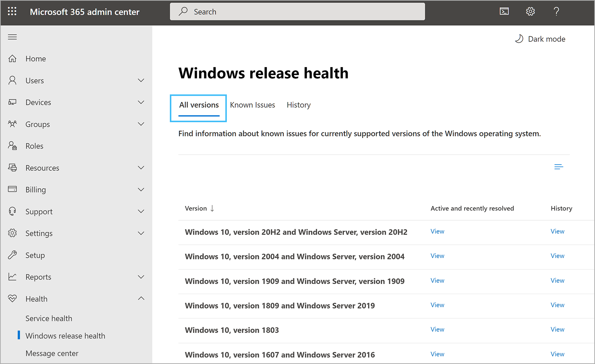
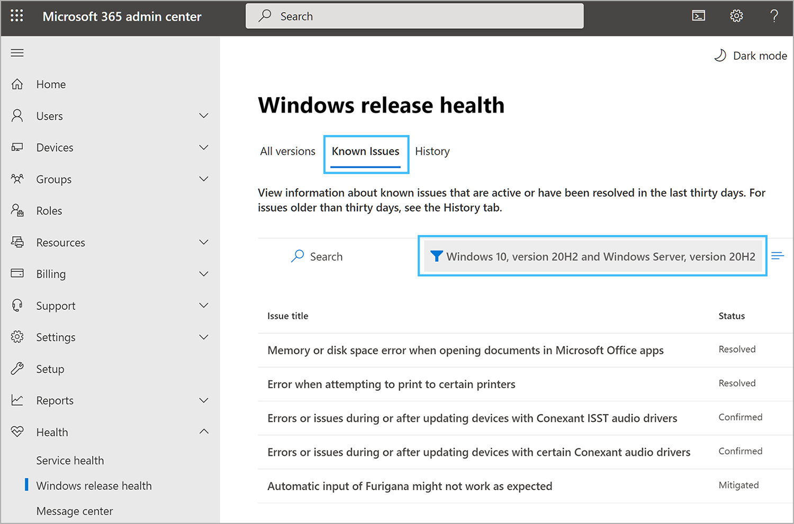
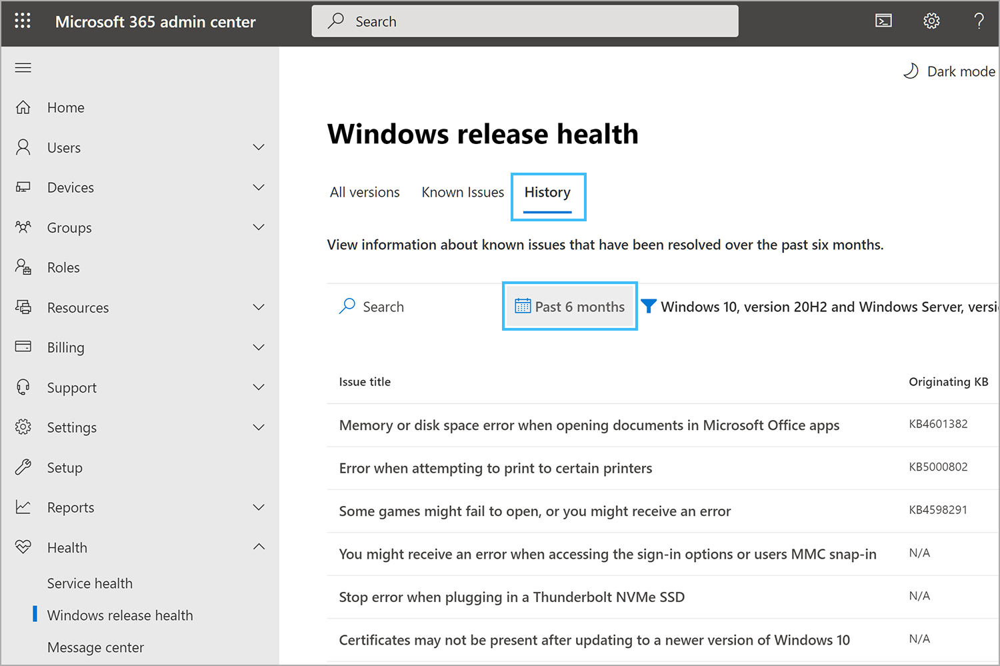
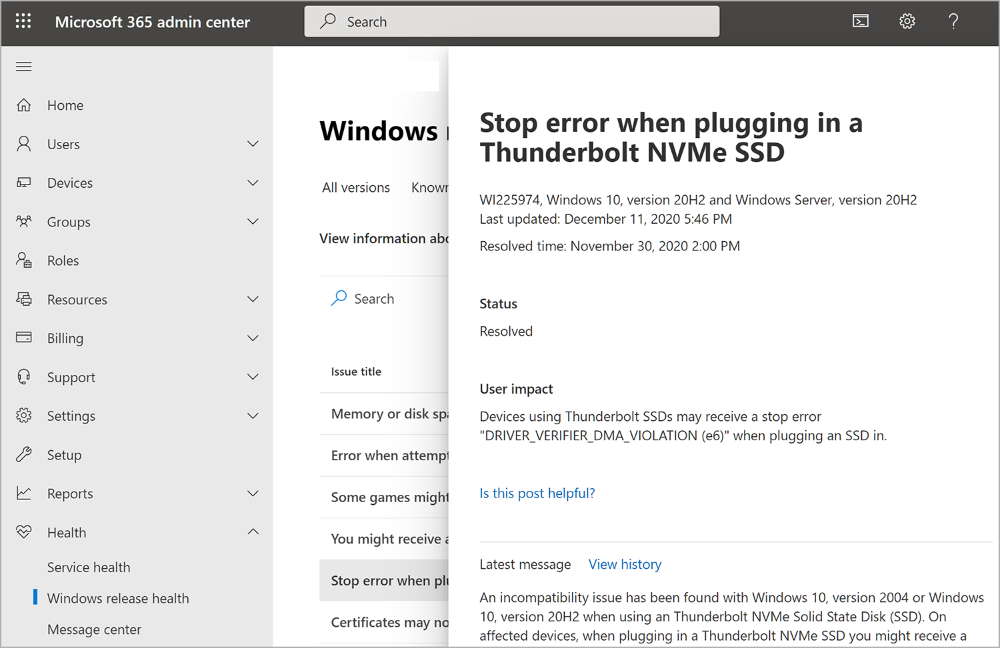
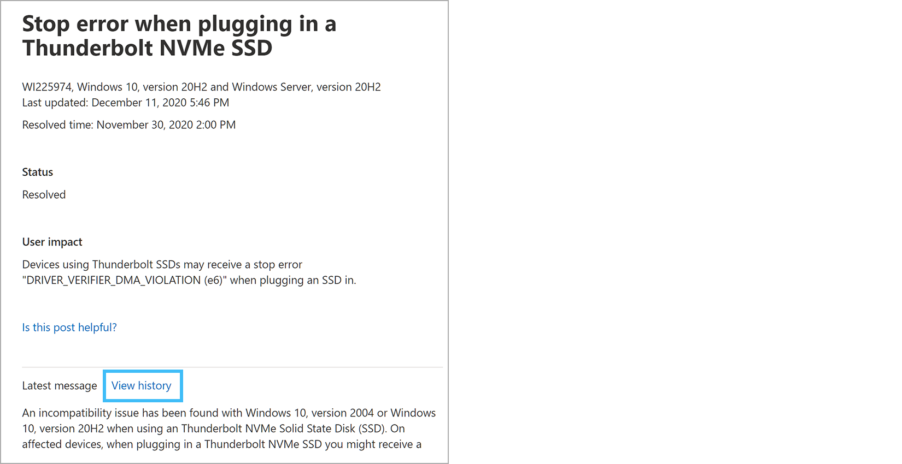
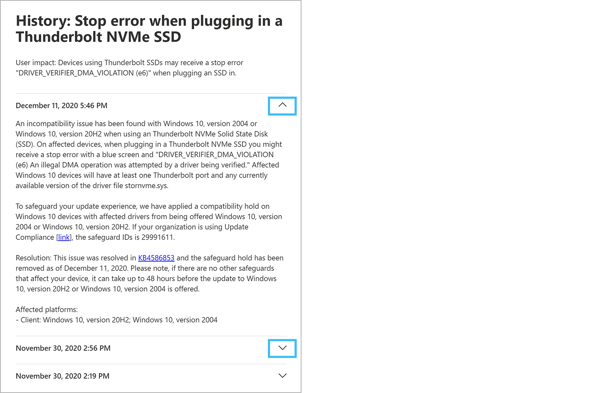

# How to check Windows release health

The Windows release health page in the Microsoft 365 admin center enables you to view the latest information on known issues for Windows monthly and feature updates. A known issue is an issue that impacts Windows devices and that has been identified in a Windows monthly update or feature update. The Windows release health page is designed to inform you about known issues. You can use this information to troubleshoot issues your users may be experiencing. You can also determine when, and at what scale, to deploy an update in your organization.

If you're unable to sign in to the Microsoft 365 admin portal, check the [Microsoft 365 service health](https://status.office365.com) status page to check for known issues preventing you from signing into your tenant.

To be informed about the latest updates and releases, follow [@WindowsUpdate](https://twitter.com/windowsupdate) on Twitter.

## Prerequisites

Ensure the following prerequisites are met to display the Windows release health page in the Microsoft 365 admin center:

- One of the following licenses:
   - Windows 10/11 Enterprise E3 or E5 (included in Microsoft 365 F3, E3, or E5)
   - Windows 10/11 Education A3 or A5 (included in Microsoft 365 A3 or A5)

- Sign into the Microsoft 365 admin center using an [admin role](/microsoft-365/admin/add-users/about-admin-roles).
   - Most roles containing the word `administrator` give you access to the Windows release health page such as [Global Administrator](/azure/active-directory/roles/permissions-reference#global-administrator), [Helpdesk Administrator](/azure/active-directory/roles/permissions-reference#helpdesk-administrator), and [Service Support Administrator](/azure/active-directory/roles/permissions-reference#service-support-administrator). For more information, see [Assign admin roles in the Microsoft 365 admin center](/microsoft-365/admin/add-users/assign-admin-roles).

> [!NOTE]
> Currently, Windows release health isn't available for Government Community Cloud (GCC) tenants.

## How to review Windows release health information

1. Go to the [Microsoft 365 admin center](https://admin.microsoft.com) and sign in with an administrator account.
  
1. To view Windows release health in the Microsoft 365 Admin Center, go to **Health > Windows release health**.

1. On the **Windows release health** page, you'll have access to known issue information for all supported versions of the Windows operating system.

   The **All versions** tab (the default view) shows all Windows products with access to their posted known issues.

   

   A known issue is an issue that has been identified in a Windows monthly update or feature update that impacts Windows devices. The **Active and recently resolved** column provides a link to the **Known issues** tab filtered to the version selected. Selecting the **Known issues** tab will show known issues that are active or resolved within the last 30 days.

   

   The **History** tab shows the history of known issues that have been resolved for up to 6 months.

   

   The known issue summary provides the following information:

   - **Title** - A summary of the problem.
   - **Version** - The name of the affected Windows product version.
   - **Status** - The current status of the issue.
   - **Originating KB** - The KB number where the issue was first identified.
   - **Originating build** - The build number for the KB.

   Select the **Issue title** to access more information, including a link to the history of all status updates posted while we work on a solution. For example:

   

## Sign up for email notifications 

You have the option to sign up for email notifications about Windows known issues and informational updates. Notifications include changes in issue status, new workarounds, and issue resolutions. To subscribe to notifications:

1. Go to the [Windows release health page](https://admin.microsoft.com/Adminportal/Home?#/windowsreleasehealth).
1. Select **Preferences** > **Email**, then select **Send me email notifications about Windows release health**.
1. Specify the following information: 
    - Email address for the notifications
        - Each admin account can specify up to two email addresses under their email preferences
    - Windows versions to be notified about
1. Select **Save** when you're finished specifying email addresses and Windows versions. It may take up to 8 hours for these changes to take effect. 

> [!Note]
> When a single known issue affects multiple versions of Windows, you'll receive only one email notification, even if you've selected notifications for multiple versions. Duplicate emails won't be sent.

## Status definitions

In the **Windows release health** experience, every known issue is assigned as status. Those statuses are defined as follows:

| Status | Definition |
|:-----|:-----|
|**Reported** | An issue has been brought to the attention of the Windows teams. At this stage, there's no confirmation that users are affected. |
|**Investigating** | The issue is believed to affect users and efforts are underway to gather more information about the issue's scope, mitigation steps, and root cause. |
|**Confirmed** | After close review, Microsoft has determined the issue is affecting Windows users, and progress is being made on mitigation steps and root cause. |
|**Mitigated** | A workaround is available and communicated to Windows customers for a known issue. A known issue will stay in this state until a KB article is released by Microsoft to resolve the known issue. |
|**Mitigated: External** | A workaround is available and communicated to Windows customers for a known issue that was caused by a software or driver from a third-party software or device manufacturer. A known issue will stay in this state until the issue is resolved by Microsoft or the third-party. |
|**Resolved** | A solution has been released by Microsoft and has been documented in a KB article that will resolve the known issue once it's deployed in the customer's environment. |
|**Resolved: External** | A solution has been released by a Microsoft or a third-party that will resolve the known issue once it's deployed in the customer's environment. |

## Known issue history

The Windows release health page lets you view the history of all status updates posted for a specific known issue. To view all past updates posted for a given issue, select **View history** on the issue detail page.
  

  
A list of all status updates posted in the selected timeframe will be displayed, as shown below. You can expand any row to view the specific information provided in that status update.  

  
## Frequently asked questions

### Windows release health coverage

- **What is Windows release health?**
    Windows release health is a Microsoft informational service created to keep licensed Windows customers aware of identified known issues and important announcements.

-   **Microsoft 365 service health content is specific to my tenants and services. Is the content in Windows release health specific to my Windows environment?**   
    Windows release health doesn't monitor user environments or collect customer environment information. In Windows release health, all known issue content across all supported Windows versions is published to all subscribed customers. Future iterations of the solution may target content based on customer location, industry, or Windows version.

-   **Where do I find Windows release health?**   
    After logging into Microsoft 365 admin center, expand the left-hand menu using **…Show All**, select **Health** and you'll see **Windows release health**.

-   **Is the Windows release health content published to Microsoft 365 admin center the same as the content on Windows release health on Microsoft Learn?**   
    No. While the content is similar, you may see more issues and more technical details published to Windows release health on Microsoft 365 admin center to better support the IT admin. For example, you’ll find details to help you diagnose issues in your environment, steps to mitigate issues, and root cause analysis.

-   **How often will content be updated?**   
    In an effort to ensure Windows customers have important information as soon as possible, all major known issues will be shared with Windows customers on both Microsoft Learn and the Microsoft 365 admin center. We may also update the details available for Windows release health in the Microsoft 365 admin center when we have additional details on workarounds, root cause, or other information to help you plan for updates and handle issues in your environment.

-   **Can I share this content publicly or with other Windows customers?**   
    Windows release health is provided to you as a licensed Windows customer and isn't to be shared publicly.

-   **Is the content redundant? How is the content organized in the different tabs?**   
    Windows release health provides three tabs. The landing **All versions** tab allows you to select a specific version of Windows. The **Known issues** tab shows the list of issues that are active or resolved in the past 30 days. The **History** tab shows a six-month history of known issues that have been resolved.

-   **How do I find information for the versions of Windows I'm managing?**   
    On the **All versions** tab, you can select any Windows version. This action takes you to the **Known issues** tab filtered for the version you selected. The **Known issues** tab provides the list of active known issues and the issues resolved in the last 30 days. This selection persists throughout your session until changed. From the **History** tab, you can view the list of resolved issues for that version. To change versions, use the filter in the tab.

### Microsoft 365 Admin Center functions

-   **How do I best search for issues impacting my environment?**   
    You can search Microsoft 365 admin center pages using keywords. For Windows release health, go to the desired product page and search using KB numbers, build numbers, or keywords.

-   **How do I add other Windows admins?**   
    Using the left-hand menu, go to Users, then select the Active Users tab and follow the prompts to add a new user, or assign an existing user, to the role of **Service Support admin**.

-   **Why can't I click to the KB article from the Known issues or History tabs?**   
    Within the issue description, you'll find links to the KB articles. In the Known issue and History tabs, the entire row is a clickable entry to the issue's Details pane.

-   **Microsoft 365 admin center has a mobile app but I don't see Windows release health under the Health menu. Is this an open issue?**   
    We're working to build the Windows release health experience on mobile devices in a future release.

### Help and support
  
-   **What should I do if I have an issue with Windows that is not reported in Windows release health?**   
    Seek assistance through Premier support, the [Microsoft Support website](https://support.microsoft.com), or connect with your normal channels for Windows support.

-   **When reaching out to Support, they asked me for an advisory ID. What is this and where can it?**   
    The advisory ID can be found in the upper left-hand corner of the known issue Details pane. To find it, select the known issue you're seeking help on, select the **Details** pane, and you'll find the ID under the issue title. It will be the letters `WI` followed by a number, similar to `WI123456`.

-   **How can I learn more about expanding my use of Microsoft 365 admin center?**
    For more information, see the [Microsoft 365 admin center documentation](/microsoft-365/admin/admin-overview/about-the-admin-center).
