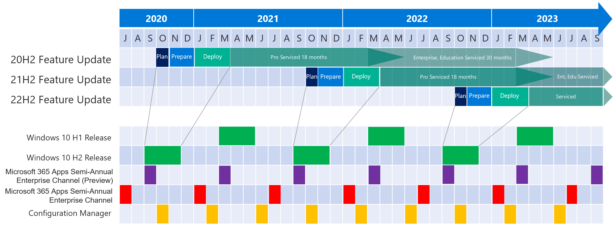

# Define update strategy with a calendar

Traditionally, organizations treated the deployment of operating system updates (especially feature updates) as a discrete project that had a beginning, a middle, and an end. A release was "built" (usually in the form of an image) and then distributed to users and their devices.

Today, more organizations are treating deployment as a continual process of updates that roll out across the organization in waves. In this approach, an update is plugged into this process and while it runs, you monitor for anomalies, errors, or user impact and respond as issues arise--without interrupting the entire process. Microsoft has been evolving its Windows release cycles, update mechanisms, and relevant tools to support this model. For more information about the Windows lifecycle, see [Windows lifecycle FAQ](/lifecycle/faq/windows).

We encourage you to deploy every available release and maintain a fast cadence for some portion of your environment. We also recognize that you might have a large number of devices, and a need for little or no disruption. The lifecycle cadence lets you allow some portion of your environment to move faster while the majority can move less quickly.

## Calendar approaches
You can use a calendar approach for either a faster twice-per-year cadence or an annual cadence. Depending on company size, installing feature updates less often than once annually risks devices going out of service and becoming vulnerable to security threats, because they stop receiving the monthly security updates once a version is out of support.

## Annual approach
Here's a calendar showing an example schedule that applies one Windows feature update per calendar year, aligned with Microsoft Configuration Manager and Microsoft 365 Apps release cycles:

This approach provides approximately 12 months of use from each feature update before the next update is due to be installed by aligning to the Windows H2 feature update. 

This cadence might be most suitable for you if any of these conditions apply:

- You're just starting your journey with the Windows servicing process. If you're unfamiliar with new processes that support Windows servicing, moving from a project happening once every three to five years to a feature update process can be daunting. This approach gives you time to learn new approaches and tools to reduce effort and cost.

- You want to wait and see how successful other companies are at adopting a Windows feature update.

- You want to go quickly with feature updates, and want the ability to skip a feature update while keeping Windows serviced in case business priorities change. 

