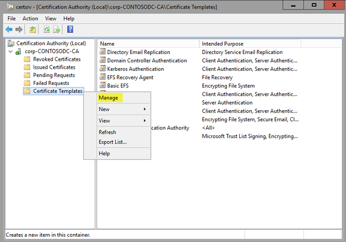
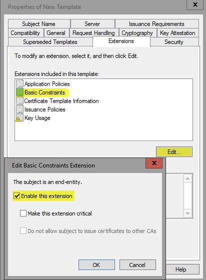
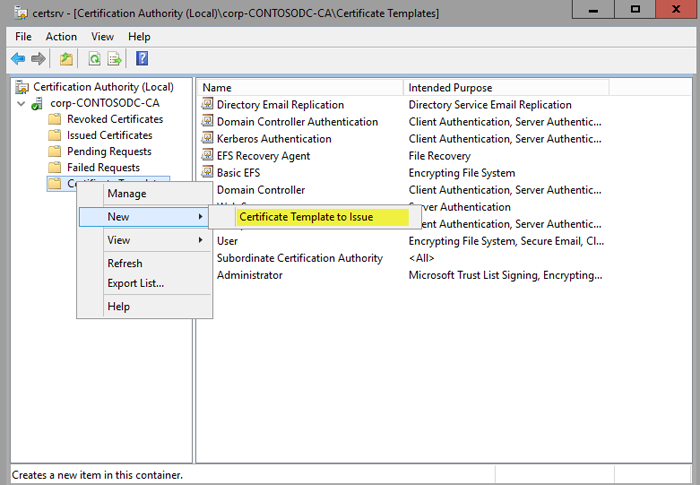
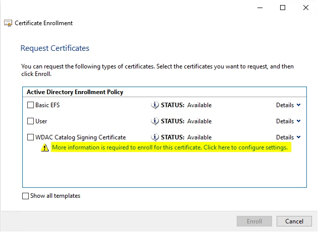

# Optional: Create a code signing cert for App Control for Business

[!INCLUDE [Feature availability note](../includes/feature-availability-note.md)]

As you deploy App Control for Business, you might need to sign catalog files or App Control policies internally. To do this signing, you'll either need to use [Microsoft's Trusted Signing service](/azure/trusted-signing/), a publicly issued code signing certificate or an internal CA. If you've purchased a code signing certificate, you can skip this article, and instead follow other articles listed in the [App Control for Business Deployment Guide](appcontrol-deployment-guide.md).

If you have an internal CA, complete these steps to create a code signing certificate.

> [!WARNING]
> When creating signing certificates for App Control policy signing, Boot failure (blue screen) may occur if your signing certificate does not follow these rules:
>
> - All policies, including base and supplemental, must be signed according to the [PKCS 7 Standard](https://datatracker.ietf.org/doc/html/rfc5652).
> - Use RSA keys with 2K, 3K, or 4K key size only. ECDSA isn't supported.
> - You can use SHA-256, SHA-384, or SHA-512 as the digest algorithm on Windows 11, as well as Windows 10 and Windows Server 2019 and above after applying the November 2022 cumulative security update. All other devices only support SHA256.

1. Open the Certification Authority Microsoft Management Console (MMC) snap-in, and then select your issuing CA.

2. When connected, right-click **Certificate Templates**, and then select **Manage** to open the Certification Templates Console.

    

    Figure 1. Manage the certificate templates

3. In the navigation pane, right-click the Code Signing certificate, and then select **Duplicate Template**.

4. On the **Compatibility** tab, clear the **Show resulting changes** check box. Select **Windows Server 2012** from the **Certification Authority** list, and then select **Windows 8 / Windows Server 2012** from the **Certificate recipient** list.

5. On the **General** tab, specify the **Template display name** and **Template name**. This example uses the name **App Control Catalog Signing Certificate**.

6. On the **Request Handling** tab, select the **Allow private key to be exported** check box.

7. On the **Extensions** tab, select the **Basic Constraints** check box, and then select **Edit**.

8. In the **Edit Basic Constraints Extension** dialog box, select **Enable this extension**, as shown in Figure 2.

    

    Figure 2. Select constraints on the new template

9. If a certificate manager is required to approve any issued certificates, on the **Issuance Requirements** tab, select **CA certificate manager approval**.

10. On the **Subject Name** tab, select **Supply in the request**.

11. On the **Security** tab, verify that whatever account will be used to request the certificate has the right to enroll the certificate.

12. Select **OK** to create the template, and then close the Certificate Template Console.

When this certificate template has been created, you must publish it to the CA published template store. To do so, complete the following steps:

1. In the Certification Authority MMC snap-in, right-click **Certification Templates**, point to **New**, and then select **Certificate Template to Issue**, as shown in Figure 3.

    

    Figure 3. Select the new certificate template to issue

    A list of available templates to issue appears, including the template you created.

2. Select the App Control Catalog signing certificate, and then select **OK**.

Now that the template is available to be issued, you must request one from the computer running Windows 10 or Windows 11 on which you create and sign catalog files. To begin, open the MMC, and then complete the following steps:

1. In MMC, from the **File** menu, select **Add/Remove Snap-in**. Double-click **Certificates**, and then select **My user account**.

2. In the Certificates snap-in, right-click the Personal store folder, point to **All Tasks**, and then select **Request New Certificate**.

3. Select **Next** twice to get to the certificate selection list.

4. In the **Request Certificate** list, select your newly created code signing certificate, and then select the blue text that requests additional information, as shown in Figure 4.

    

    Figure 4. Get more information for your code signing certificate

5. In the **Certificate Properties** dialog box, for **Type**, select **Common name**. For **Value**, specify a meaningful name for your certificate (in this example, we select **$ContosoSigningCert**), and then select **Add**. When added, select **OK.**

6. Enroll and finish.

>[!NOTE]
>If a certificate manager is required to approve any issued certificates and you selected to require management approval on the template, the request will need to be approved in the CA before it will be issued to the client.

This certificate must be installed in the user's personal store on the computer that will be signing the catalog files and code integrity policies. If the signing will happen on the same computer you used to request the certificate, you can skip the following steps. If you'll be signing on another computer, you need to export the .pfx certificate with the necessary keys and properties. To do so, complete the following steps:

1. Right-click the certificate, point to **All Tasks**, and then select **Export**.

2. Select **Next**, and then select **Yes, export the private key**.

3. Choose the default settings, and then select **Export all extended properties**.

4. Set a password, select an export path, and then select **AppControlCatSigningCert.pfx** as the file name.

When the certificate has been exported, import it into the personal store for the user who will be signing the catalog files or code integrity policies on the specific computer that will be signing them.
