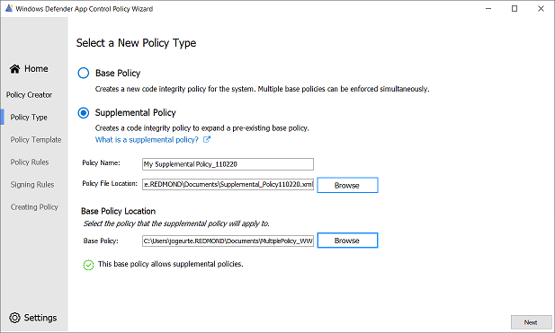
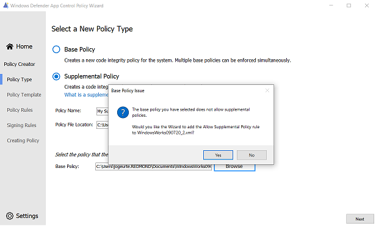
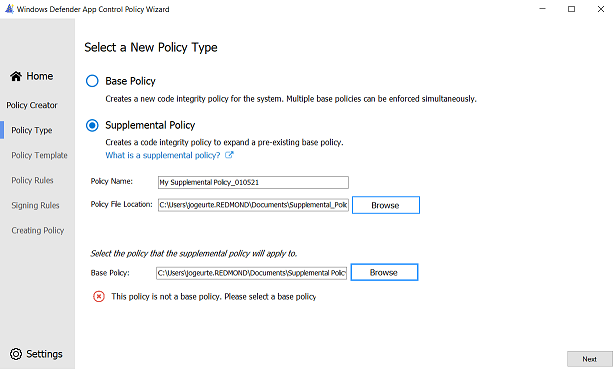
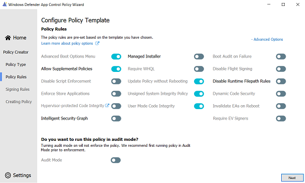
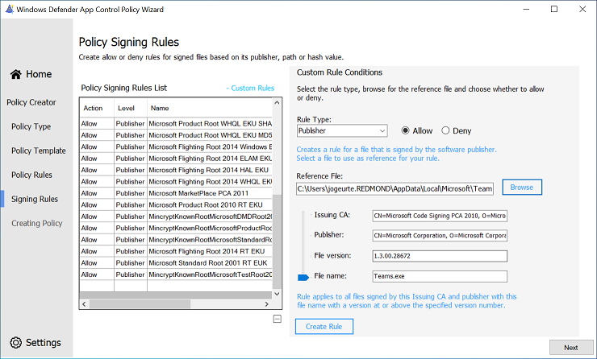
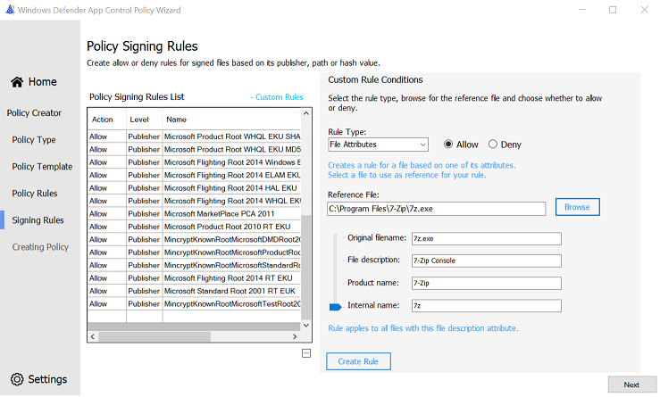

# Creating a new Supplemental Policy with the Wizard

[!INCLUDE [Feature availability note](../includes/feature-availability-note.md)]

Beginning in Windows 10 version 1903, App Control for Business supports the creation of multiple active policies on a device. One or more supplemental policies allow customers to expand a [App Control base policy](appcontrol-wizard-create-base-policy.md) to increase the circle of trust of the policy. A supplemental policy can expand only one base policy, but multiple supplementals can expand the same base policy. When supplemental policies are used, applications allowed by the base or any of its supplemental policies are allowed to run.

Prerequisite information about application control can be accessed through the [App Control design guide](appcontrol-design-guide.md). This page outlines the steps to create a supplemental application control policy, configure the policy options, and the signer and file rules.

## Expanding a Base Policy

Once the Supplemental Policy type is chosen on the New Policy page, policy name and file dialog fields can be used to name and save the supplemental policy. The next step requires selecting a base policy to expand. To expand a base policy, the base must allow supplemental policies. The App Control Wizard verifies if the base policy allows supplementals and shows the following confirmation.

If the base policy isn't configured for supplemental policies, the Wizard attempts to convert the policy to one that can be supplemented. Once successful, the Wizard shows a dialog demonstrating that the addition of the Allow Supplemental Policy rule was completed.

Policies that can't be supplemented, for instance another supplemental policy, are detected by the Wizard and show the following error. Only a base policy can be supplemented. More information on supplemental policies can be found on our [Multiple Policies article](deploy-multiple-appcontrol-policies.md).

## Configuring Policy Rules

Upon page launch, policy rules are automatically enabled/disabled depending on the chosen base policy from the previous page. Most of the supplemental policy rules are inherited from the base policy. The Wizard automatically parses the base policy and sets the required supplemental policy rules to match the base policy rules. Inherited policy rules are grayed out and aren't modifiable in the user interface.

A short description of the rule is shown at the bottom of the page when the cursor is placed on the rule title.

### Configurable Supplemental Policy Rules Description

Supplemental policies can only configure three policy rules. The following table describes each policy rule, beginning with the left-most column. Selecting the **+ Advanced Options** label shows another column of policy rules, the advanced policy rules.

| Rule option | Description |
|------------ | ----------- |
| **Intelligent Security Graph Authorization** | Use this option to automatically allow applications with "known good" reputation as defined by Microsoft's Intelligent Security Graph (ISG). |
| **Managed Installer** | Use this option to automatically allow applications installed by a software distribution solution, such as Microsoft Configuration Manager, that has been defined as a managed installer. |
| **Disable Runtime FilePath Rule Protection** | This option disables the default runtime check that only allows FilePath rules for paths that are only writable by an administrator. |

## Creating custom file rules

File rules in an application control policy specify the level at which applications are identified and trusted. File rules are the main mechanism for defining trust in the application control policy. Selecting **+ Custom Rules** opens the custom file rule conditions panel to create and customize targeted file rules for your policy. The Wizard supports four types of file rules:

### Publisher Rules

The Publisher file rule type uses properties in the code signing certificate chain to base file rules. Once the file to base the rule off of, called the *reference file*, is selected, use the slider to indicate the specificity of the rule.  The following table shows the relationship between the slider placement, the corresponding App Control for Business rule level, and its description. The lower the placement on the table and the UI slider, the greater the specificity of the rule.

| Rule Condition | App Control Rule Level | Description |
|------------ | ----------- | ----------- |
| **Issuing CA** | PCACertificate | Highest available certificate is added to the signers. This certificate is typically the PCA certificate, one level below the root certificate. Any file signed by this certificate is affected. |
| **Publisher** | Publisher | This rule is a combination of the PCACertificate rule and the common name (CN) of the leaf certificate. Any file signed by a major CA but with a leaf from a specific company, for example, a device driver publisher, is affected. |
| **File version** | SignedVersion | This rule is a combination of the PCACertificate and Publisher rule, and a version number. Anything from the specified publisher with a version at or above the one specified is affected. |
| **File name** | FilePublisher | Most specific. Combination of the file name, publisher, and PCA certificate and a minimum version number. Files from the publisher with the specified name and greater or equal to the specified version are affected. |

### Filepath Rules

Filepath rules don't provide the same security guarantees that explicit signer rules do, as they're based on mutable access permissions. To create a filepath rule, select the file using the *Browse* button.

### File Attribute Rules

The Wizard supports the creation of [file name rules](select-types-of-rules-to-create.md#use--specificfilenamelevel-with-filename-filepublisher-or-whqlfilepublisher-level-rules) based on authenticated file attributes. File name rules are useful when an application and its dependencies (for example, DLLs) may all share the same product name, for instance. This rule level allows users to easily create targeted policies based on the Product Name file name. To select the file attribute to create the rule, move the slider on the Wizard to the desired attribute. The following table describes each of the supported file attributes off which to create a rule.

| Rule level | Description |
|------------ | ----------- |
| **Original Filename** | Specifies the original file name, or the name with which the file was first created, of the binary. |
| **File description** | Specifies the file description provided by the developer of the binary. |
| **Product name** | Specifies the name of the product with which the binary ships. |
| **Internal name** | Specifies the internal name of the binary. |

### File Hash Rules

Lastly, the Wizard supports creating file rules using the hash of the file. Although this level is specific, it can cause extra administrative overhead to maintain the current product versions' hash values. Each time a binary is updated, the hash value changes, therefore requiring a policy update. By default, the Wizard uses file hash as the fallback in case a file rule can't be created using the specified file rule level.

#### Deleting Signing Rules

The table on the left of the page documents the allow and deny rules in the template, and any custom rules you create. Rules can be deleted from the policy by selecting the rule from the rules list table. Once the rule is highlighted, press the delete button underneath the table. You're again prompted for another confirmation. Select `Yes` to remove the rule from the policy and the rules table.

## Up next

- [Editing an App Control for Business policy using the Wizard](appcontrol-wizard-editing-policy.md)
