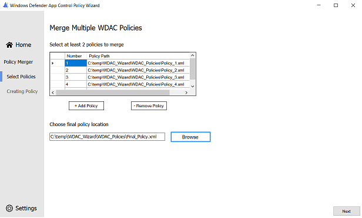

# Merging existing policies with the App Control Wizard

Beginning in Windows 10 version 1903, App Control for Business supports multiple policies. Before version 1903, however, Windows 10 could only have one App Control policy. So, users were required to merge multiple App Control policies into one. The App Control Wizard has a simple to use user interface to allow users to merge multiple App Control policies. The Wizard can support up to 15 policy files as input during the merge workflow.

Select the policies you wish to merge into one policy using the `+ Add Policy` button under the table. Once added, policies will be enumerated within the table. To remove a policy from the table, if accidentally added, highlight the policy row and select the `- Remove Policy` button. Confirmation will be required before the policy is withdrawn from the table.

> [!NOTE]
> The policy type and ID of the final output policy will be determined based on the type and ID of the **first policy** in the policy list table. For instance, if a legacy policy format policy and a multi-policy format policy are merged together, the output format of the policy will be whichever policy is specified first in the table. For more information on policy formats, visit the [Multiple App Control for Business Policies page](deploy-multiple-appcontrol-policies.md).

Lastly, select a filepath save location for the final merged policy using the `Browse` button. If a minimum of two policies are selected, and the save location is specified, select the `Next` button to build the policy.

