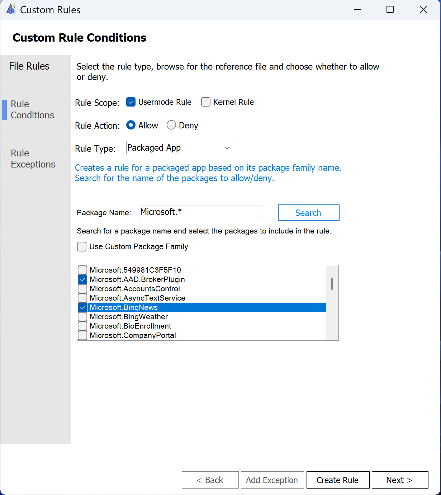
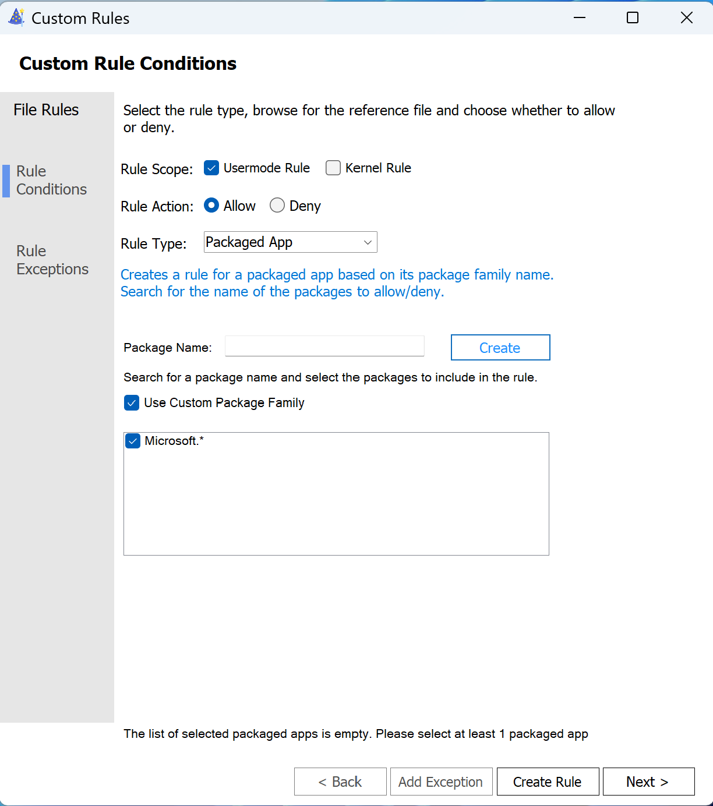

# Manage Packaged Apps with Windows Defender Application Control

**Applies to:**

- Windows 10
- Windows 11
- Windows Server 2016 and above

>[!NOTE]
>Some capabilities of Windows Defender Application Control (WDAC) are only available on specific Windows versions. Learn more about the [WDAC feature availability](../feature-availability.md).

This article for IT professionals describes concepts and lists procedures to help you manage packaged apps with Windows Defender Application Control (WDAC) as part of your overall application control strategy.

## Comparing classic Windows Apps and Packaged Apps

The biggest challenge in adopting application control is the lack of a strong app identity for classic Windows apps, also known as win32 apps. A typical win32 app consists of multiple components, including the installer that is used to install the app, and one or more exes, dlls, or scripts. An app can consist of hundreds or even thousands of individual binaries that work together to deliver the functionality that your users understand as the app. Some of that code may be signed by the software publisher, some may be signed by other companies, and some of it may not be signed at all. Much of the code may be written to disk by a common set of installers, but some may already be installed and some downloaded on demand. Some of the binaries have common resource header metadata, such as product name and product version, but other files won't share that information. So while you want to be able to express rules like "allow app Foo", that isn't something Windows inherently understands for classic Windows apps. Instead, you may have to create many WDAC rules to allow all the files that comprise the app.

Packaged apps on the other hand, also known as [MSIX](/windows/msix/overview), ensure that all the files that make up an app share the same identity and have a common signature. Therefore, with packaged apps, it's possible to control the entire app with a single WDAC rule.

## Using WDAC to Manage Packaged Apps

> [!IMPORTANT]
> When controlling packaged apps, you must choose between signer rules or Package Family Name (PFN) rules. If **any** Package Family Name (PFN) rule is used in your WDAC base policy or one of its supplemental policies, then **all** packaged apps must be controlled exclusively using PFN rules. You can't mix-and-match PFN rules with signature-based rules within a given base policy's scope. This will affect many inbox system apps like the Start menu. You can use wildcards in PFN rules on Windows 11 to simplify the rule creation.

### Creating signature-based rules for Packaged Apps

All of the files that make up an MSIX app are signed with a common catalog signature. You can create a signer rule from the MSIX app's installer file (\.msix or \.msixbundle) or from the AppxSignature.p7x file found in the app's installation folder under %ProgramFiles%\\WindowsApps\\ using the [New-CIPolicyRule](/powershell/module/configci/new-cipolicyrule) PowerShell cmdlet. For example:

#### Create signer rule from MSIX/MSIXBUNDLE

```powershell
$FilePath = $env:USERPROFILE+'\Downloads\WDACWizard_2.1.0.1_x64_8wekyb3d8bbwe.MSIX'
$Rules = New-CIPolicyRule -DriverFilePath $FilePath -Level Publisher
```

Then use the [Merge-CIPolicy](/powershell/module/configci/merge-cipolicy) PowerShell cmdlet to merge your new rule into your existing WDAC policy XML.

#### Create signer rule from AppxSignature.p7x

```powershell
$FilePath = $env:ProgramFiles+'\WindowsApps\Microsoft.WDAC.WDACWizard_2.1.0.1_x64__8wekyb3d8bbwe\AppxSignature.p7x'
$Rules = New-CIPolicyRule -DriverFilePath $FilePath -Level Publisher
```

Then use the [Merge-CIPolicy](/powershell/module/configci/merge-cipolicy) PowerShell cmdlet to merge your new rule into your existing WDAC policy XML.

### Creating PackageFamilyName rules for Packaged Apps

#### Create PFN rules from PowerShell

You can create PFN rules directly from packaged apps that are currently installed using the [Get-AppXPackage](/powershell/module/appx/get-appxpackage) and [New-CIPolicyRule](/powershell/module/configci/new-cipolicyrule) PowerShell cmdlets. For example:

```powershell
# Query for the packaged apps. This example looks for all packages from Microsoft.
$Packages = Get-AppXPackage -Name Microsoft.*
foreach ($Package in $Packages)
{
   $Rules += New-CIPolicyRule -Package $Package
}
```

Then use the [Merge-CIPolicy](/powershell/module/configci/merge-cipolicy) PowerShell cmdlet to merge your new rule(s) into your existing WDAC policy XML.

#### Create PFN rules using the WDAC Wizard

##### Create PFN rule from an installed MSIX app

Use the following steps to create a WDAC PFN rule for an app that is installed on the system:

1. From the **Policy Signing Rules** page of the [WDAC Wizard](https://aka.ms/wdacwizard), select **Add Custom Rule**.
2. Check **Usermode Rule** as the Rule Scope, if not checked.
3. Select either **Allow** or **Deny** for your Rule Action.
4. Select **Packaged App** for your Rule Type.
5. In the **Package Name** field, enter a string value to search. You can use `?` or `*` wildcards in the search string. Then select **Search**.
6. In the results box, check one or more apps for which you want to create rules.
7. Select **Create Rule**.
8. Create any other rules desired, then complete the Wizard.



##### Create a PFN rule using a custom string

Use the following steps to create a PFN rule with a custom string value:

1. Repeat steps 1-4 in the previous example.
2. Check the box labeled **Use Custom Package Family**. The *Search* button label changes to *Create*.
3. In the **Package Name** field, enter a string value for your PFN rule. You can use `?` or `*` wildcards if targeting Windows 11 devices. Then select **Create**
4. In the results box, check one or more apps for which you want to create rules.
5. Select **Create Rule**.
6. Create any other rules desired, then complete the Wizard.


