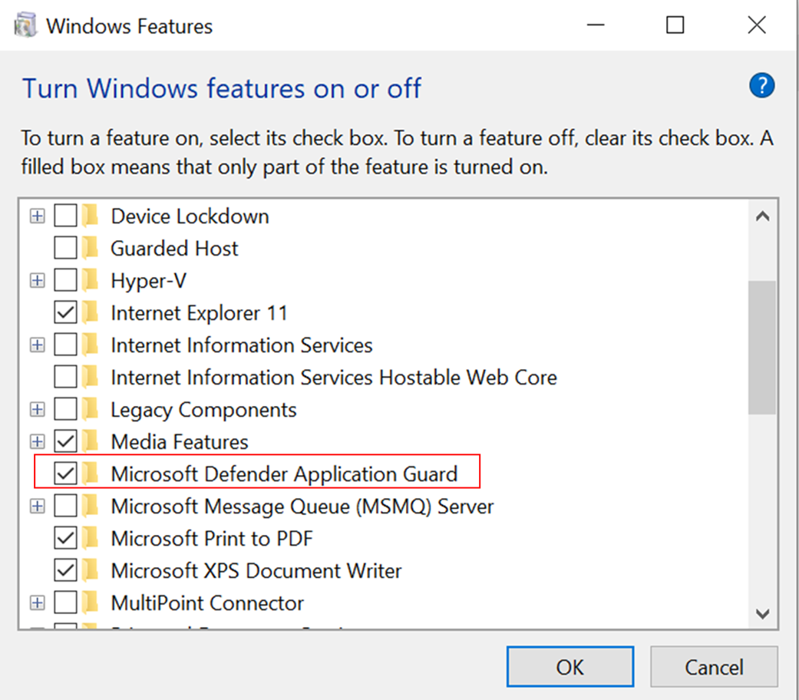

# Prepare to install Microsoft Defender Application Guard

Before you continue, review [System requirements for Microsoft Defender Application Guard](reqs-md-app-guard.md) to review the hardware and software installation requirements for Microsoft Defender Application Guard.

> [!NOTE]
> Microsoft Defender Application Guard is not supported on VMs and VDI environment. For testing and automation on non-production machines, you may enable WDAG on a VM by enabling Hyper-V nested virtualization on the host.

## Prepare for Microsoft Defender Application Guard

Before you can install and use Microsoft Defender Application Guard, you must determine which way you intend to use it in your enterprise. You can use Application Guard in either **Standalone** or **Enterprise-managed** mode.

### Standalone mode

Employees can use hardware-isolated browsing sessions without any administrator or management policy configuration. In this mode, you must install Application Guard and then the employee must manually start Microsoft Edge in Application Guard while browsing untrusted sites. For an example of how this works, see the [Application Guard in standalone mode](test-scenarios-md-app-guard.md) testing scenario.

Standalone mode is applicable for:

- Windows 10 Enterprise edition, version 1709 and later
- Windows 10 Pro edition, version 1803 and later
- Windows 10 Education edition, version 1809 and later
- Windows 11 Enterprise, Education, or Pro editions

## Enterprise-managed mode

You and your security department can define your corporate boundaries by explicitly adding trusted domains and by customizing the Application Guard experience to meet and enforce your needs on employee devices. Enterprise-managed mode also automatically redirects any browser requests to add non-enterprise domain(s) in the container.

Enterprise-managed mode is applicable for:

- Windows 10 Enterprise edition, version 1709 and later
- Windows 10 Education edition, version 1809 and later
- Windows 11 Enterprise or Education editions

The following diagram shows the flow between the host PC and the isolated container.


## Install Application Guard

Application Guard functionality is turned off by default. However, you can quickly install it on your employee's devices through the Control Panel, PowerShell, or your mobile device management (MDM) solution.

### Install from Control Panel

1. Open the **Control Panel**, select **Programs,** and then select **Turn Windows features on or off**.

    

1. Select the check box next to **Microsoft Defender Application Guard** and then select **OK** to install Application Guard and its underlying dependencies.

### Install from PowerShell

> [!NOTE]
> Ensure your devices have met all system requirements prior to this step. PowerShell will install the feature without checking system requirements. If your devices don't meet the system requirements, Application Guard may not work. This step is recommended for enterprise managed scenarios only.

1. Select the **Search** icon in the Windows taskbar and type **PowerShell**.

1. Right-click **Windows PowerShell**, and then select **Run as administrator** to open Windows PowerShell with administrator credentials.

1. Type the following command:

   ```powershell
   Enable-WindowsOptionalFeature -Online -FeatureName Windows-Defender-ApplicationGuard
   ```

1. Restart the device to install Application Guard and its underlying dependencies.

### Install from Intune

> [!IMPORTANT]
> Make sure your organization's devices meet [requirements](reqs-md-app-guard.md) and are [enrolled in Intune](/mem/intune/enrollment/device-enrollment).

1. Sign in to the [Microsoft Intune admin center](https://go.microsoft.com/fwlink/?linkid=2109431).

1. Select **Endpoint security** > **Attack surface reduction** > **Create Policy**, and do the following:

   - In the **Platform** list, select **Windows 10 and later**.
   - In the **Profile** type, select **App and browser isolation**.
   - Select **Create**.

1. In the **Basics** tab, specify the **Name** and **Description** for the policy. Select **Next**.

1. In the **Configuration settings** tab, configure the **Application Guard** settings, as desired. Select **Next**.

1. In the **Scope tags** tab, if your organization is using scope tags, choose **+ Select scope tags**, and then select the tags you want to use. Select **Next**.

   To learn more about scope tags, see [Use role-based access control (RBAC) and scope tags for distributed IT](/mem/intune/fundamentals/scope-tags).

1. In the **Assignments** page, select the users or groups that will receive the policy. Select **Next**.

   To learn more about assigning policies, see [Assign policies in Microsoft Intune](/mem/intune/configuration/device-profile-assign).

1. Review your settings, and then select **Create**.

After the policy is created, any devices to which the policy should apply will have Microsoft Defender Application Guard enabled. Users might have to restart their devices in order for protection to be in place.
