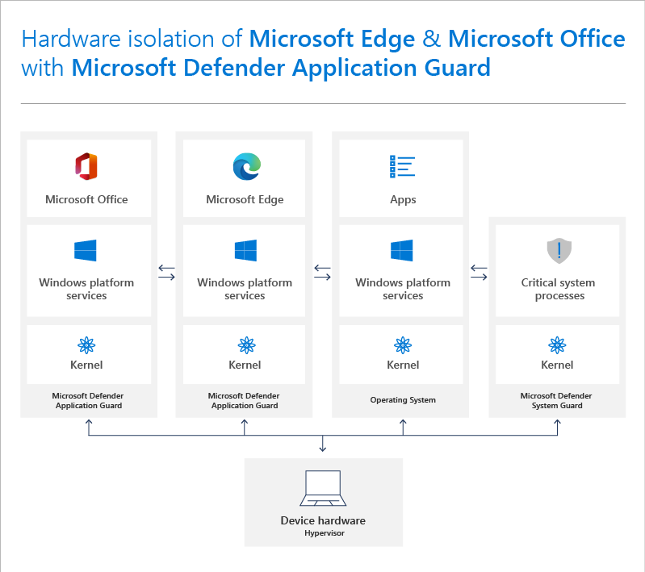

[!INCLUDE [mdag-edge-deprecation-notice](../../../includes/mdag-edge-deprecation-notice.md)]

# Microsoft Defender Application Guard overview

Microsoft Defender Application Guard (MDAG) is designed to help prevent old and newly emerging attacks to help keep employees productive. Using our unique hardware isolation approach, our goal is to destroy the playbook that attackers use by making current attack methods obsolete.

## What is Application Guard and how does it work?

For Microsoft Edge, Application Guard helps to isolate enterprise-defined untrusted sites, protecting your company while your employees browse the Internet. As an enterprise administrator, you define what is among trusted web sites, cloud resources, and internal networks. Everything not on your list is considered untrusted. If an employee goes to an untrusted site through either Microsoft Edge or Internet Explorer, Microsoft Edge opens the site in an isolated Hyper-V-enabled container.

For Microsoft Office, Application Guard helps prevents untrusted Word, PowerPoint and Excel files from accessing trusted resources. Application Guard opens untrusted files in an isolated Hyper-V-enabled container. The isolated Hyper-V container is separate from the host operating system. This container isolation means that if the untrusted site or file turns out to be malicious, the host device is protected, and the attacker can't get to your enterprise data. For example, this approach makes the isolated container anonymous, so an attacker can't get to your employee's enterprise credentials.

### What types of devices should use Application Guard?

Application Guard has been created to target several types of devices:

- **Enterprise desktops**. These desktops are domain-joined and managed by your organization. Configuration management is primarily done through Microsoft Configuration Manager or Microsoft Intune. Employees typically have Standard User privileges and use a high-bandwidth, wired, corporate network.

- **Enterprise mobile laptops**. These laptops are domain-joined and managed by your organization. Configuration management is primarily done through Microsoft Configuration Manager or Microsoft Intune. Employees typically have Standard User privileges and use a high-bandwidth, wireless, corporate network.

- **Bring your own device (BYOD) mobile laptops**. These personally owned laptops aren't domain-joined, but are managed by your organization through tools, such as Microsoft Intune. The employee is typically an admin on the device and uses a high-bandwidth wireless corporate network while at work and a comparable personal network while at home.

- **Personal devices**. These personally owned desktops or mobile laptops aren't domain-joined or managed by an organization. The user is an admin on the device and uses a high-bandwidth wireless personal network while at home or a comparable public network while outside.

[!INCLUDE [microsoft-defender-application-guard-mdag-for-edge-standalone-mode](../../../../../includes/licensing/microsoft-defender-application-guard-mdag-for-edge-standalone-mode.md)]

For more information about Microsoft Defender Application Guard (MDAG) for Edge enterprise mode, [Configure Microsoft Defender Application Guard policy settings.](configure-md-app-guard.md)

## Related articles

|Article |Description |
|:------|:------------|
|[System requirements for Microsoft Defender Application Guard](reqs-md-app-guard.md) |Specifies the prerequisites necessary to install and use Application Guard.|
|[Prepare and install Microsoft Defender Application Guard](install-md-app-guard.md) |Provides instructions about determining which mode to use, either Standalone or Enterprise-managed, and how to install Application Guard in your organization.|
|[Configure the Group Policy settings for Microsoft Defender Application Guard](configure-md-app-guard.md) |Provides info about the available Group Policy and MDM settings.|
|[Testing scenarios using Microsoft Defender Application Guard in your business or organization](test-scenarios-md-app-guard.md)|Provides a list of suggested testing scenarios that you can use to test Application Guard in your organization.|
| [Microsoft Defender Application Guard Extension for web browsers](md-app-guard-browser-extension.md) | Describes the Application Guard extension for Chrome and Firefox, including known issues, and a troubleshooting guide |
| [Microsoft Defender Application Guard for Microsoft Office](/microsoft-365/security/office-365-security/install-app-guard) | Describes Application Guard for Microsoft Office, including minimum hardware requirements, configuration, and a troubleshooting guide |
|[Frequently asked questions - Microsoft Defender Application Guard](faq-md-app-guard.yml)|Provides answers to frequently asked questions about Application Guard features, integration with the Windows operating system, and general configuration.|
|[Use a network boundary to add trusted sites on Windows devices in Microsoft Intune](/mem/intune/configuration/network-boundary-windows)|Network boundary, a feature that helps you protect your environment from sites that aren't trusted by your organization.|
