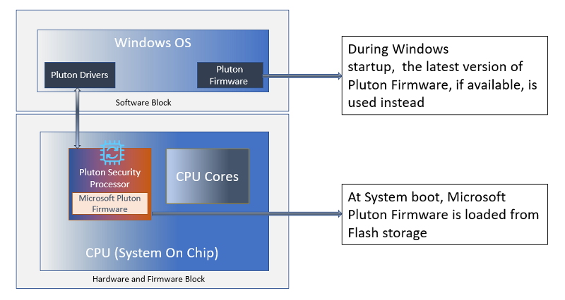
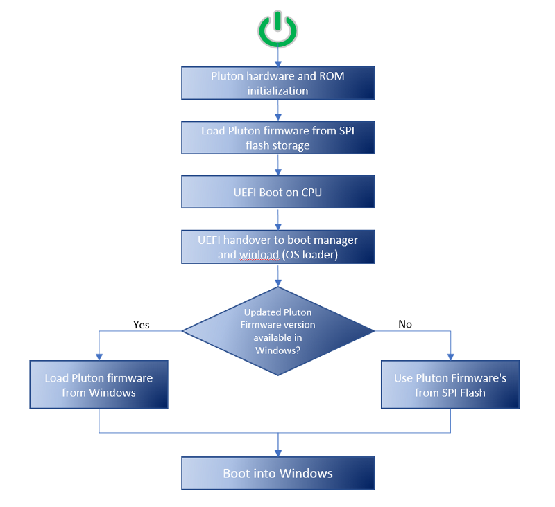

# Microsoft Pluton security processor

Microsoft Pluton security processor is a chip-to-cloud security technology built with [Zero Trust](/security/zero-trust/zero-trust-overview) principles at the core. Microsoft Pluton provides hardware-based root of trust, secure identity, secure attestation, and cryptographic services. Pluton technology is a combination of a secure subsystem which is part of the System on Chip (SoC) and Microsoft authored software that runs on this integrated secure subsystem.

Microsoft Pluton is currently available on devices with Ryzen 6000 and Qualcomm Snapdragon® 8cx Gen 3 series processors. Microsoft Pluton can be enabled on devices with Pluton capable processors running Windows 11, version 22H2.

## What is Microsoft Pluton?

Designed by Microsoft and built by silicon partners, Microsoft Pluton is a secure crypto-processor built into the CPU for security at the core to ensure code integrity and the latest protection with updates delivered by Microsoft through Windows Update. Pluton protects credentials, identities, personal data and encryption keys. Information is significantly harder to be removed even if an attacker has installed malware or has complete physical possession of the PC.

Microsoft Pluton is designed to provide the functionality of the Trusted Platform Module as well as deliver other security functionality beyond what is possible with the TPM 2.0 specification, and allows for additional Pluton firmware and OS features to be delivered over time via Windows Update. For more information, see [Microsoft Pluton as TPM](pluton-as-tpm.md).

Pluton is built on proven technology used in Xbox and Azure Sphere, and provides hardened integrated security capabilities to Windows 11 devices in collaboration with leading silicon partners. For more information, see [Meet the Microsoft Pluton processor – The security chip designed for the future of Windows PCs](https://www.microsoft.com/security/blog/2020/11/17/meet-the-microsoft-pluton-processor-the-security-chip-designed-for-the-future-of-windows-pcs/).

## Microsoft Pluton security architecture overview

Pluton Security subsystem consists of the following layers:

| | Description |
|--|--|
| **Hardware** | Pluton Security Processor is a secure element tightly integrated into the SoC subsystem. It provides a trusted execution environment while delivering cryptographic services required for protecting sensitive resources and critical items like keys, data, etc. |
| **Firmware** | Microsoft authorized firmware provides required secure features and functionality, and exposes interfaces that operating system software and applications can use to interact with Pluton. The firmware is stored in the flash storage available on the motherboard. When the system boots, the firmware is loaded as a part of Pluton Hardware initialization. During Windows startup, a copy of this firmware (or the latest firmware obtained from Windows Update, if available) is loaded in the operating system. For additional information, see [Firmware load flow](#firmware-load-flow) |
| **Software** | Operating system drivers and applications available to an end user to allow seamless usage of the hardware capabilities provided by the Pluton security subsystem. |

## Firmware load flow

When the system boots, Pluton hardware initialization is performed by loading the Pluton firmware from the Serial Peripheral Interface (SPI) flash storage available on the motherboard. During Windows startup however, the latest version of the Pluton firmware is used by the operating system. If newer firmware is not available, Windows uses the firmware that was loaded during the hardware initialization. The diagram below illustrates this process:

## Related topics

[Microsoft Pluton as TPM](pluton-as-tpm.md)
