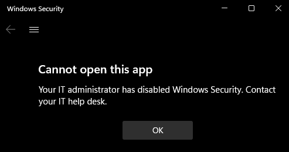

# Family options

The **Family options** section contains links to settings and further information for parents of a Windows PC. It isn't intended for enterprise or business environments.

Home users can learn more at the [Help protection your family online in Windows Security article at support.microsoft.com](https://support.microsoft.com/help/4013209/windows-10-protect-your-family-online-in-windows-defender)

This section can be hidden from users of the machine. This option can be useful if you don't want employees in your organization to see or have access to this section.

## Hide the Family options section

You can choose to hide the entire section by using Group Policy. The section won't appear on the home page of **Windows Security**, and its icon won't be shown on the navigation bar on the side.

This section can be hidden only by using Group Policy.

> [!IMPORTANT]
> You must have Windows 10, version 1709 or later. The ADMX/ADML template files for earlier versions of Windows do not include these Group Policy settings.

1. On your Group Policy management machine, open the [Group Policy Management Console](/previous-versions/windows/it-pro/windows-server-2008-R2-and-2008/cc731212(v=ws.11)), right-click the Group Policy Object you want to configure and select **Edit**.
1. In **Group Policy Management Editor**, go to **Computer configuration** and select **Administrative templates**.
1. Expand the tree to **Windows components > Windows Security > Family options**.
1. Open the **Hide the Family options area** setting and set it to **Enabled**. Select **OK**.
1. [Deploy](/windows/win32/srvnodes/group-policy) the updated GPO as you normally do.

> [!NOTE]
> If you hide all sections then **Windows Security** will show a restricted interface, as in the following screenshot:
>
> 
